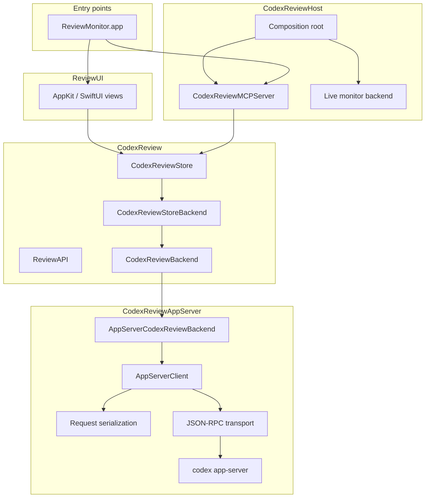

# CodexReviewKit Architecture

CodexReviewKit provides ReviewMonitor, a native macOS app for running and
observing Codex review. The package has one observable review store, one Codex
app-server gateway, and an internal MCP adapter owned by the app.

The package is organized around four ownership boundaries:

- `CodexReview` owns review behavior and observable product state.
- `CodexReviewAppServer` owns all `codex app-server` JSON-RPC I/O.
- `CodexReviewMCPServer` converts app-managed MCP tool calls to review commands.
- `CodexReviewHost` assembles concrete live dependencies.

`ReviewUI` renders the monitor state and forwards user intent. It does not own
review rules, app-server protocol details, persistence, or process lifecycle.

## Targets

| Target | Responsibility |
| --- | --- |
| `CodexReview` | Review API, `CodexReviewStore`, observable state, and product invariants |
| `CodexReviewAppServer` | `codex app-server` JSON-RPC protocol, process transport, request serialization, notifications |
| `CodexReviewMCPServer` | Internal MCP tool request/response conversion and Streamable HTTP endpoint |
| `CodexReviewHost` | Runtime composition for ReviewMonitor |
| `CodexReviewTesting` | Deterministic fake backend, fake JSON-RPC transport, gates, manual clock |
| `ReviewUI` | Native monitor UI rendering and user-intent forwarding |

ReviewMonitor is the product entry point. Review behavior, Codex protocol
handling, MCP conversion, and UI rendering remain in their owning targets.

## Runtime Flow

## CodexReview

`CodexReview` is organized by product responsibility. It avoids generic layer
names when the responsibility is more specific.

| Folder | Contents |
| --- | --- |
| `ReviewAPI` | Review request, target, result, selection, and review-facing error types |
| root files | Backend protocol and app-server-facing DTOs |
| `Model` | Observable account, settings, workspace, job, log, and parsed finding state |
| `Store` | `CodexReviewStore`, store backend protocol, preview backend, review commands, ordering, diagnostics |
| `Settings` | Settings persistence service and settings backend boundary |
| `Support` | Small module-local utilities |

`CodexReviewStore` is the single source of truth for review, runtime, auth,
settings, workspace, job, and log state. It is also the command owner for
`review_start`, `review_await`, `review_read`, `review_list`, `review_cancel`, session close,
auth actions, and settings updates. UI and MCP both use the same store API.

`CodexReviewStoreBackend` is the dependency boundary below the store. Live,
preview, and test backends all implement that boundary; product state remains in
the store.

## App-Server Gateway

`CodexReviewAppServer` treats raw JSON-RPC as the only I/O boundary.

- One live `codex app-server` process maps to one shared connection.
- `initialize` and `initialized` run once per connection.
- `config/read`, `account/read`, `thread/start`, `review/start`,
  `turn/interrupt`, `thread/unsubscribe`, and
  `thread/backgroundTerminals/clean` are typed requests.
- Same-thread mutating requests are serialized.
- Different-thread requests may run concurrently.
- `turn/interrupt` is a control request and is not queued behind an in-flight
  same-thread `review/start`.
- Notifications are subscribed before `review/start` so terminal events emitted
  with the response are not lost.
- Cancellation is represented by typed control/cleanup requests, not by closing
  the transport.

Fake and live tests use the same transport protocol.

## MCP Boundary

`CodexReviewMCPServer` knows MCP tool names, request arguments, and response
shape. It calls `CodexReviewStore` commands and does not know Codex JSON-RPC
details.

ReviewMonitor owns the default Streamable HTTP endpoint at
`http://localhost:9417/mcp`. The HTTP boundary follows current MCP session
semantics: `initialize` creates an `MCP-Session-Id`, subsequent requests carry
that session header, responses are delivered as JSON or SSE as negotiated by the
client, and `DELETE` closes a session.

The public tool surface is:

- `review_start`
- `review_await`
- `review_read`
- `review_list`
- `review_cancel`

## Monitor UI Boundary

`ReviewUI` observes `CodexReviewStore` directly.

- Views and view controllers render observable state.
- User actions call store methods.
- UI tests cover layout, selection, rendering, accessibility-facing text, and
  user-intent forwarding.
- Review/auth/settings semantics are tested in `CodexReviewTests` and
  `CodexReviewAppServerTests`.

## Testing

Default tests are deterministic and do not start a live `codex app-server`.

| Test area | Uses | Verifies |
| --- | --- | --- |
| `CodexReviewTests` | Fake `CodexReviewStoreBackend` | Review/auth/settings state machines, cancellation, result retention |
| `CodexReviewAppServerTests` | Fake JSON-RPC transport | App-server schema, serialization, notification buffering, interrupt/cleanup |
| `CodexReviewMCPServerTests` | Fake review store | MCP conversion and response shape |
| `CodexReviewHostTests` | Fake runtime dependencies | Composition, startup, shutdown |
| `ReviewUITests` | Preview/test monitor backend | Native UI behavior and user-intent forwarding |
| `ArchitectureFenceTests` | Source scan | Target ownership and forbidden implementation imports |

Forbidden test patterns:

- Sleeping to wait for lifecycle progress when an explicit signal can be used.
- Inspecting fake-only storage as product behavior.
- Starting a live `codex app-server` in default CI tests.
- Testing behavior only because another implementation happened to behave
  differently.
