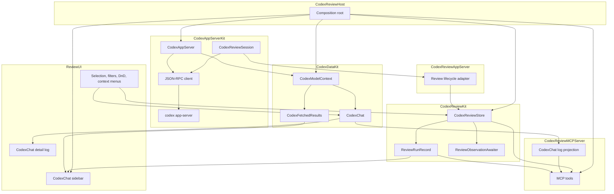

# CodexReviewKit Architecture

CodexReviewKit provides ReviewMonitor, a native macOS app for running and
observing Codex review. The package is organized around one invariant:
generic Codex data comes from CodexKit, while ReviewMonitor owns only review
product behavior.

Review content and log content flow in one direction:

```text
codex app-server
  -> CodexAppServerKit typed app-server APIs
  -> CodexDataKit CodexChat snapshot/change streams
  -> ReviewMonitor UI / MCP log projections
```

Review execution lifecycle flows separately:

```text
codex app-server review session
  -> CodexReviewAppServer lifecycle adapter
  -> CodexReviewKit ReviewRunRecord
  -> ReviewMonitor UI / MCP lifecycle projections
```

`ReviewRunRecord` is not a transcript, log, final-review, or timeline source.
It tracks lifecycle, cancellation, restart, recovery, ownership, and MCP command
state for a review run. `CodexChat` is the source of truth for review content
after a run has an associated chat/turn.

Raw JSON-RPC notifications are an input boundary only. They must not become the
source of truth for ReviewMonitor UI or MCP responses after they have been
normalized into typed app-server APIs and CodexDataKit models.

## Targets

This table describes intended ownership.

| Target | Responsibility |
| --- | --- |
| `CodexAppServerKit` | App-server SDK: local `codex app-server` process transport, JSON-RPC client, typed request DTOs, app-server notification schema, and Swift domain APIs for threads, turns, prompts, review sessions, models, accounts, and login. Raw DTOs are not its public boundary. It has no Review, UI, or MCP dependencies |
| `CodexDataKit` | Reusable observable Codex model owners for generic app-server concepts: `CodexModelContainer`, `CodexModelContext`, `CodexFetchRequest`, `CodexFetchedResults`, `CodexWorkspaceGroup`, `CodexWorkspace`, `CodexChat`, chat snapshots, and chat change streams. It lives in the separate CodexKit repository |
| `CodexReviewKit` | Review product core: run identity, lifecycle, cancellation, restart/recovery, auth/settings/runtime state, store commands, MCP command state, and ReviewMonitor-specific policies. It has no app-server wire, UI, or MCP dependencies |
| `CodexReviewAppServer` | Adapter from `CodexAppServerKit` high-level review sessions into `CodexReviewKit` lifecycle events and cleanup/recovery operations |
| `CodexReviewMCPServer` | MCP server and projections over the review store contract plus CodexChat log projections. It owns MCP protocol request/response conversion and the Streamable HTTP endpoint. It has no UI or app-server backend dependency |
| `CodexReviewHost` | Runtime composition for ReviewMonitor |
| `ReviewUI` | Concrete ReviewMonitor UI: AppKit views/controllers, existing hosted SwiftUI views, sidebar selection/filter/DnD presentation, context menus, and log rendering state |
| `CodexReviewTesting` | Deterministic fake backend, fake JSON-RPC transport, gates, manual clock |
| `TextTransitions` | UI text transition view support |

ReviewMonitor is the product entry point. The host target wires the concrete
runtime together; lower targets do not import the host.

## Source Of Truth

`CodexDataKit` owns generic Codex model state. ReviewMonitor should use
`CodexFetchedResults<CodexChat>` for chat lists and `CodexChat` snapshot/change
streams for selected chat content. Collection/list UI observes these owners
through ObservationBridge. Large transcript/log surfaces consume APIs that emit
an initial snapshot followed by row-level changes so the UI can append or update
content without re-reading the whole transcript.

`CodexReviewKit` owns review-run lifecycle state. A run records:

- target and command metadata,
- current status and lifecycle message,
- associated source/review thread and turn identifiers,
- cancellation and cleanup metadata,
- restart and recovery state,
- MCP session ownership and command visibility.

The run lifecycle may say that a review succeeded, failed, or was cancelled. It
does not contain the final review text. MCP `review.finalReview` and the detail
log are derived from the CodexChat projection when a projection is available.
When no CodexChat projection is available, MCP may report terminal lifecycle
state with no final review.

`ReviewMonitorLog` and MCP log values are render/protocol projections. They can
be rebuilt from `CodexChat` turn snapshots plus changes. They must not become
authoritative model state.

`ReviewUI` owns transient presentation state only: selected chat, expanded
sidebar groups, local filter text/mode, drag state, context-menu dispatch, view
controller lifetime, and installed native views. User actions call store or
CodexDataKit model APIs; UI code does not parse app-server wire data.

## Target Graph



The diagram describes ownership direction, not every SwiftPM dependency. New
code should not move generic Codex model ownership, UI rendering, or MCP
projection responsibilities back into review lifecycle owners.

## Observation Ownership

ObservationBridge is a subscription primitive. It is not storage, cache, or a
source of truth.

- The observable owner keeps semantic state: `CodexFetchedResults<CodexChat>`,
  `CodexChat`, and `CodexReviewStore`.
- Subscription tokens live with the subscriber that created them. A view
  controller, awaiter, or driver that starts observation is responsible for
  cancelling its token when that owner ends.
- `ReviewObservationAwaiter` belongs in `CodexReviewKit` because it is a
  use-case-level awaiter over review lifecycle state.
- Sidebar cells and native collection/outline rows should observe their own
  row models through ObservationBridge. Selection changes must not force every
  cell to re-render.
- Log surfaces should consume chat snapshot/change streams directly. Append-only
  text should be applied incrementally instead of rebuilding visible content
  from an observed array whenever possible.
- MCP projections are value snapshots over store state plus CodexChat
  projections. They must not retain ObservationBridge tokens or persist their
  projection as model state.

## CodexReviewKit

`CodexReviewKit` is the public review product surface used by ReviewMonitor and
the MCP server. It owns review commands, auth/settings/runtime state, network
recovery policy, diagnostics, and review-run lifecycle through
`CodexReviewStore`.

`CodexReviewStore` remains the command owner for `review_start`,
`review_await`, `review_read`, `review_list`, `review_cancel`, session close,
auth actions, and settings updates. It coordinates lifecycle state and selected
CodexChat projections; it does not store transcript text on the run.

`CodexReviewStoreBackend` is the dependency boundary below the store. Live,
preview, and test backends all implement that boundary; product state remains in
the store.

## App-Server Gateway

`CodexAppServerKit` treats raw JSON-RPC as the only live I/O boundary.

- One live `codex app-server` process maps to one shared connection.
- `initialize` and `initialized` run once per connection.
- `config/read`, `account/read`, login, model, thread, and turn methods are
  typed requests in the generic Kit boundary.
- The public Kit API is expressed as `CodexAppServer`, Codex thread/turn values,
  prompt/response APIs, Codex-specific response stream controls, thread event
  streams, messages, transcript/log values, high-level review sessions, model
  values, account values, and login handles.
- App-server notification schemas belong inside the Kit boundary. Public review
  surfaces should be high-level sessions and CodexDataKit models, not raw
  notification DTOs.
- Same-thread mutating requests are serialized. `turn/interrupt` is the
  intentional control-path exception so an in-flight response can be stopped
  without waiting behind queued same-thread work.
- Different-thread requests may run concurrently.
- Notifications are routed by turn ID, early turn notifications are replayed to
  later consumers, and schema-new notifications are preserved as unknown domain
  values.
- Cancellation is represented by typed control/cleanup requests, not by closing
  the transport.

`CodexReviewAppServer` adapts high-level `CodexReviewSession` lifecycle events
into ReviewMonitor backend events and adds ReviewMonitor-specific cleanup and
recovery on top of the generic boundary. Agent messages and message deltas are
not review lifecycle events; they belong to CodexChat.

Fake and live tests use the same transport protocol.

## MCP Boundary

`CodexReviewMCPServer` knows MCP tool names, request arguments, response shape,
session headers, Streamable HTTP behavior, and MCP-facing value snapshots from
store state plus CodexChat projections. It calls store commands and projects
selected CodexChat turns into MCP log/review values. It does not know Codex
JSON-RPC details, does not depend on the UI or app-server backend, and must not
import ReviewUI, the app-server runtime, or app-server wire DTOs.

ReviewMonitor owns the default Streamable HTTP endpoint at
`http://localhost:9417/mcp`. The HTTP boundary follows current MCP session
semantics: `initialize` creates an `MCP-Session-Id`, subsequent requests carry
that session header, responses are delivered as JSON or SSE as negotiated by the
client, and `DELETE` closes a session.

The public tool surface is:

- `review_start`
- `review_await`
- `review_read`
- `review_list`
- `review_cancel`

## Monitor UI Boundary

`ReviewUI` observes CodexDataKit and review product state, then forwards user
intent.

- Views and view controllers render observable state.
- User actions call store or CodexDataKit model methods.
- Sidebar list input should come from `CodexFetchedResults<CodexChat>` grouped
  by `CodexWorkspaceGroup`/`CodexWorkspace`, with ReviewMonitor-specific review
  status badges overlaid from review-run lifecycle state.
- Detail log input should come from the selected `CodexChat` snapshot/change
  stream.
- Generic Codex model state should come from `CodexDataKit` owners instead of
  ReviewMonitor-local models when a reusable owner exists.
- UI code must not import app-server runtime, app-server wire, or MCP server
  targets.
- UI tests cover layout, selection, rendering, accessibility-facing text, and
  user-intent forwarding.
- Review/auth/settings semantics are tested in lower target tests.

The current ReviewMonitor UI model boundary is therefore:

- `CodexDataKit`: generic observable app-server models and fetch/query owners.
- `CodexReviewKit`: review-run lifecycle, auth/settings product state, product
  commands, cancellation/restart/recovery, and MCP-facing run ownership.
- `ReviewUI`: native AppKit/SwiftUI rendering state such as sidebar selection,
  filters, drag state, installed controllers, row views, context menus, and
  transient presentation.

CodexDataKit migration candidates should be split by owner:

- Account owner: active-account loading, login progress, login
  cancellation/completion, logout, account events, and rate-limit windows over
  `CodexAppServer`.
- Model-configuration owner: model catalog loading, current configuration,
  normalized review-model/reasoning/service-tier selection, and configuration
  persistence over `CodexAppServer`.

ReviewMonitor-specific account-switch confirmation, running-review warning
policy, review cancellation/restart, persisted ReviewMonitor sidebar state, and
MCP-facing review result state remain in CodexReviewKit/ReviewUI unless they
become generic Codex product behavior.

## Testing

Default tests are deterministic and do not start a live `codex app-server`.

| Test area | Uses | Verifies |
| --- | --- | --- |
| `CodexAppServerKitTests` | Fake JSON-RPC transport | Generic app-server handshake, request serialization, retry, notification routing, domain result aggregation, and high-level review stream behavior |
| `CodexReviewKitTests` | Fake `CodexReviewStoreBackend`, review lifecycle records, and ObservationBridge awaiters | Use-case observation behavior, review/auth/settings state machines, cancellation, restart/recovery, and lifecycle retention |
| `CodexReviewAppServerTests` | Fake app-server review sessions or transport as needed | Adapter behavior from high-level review sessions into lifecycle events, cleanup, and recovery |
| `CodexReviewMCPServerTests` | Fake review store and CodexChat projections | MCP protocol conversion, response shape, lifecycle projection, and CodexChat log/review projection snapshots |
| `CodexReviewHostTests` | Fake runtime dependencies | Composition, startup, shutdown |
| `ReviewUITests` | Preview/test monitor backend and CodexChat fixtures | Native UI behavior, CodexChat rendering, context menus, DnD/filter presentation, and user-intent forwarding |

Forbidden test patterns:

- Sleeping to wait for lifecycle progress when an explicit signal can be used.
- Enforcing architecture with string-scan or `ArchitectureFence`-style tests.
  Target ownership should be covered by contract and behavior tests at the
  relevant boundary.
- Inspecting fake-only storage as product behavior.
- Starting a live `codex app-server` in default CI tests.
- Testing behavior only because another implementation happened to behave
  differently.
- Parsing raw app-server wire or string logs from UI/MCP tests when CodexChat or
  review-run lifecycle state can express the behavior.
