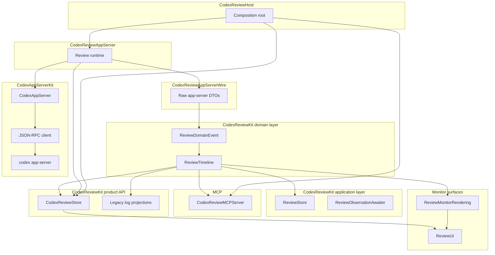

# CodexReviewKit Architecture

CodexReviewKit provides ReviewMonitor, a native macOS app for running and
observing Codex review. The package is organized so the generic app-server
client, review-specific app-server behavior, semantic review events, observable
timeline state, UI rendering, and MCP responses each have a clear owner.

The important architectural invariant is that review progress flows in one
direction:

```text
raw app-server wire
  -> domain review event
  -> observable review timeline
  -> UI / MCP / rendering / legacy log projections
```

Raw JSON-RPC notifications are an input boundary only. They must not become the
source of truth for ReviewMonitor UI, MCP responses, or legacy logs after they
have been converted into domain events.

## Targets

| Target | Responsibility |
| --- | --- |
| `CodexReviewKit` | Review identifiers, kinds, runs, jobs, semantic timeline, application store/use-case primitives, `CodexReviewStore`, auth/settings/runtime product state, and legacy log compatibility projections |
| `CodexAppServerKit` | Generic `codex app-server` process transport, JSON-RPC client, typed request DTOs, and Swift domain API for threads, turns, prompts, models, accounts, and login |
| `CodexReviewAppServerWire` | Raw `codex app-server` review notification DTO decode and conversion into domain events |
| `CodexReviewAppServer` | Review-specific `review/start` orchestration, ReviewMonitor notification routing, and runtime conversion |
| `CodexReviewMCPServer` | MCP-facing projections from observable review/domain state, internal MCP protocol request/response conversion, and Streamable HTTP endpoint |
| `CodexReviewHost` | Runtime composition for ReviewMonitor |
| `ReviewMonitorRendering` | Domain timeline rendering helpers that do not know AppKit/SwiftUI or app-server wire |
| `ReviewUI` | Native monitor UI rendering and user-intent forwarding |
| `CodexReviewTesting` | Deterministic fake backend, fake JSON-RPC transport, gates, manual clock |
| `TextTransitions` | UI text transition view support |

ReviewMonitor is the product entry point. The host target wires the concrete
runtime together; lower targets do not import the host.

## Source Of Truth

`CodexReviewKit` owns the semantic timeline vocabulary. It defines the
review item kinds, timeline item content, and `ReviewDomainEvent` values that
describe review progress independently of any transport, UI, or MCP protocol.

`CodexAppServerKit` owns the generic app-server connection boundary. It starts
the local `codex app-server` process, performs JSON-RPC framing, sends
`initialize`/`initialized`, retries overload responses, preserves unknown
notifications, and exposes `CodexAppServer` as the Swift-facing container for
threads, turns, prompts, messages, transcripts, log entries, models, accounts,
and login flows. It must not import ReviewMonitor targets.

`CodexReviewAppServerWire` owns raw app-server notification shapes. Its job is
to decode review-specific wire payloads and expose domain events. It may depend on
`CodexReviewKit`, but it must not import UI, rendering, or MCP targets.

`CodexReviewAppServer` owns ReviewMonitor's `review/start` runtime behavior. It
uses the generic app-server boundary for transport and common DTOs, converts
review notifications through `CodexReviewAppServerWire`, and hands
application-facing review events to the store. Review wire details stop at this
boundary.

`ReviewTimeline` and application/store state are the observable source of truth
after conversion. UI views, rendering helpers, MCP server projections, and
legacy log support project from the timeline; they do not parse raw app-server
events and do not make string logs authoritative again.

Legacy log support exists for compatibility with older ReviewMonitor surfaces:

- `ReviewLogEntryTimelineProjection` rebuilds semantic timeline state from
  existing log entries during migration or compatibility paths.
- `ReviewTimelineLegacyLogProjection` derives legacy log entries from timeline
  items when old APIs need them.

Those projections are compatibility edges. New behavior should prefer domain
events and timeline state as the owner.

## Target Graph



The diagram describes ownership direction, not every SwiftPM dependency. New
code should not move domain, application, rendering, UI, or MCP projection
responsibilities back into runtime owners.

## Observation Ownership

ObservationBridge is a subscription primitive. It is not storage, cache, or a
source of truth.

- The observable owner keeps semantic state: domain timelines, application
  stores, and product stores.
- Subscription tokens live with the subscriber that created them. A view
  controller, awaiter, or driver that starts observation is responsible for
  cancelling its token when that owner ends.
- `ReviewObservationAwaiter` belongs in `CodexReviewKit` because it is a
  use-case-level awaiter over observable domain state.
- UI observation tokens are view/controller lifetime details. Any UI projection
  derived from observed state is transient and can be rebuilt from the timeline.
- MCP and rendering projections are value snapshots over timeline state. They
  must not retain ObservationBridge tokens or persist their projection as model
  state.

## CodexReviewKit

`CodexReviewKit` is the public product surface used by existing ReviewMonitor code.
It owns review commands, auth/settings/runtime state, network recovery policy,
diagnostics, and legacy store APIs through `CodexReviewStore`.

`CodexReviewStore` remains the command owner for `review_start`,
`review_await`, `review_read`, `review_list`, `review_cancel`, session close,
auth actions, and settings updates. It depends on domain timeline types and
application awaiters instead of owning app-server wire shapes.

`CodexReviewStoreBackend` is the dependency boundary below the store. Live,
preview, and test backends all implement that boundary; product state remains in
the store.

## App-Server Gateway

`CodexAppServerKit` treats raw JSON-RPC as the only live I/O boundary.

- One live `codex app-server` process maps to one shared connection.
- `initialize` and `initialized` run once per connection.
- `config/read`, `account/read`, login, model, thread, and turn methods are
  typed requests in the generic Kit boundary.
- The public Kit API is expressed as `CodexAppServer`, `CodexThreadID`,
  `CodexTurnID`, `CodexThread`, `CodexPrompt`, Foundation Models-style
  `respond` / `streamResponse` / `CodexResponseStream.collect()` calls,
  Codex-specific response stream controls, thread event streams, messages,
  transcript/log values, model values, account values, and login handles.
- Same-thread mutating requests are serialized. `turn/interrupt` is the
  intentional control-path exception so an in-flight response can be stopped
  without waiting behind queued same-thread work.
- Different-thread requests may run concurrently.
- Notifications are routed by turn ID, early turn notifications are replayed to
  later consumers, and schema-new notifications are preserved as unknown domain
  events.
- Cancellation is represented by typed control/cleanup requests, not by closing
  the transport.

`CodexReviewAppServer` adds ReviewMonitor-specific `review/start`, review
notification conversion, cleanup, recovery, and UI-facing orchestration on top
of that generic boundary.

The intended ownership for review logs is that `CodexAppServerKit` supplies
generic app-server thread events and log entries, while ReviewMonitor-specific
targets adapt those values into `ReviewDomainEvent`, `ReviewTimeline`, and
legacy review log projections.

Fake and live tests use the same transport protocol.

## MCP Boundary

`CodexReviewMCPServer` knows MCP tool names, request arguments, response shape,
session headers, Streamable HTTP behavior, and MCP-facing value snapshots from
domain/product state. It calls store commands and projects the review timeline
into MCP tool response shape. It does not know Codex JSON-RPC details and must
not import ReviewUI, the app-server runtime, or app-server wire DTOs.

ReviewMonitor owns the default Streamable HTTP endpoint at
`http://localhost:9417/mcp`. The HTTP boundary follows current MCP session
semantics: `initialize` creates an `MCP-Session-Id`, subsequent requests carry
that session header, responses are delivered as JSON or SSE as negotiated by the
client, and `DELETE` closes a session.

The public tool surface is:

- `review_start`
- `review_await`
- `review_read`
- `review_list`
- `review_cancel`

## Monitor UI Boundary

`ReviewUI` observes product/domain state and forwards user intent.

- Views and view controllers render observable state.
- User actions call store methods.
- UI rendering may use `ReviewMonitorRendering` helpers over `ReviewTimeline`.
- UI code must not import app-server runtime, app-server wire, or
  MCP server targets.
- UI tests cover layout, selection, rendering, accessibility-facing text, and
  user-intent forwarding.
- Review/auth/settings semantics are tested in lower target tests.

`ReviewMonitorRendering` is intentionally lower than UI. It can render domain
timeline values, but it must not import AppKit/SwiftUI UI, app-server, wire, or
MCP targets.

## Testing

Default tests are deterministic and do not start a live `codex app-server`.

| Test area | Uses | Verifies |
| --- | --- | --- |
| `CodexAppServerKitTests` | Fake JSON-RPC transport | Generic app-server handshake, request serialization, retry, notification routing, and domain result aggregation |
| `CodexReviewAppServerWireTests` | Raw notification JSON | Wire decode and domain event conversion |
| `CodexReviewKitTests` | Domain timelines, ObservationBridge awaiters, and fake `CodexReviewStoreBackend` | Semantic timeline mutation, use-case observation behavior, review/auth/settings state machines, cancellation, result retention |
| `CodexReviewAppServerTests` | Fake JSON-RPC transport | Review-specific request serialization, notification buffering, interrupt/cleanup, and recovery |
| `CodexReviewMCPServerTests` | Fake review store and domain timeline projections | MCP protocol conversion, response shape, and timeline projection snapshots |
| `CodexReviewHostTests` | Fake runtime dependencies | Composition, startup, shutdown |
| `ReviewUITests` | Preview/test monitor backend | Native UI behavior and user-intent forwarding |

Forbidden test patterns:

- Sleeping to wait for lifecycle progress when an explicit signal can be used.
- Inspecting fake-only storage as product behavior.
- Starting a live `codex app-server` in default CI tests.
- Testing behavior only because another implementation happened to behave
  differently.
- Parsing raw app-server wire or string logs from UI/MCP tests when a domain
  timeline or store projection can express the behavior.
