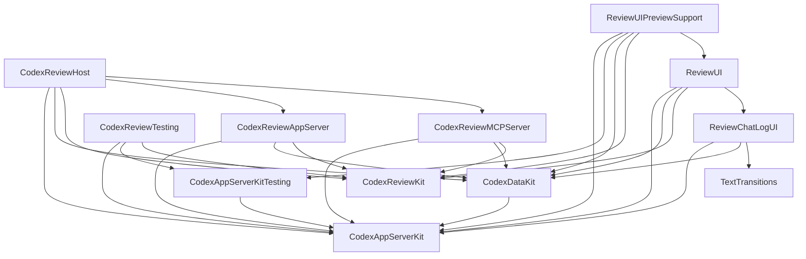

# CodexKit Integration Design

| Item | Decision |
| --- | --- |
| Status | **Approved Phase 2 design** |
| Canonical scope | This is the only source of truth for the CodexKit repository/package topology |
| CodexReviewKit base | `e9240c4d1a3fd71a406a76909f78fdac2af911b6` |
| Imported CodexKit source | `ab025ed970d30c7679913951bdb9fff20a9b77b1` |
| Requirements | macOS 26 or later; Swift 6.3 or later |

This design moves the three CodexKit products into the existing
CodexReviewKit package without changing their module names, public API surface,
owners, or behavior. `Docs/architecture.md` is the derived runtime ownership
view. If another document disagrees about repository or package topology, this
document wins.

## Scope And Consumer Contract

The outcome is one repository and one Swift package that distributes
ReviewMonitor plus `CodexAppServerKit`, `CodexDataKit`, and
`CodexAppServerKitTesting`. ReviewMonitor is the known production consumer. The
separate `Fixtures/CodexReviewKitProductConsumer` package is the distribution
contract consumer for all three products; it is not evidence that every unknown
external consumer can accept the new platform floor.

The integration changes ownership of distribution, versioning, and CI. It does
not redesign runtime behavior, public API, data ownership, or variant handling.
Implementation visibility can change only under the collision rule in
"Access Control" below.

## Target Graph And Owners

An arrow means the source target depends on the destination target. External
dependencies are listed in the owner table rather than in the graph. The graph
is acyclic: app/review targets can depend on generic Codex targets, while generic
targets never depend on review targets.



| Target | Distribution | Owner and direct dependencies |
| --- | --- | --- |
| `CodexAppServerKit` | Public product | Owns the app-server process, transport, protocol/domain conversion, and high-level app-server APIs. It has no internal package dependency |
| `CodexAppServerKitTesting` | Public product | Owns the deterministic in-memory app-server runtime and typed fixtures. It depends on `CodexAppServerKit` |
| `CodexDataKit` | Public product | Owns observable generic Codex models, contexts, queries, membership/order, and snapshot/change streams. It depends on `CodexAppServerKit` and external `AsyncAlgorithms` |
| `CodexReviewKit` | Public product | Owns review-run lifecycle, product policy, commands, auth/settings/runtime state, and MCP command state. Its only package-external implementation dependency is `ObservationBridge` |
| `CodexReviewAppServer` | Internal target | Owns adaptation from high-level app-server review sessions to review lifecycle events. It depends on both generic products and `CodexReviewKit` |
| `CodexReviewMCPServer` | Internal target | Owns MCP protocol conversion, HTTP transport, and CodexChat projections. It depends on the generic products, `CodexReviewKit`, MCP, and SwiftNIO |
| `CodexReviewHost` | Public product | Owns ReviewMonitor runtime composition. It depends on the generic products and review adapter/core/MCP targets |
| `CodexReviewTesting` | Internal target | Owns review-product fakes, gates, and manual clock. It depends on `CodexReviewKit` and both app-server products |
| `ReviewChatLogUI` | Internal target | Owns selected-chat log rendering. It depends on the generic products and `TextTransitions` |
| `ReviewUI` | Public product | Owns ReviewMonitor presentation and user-intent forwarding. It depends on review core, chat-log UI, the generic products, and `ObservationBridge` |
| `ReviewUIPreviewSupport` | Public product | Owns preview composition through the production UI data flow. It depends on ReviewUI/core and all three generic products |
| `TextTransitions` | Public product | Owns text transition rendering and has no internal package dependency |

The target boundaries are retained because they enforce distinct owners and
dependency direction. Moving repositories does not justify merging them.

## Public Products And API Compatibility

Before integration, a consumer resolves a second package and names that package
when selecting products:

```swift
dependencies: [
    .package(
        url: "https://github.com/lynnswap/CodexKit.git",
        revision: "ab025ed970d30c7679913951bdb9fff20a9b77b1"
    ),
]

.product(name: "CodexAppServerKit", package: "CodexKit")
.product(name: "CodexDataKit", package: "CodexKit")
.product(name: "CodexAppServerKitTesting", package: "CodexKit")
```

After integration, only the dependency URL and package identity change:

```swift
dependencies: [
    .package(
        url: "https://github.com/lynnswap/CodexReviewKit.git",
        branch: "main"
    ),
]

.product(name: "CodexAppServerKit", package: "CodexReviewKit")
.product(name: "CodexDataKit", package: "CodexReviewKit")
.product(name: "CodexAppServerKitTesting", package: "CodexReviewKit")
```

The imports and consumer code remain unchanged:

```swift
import CodexAppServerKit
import CodexAppServerKitTesting
import CodexDataKit
```

Product names, module names, and the source-level public API from the imported
CodexKit commit are compatibility invariants. This integration does not add an
umbrella module or re-export one module through another.

## Access Control

Product names, module names, and public API visibility remain unchanged from the
imported CodexKit commit. The migration deliberately does not shrink that
surface because the old repository is already consumable and its complete
external consumer population is unknown. Combining a repository move with a
public visibility reduction would make failures impossible to attribute to one
compatibility change.

`package` and `internal` implementation declarations may be reduced or renamed
only when the single-package integration reveals a same-package collision,
repo-wide search proves the declaration has zero consumers, and owner tests
preserve behavior. This permits deleting the unused package-only
`enqueueAccount(CodexAccount?)` overload instead of annotating unrelated call
sites to select the public test-fixture overload. It does not permit Review
targets to begin consuming APIs that were package-only inside CodexKit; the
repository merge must not weaken the existing target-owner boundary.

`Fixtures/CodexReviewKitProductConsumer` proves that the documented public path
can import, link, and run all three products without `@testable import`. Any
future surface reduction requires a separate API inventory, consumer evidence,
versioning decision, and design gate.

## Platform Trade-off

The former CodexKit package declared macOS 15.4. A Swift package has one package
platform floor, so integration adopts CodexReviewKit's macOS 26 requirement for
all products. Swift 6.3 remains unchanged.

This is an intentional distribution compatibility break for an unknown
consumer that needs macOS 15.4 through 25. Known ReviewMonitor consumers already
require macOS 26. The external fixture also targets macOS 26. The design does not
preserve the older floor with a nested package, wrapper, or duplicate target
graph; existing SHA-pinned consumers can continue resolving the archived
CodexKit repository while they plan a migration.

## Variation Axes

Repository placement is not a runtime variation axis. The imported source stays
behaviorally identical at its public boundary; only the evidence-backed
package/internal collision cleanup defined above may differ. Adding a variant
continues to use the same owner and registration point as before integration.

| Axis | Existing absorber | Integration effect |
| --- | --- | --- |
| Real process versus injected transport | `CodexAppServerKit` configuration/transport boundary | None |
| Observable query, ordering, and mutation policy | `CodexDataKit` model context and query-plan owners | None |
| Live versus deterministic test runtime | `CodexAppServerKit` / `CodexAppServerKitTesting` target boundary | None |
| Generic Codex behavior versus review-product policy | Generic targets / review adapter and core boundary | None |
| App rendering and preview composition | `ReviewUI`, `ReviewChatLogUI`, and `ReviewUIPreviewSupport` | None |

A new variant must not require a repository-location conditional or a second
dependency path. If it does, this design must be revisited before implementation.

## Deletion List

- Delete `dependencies/CodexKit` discovery and the manifest's local-path versus
  remote fallback branch.
- Delete `codexKitFallbackRevision`, the remote CodexKit package dependency, and
  every `.product(..., package: "CodexKit")` edge in the root manifest.
- Delete CodexKit entries from the root and ReviewMonitor workspace
  `Package.resolved` files. Do not retain a pin as an inactive fallback.
- Retire the separately active CodexKit CI/release owner after migration. Its
  workflow is not copied wholesale; CodexReviewKit's existing package build,
  explicit test shards, external product contract, and release verification own
  the imported products.
- Delete README instructions for switching between a local checkout and a
  remote revision or advancing a CodexKit pin.

## Avoided Shapes

- No nested package at `dependencies/CodexKit` or another in-repository package.
  The three modules are root-package targets.
- No Git submodule. Source and history are imported by the migration commit, not
  resolved as a second checkout.
- No wrapper or bridge modules around `CodexAppServerKit`, `CodexDataKit`, or
  `CodexAppServerKitTesting`; consumers import the existing modules directly.
- No giant target that combines the three generic modules or folds them into
  `CodexReviewKit`. Their owners and one-way dependencies remain compiler-enforced.
- No `CodexKit` umbrella product, compatibility re-export, mirror state, or
  package-location runtime switch.

## Test Plan

1. Root package suites: build all tests once, then run
   `CodexAppServerKitTests` and `CodexDataKitTests` as explicit CI shards beside
   the existing review/UI shards. Both names are excluded from the `remaining`
   shard so ownership cannot depend on incidental discovery.
2. External consumer: CI runs
   `swift run --package-path Fixtures/CodexReviewKitProductConsumer`. This clean
   package selects all three products, uses only public imports, and completes
   through the in-memory runtime without a live `codex`, network, or auth.
3. Full package gate: run
   `swift test --build-system swiftbuild --no-parallel` after all branches are
   integrated.
4. Xcode consumer: run
   `xcodebuild test -project Tools/ReviewMonitor/CodexReviewMonitor.xcodeproj -scheme CodexReviewMonitor -destination 'platform=macOS,arch=arm64' CODE_SIGNING_ALLOWED=NO CODE_SIGNING_REQUIRED=NO`.
5. Release verification continues to run full package and ReviewMonitor tests;
   the first integrated release must use the existing signed/notarized local
   archive path before the old repository is archived.

Default acceptance remains deterministic. It must not launch a live app-server
or require network/auth credentials.

## Findings And Resolution

| Finding | Design resolution | Acceptance evidence |
| --- | --- | --- |
| CodexReviewKit can silently drift between a local CodexKit checkout and a reviewed remote revision | One repository commit owns both the generic modules and their consumers; the conditional dependency path is deleted | Root manifest contains no CodexKit dependency or local override; product consumer uses the root package |
| Switching dependency kind and advancing CodexKit causes `Package.resolved` churn in both SwiftPM and Xcode contexts | Remove the CodexKit pin from both resolved files; remaining dependencies resolve once for the single package graph | Root and workspace resolved files contain no `CodexKit` location/identity |
| Same-package lookup can expose dead package-only overloads that were isolated by the old package boundary | Delete or rename only the colliding declaration after repo-wide zero-use evidence; do not annotate consumer call sites or let Review targets adopt old package-only APIs | Zero-use search plus owner and full-package tests |
| CodexKit suites would otherwise land accidentally in the large `remaining` CI shard | Give `CodexAppServerKitTests` and `CodexDataKitTests` dedicated matrix entries and exclusions; run the external consumer in the API-contract job | Workflow structure check plus explicit shard/skip assertions |
| Archiving the old repository too early or destructively could break existing SHA-pinned consumers | Archive only after integration verification and preferably an integrated release; preserve the public repository, source, `Package.swift`, `LICENSE`, commits, tags, and branches | Resolve the old exact SHA from a clean consumer before and after archival |
| The package platform floor rises from macOS 15.4 to macOS 26 | State the break in installation requirements and keep the archived exact-SHA path available; do not add a compatibility topology | README requirement, macOS 26 external fixture, package/Xcode gates |

## Repository Publication And Archive Safety

Repository archival is a publication operation and is not performed by the
integration code change. Use this sequence:

1. Merge and verify the CodexReviewKit integration, including the external
   consumer and ReviewMonitor tests.
2. Preferably publish and verify the first CodexReviewKit release that contains
   all three products.
3. Update the old CodexKit README and repository description to point consumers
   to CodexReviewKit. Keep its source, `Package.swift`, `LICENSE`, complete Git
   history, tags, and branches intact.
4. Verify a clean consumer can still resolve the old exact SHA, then archive the
   public CodexKit repository without renaming, deleting, transferring, or
   rewriting it.
5. Repeat the exact-SHA resolution check after archival.

GitHub documents that archiving makes repository code, commits, tags, branches,
and releases read-only; it does not require deleting them. See
[Archiving repositories](https://docs.github.com/en/repositories/archiving-a-github-repository/archiving-repositories).
Keeping the old URL and objects intact protects existing revision pins while
clearly ending active maintenance in that repository.

Archiving CodexKit, publishing a release, editing its remote README, and changing
repository settings are explicit non-goals of this branch.
