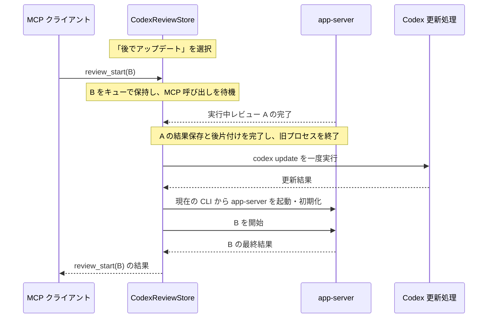

# レビュー要求を Kit 内で待たせて Codex を更新する

状態: 2026-09-26 承認済み。基準は `b19308aa72492797cb4fd7abfbbb28735b4d7cd0`。実装は [親 Issue #382](https://github.com/lynnswap/CodexReviewKit/issues/382) の sub-issue 順に進める。

「後でアップデート」を選ぶと、実行中のレビューを最後まで続け、新たな要求を `CodexReviewStore` のキューに受け付ける。実行中のレビューが終わったら Codex を更新し、app-server を再起動してキューを処理する。Monitor と MCP サーバーは動かしたままにする。

LLM は従来どおり `review_start` を一度呼ぶ。キュー待ちを理由に即座に応答を返したり、要求の再送・待機判断を LLM に任せたりしない。

## 受付から完了までを同じジョブとして扱う

更新予約後も `review_start` を受け付け、既存のジョブ ID とセッション所有権を割り当てる。要求の妥当性と履歴の保存を確認した後、Monitor では `Queued` と表示する。まだ app-server のスレッドや turn は作成しない。

キューに積んだ要求は、実行中レビューの完了、更新、app-server の起動をサーバー内部で待つ。MCP 呼び出しは通常の完了待機につなぎ、同じジョブの最終結果を返す。状態確認とキャンセルは、更新中も通常の MCP API から使える。



「後で」の選択後に届いた要求をキューに保持するため、新しい要求が続いても更新機会は失われない。すでに起動処理に入っていたレビューも、完了を待つ対象に含める。履歴保存中の新規要求は、保存が終わった時点で現在の更新状態を確認してキューへ入れる。

再開時は受付順に既存のレビュー実行処理へ渡す。通常のレビュー並行実行は維持し、1件ずつ完了まで待つ新しい直列実行制約は設けない。受付順には履歴保存の完了順ではなく、Store が要求を受け付けた順序を使う。

### MCP の既存の待機上限は維持する

現在の `review_start` と `review_await` は最大540秒で応答する。キュー待ちもこの呼び出し全体の待機時間に含める。HTTP の heartbeat は接続維持に使い、LLM 向けの新しいメッセージにはしない。

上限までに完了しなかった場合だけ、既存形式のジョブ ID と `queued` / `running` を返す。クライアントは従来の `review_await` で同じジョブを待てる。キューから削除したり、再度 `review_start` を要求したりしない。接続切断もキューの再投入には結び付けない。

この上限を超えても LLM の追加呼び出しを完全になくす保証は、本変更には含めない。固定タイムアウトを持つクライアント側の契約も変える必要があるためである。

## 実装済みの処理から変更する点

| 現在の処理 | 本変更で必要な動作 |
| --- | --- |
| `beginReview` は履歴を保存すると直ちに worker を作り、`running` にする。 | 要求の受付・保存と、worker の開始を分ける。更新予約中はジョブをキューで保持する。 |
| `hasRunningJobs` はすべての未完了ジョブや待機処理を含む。 | 更新開始の判定には、app-server を使用中のレビューとその後片付けを使う。新たにキューへ入ったジョブを完了待ちの対象にしない。 |
| `admitRuntimeReplacement` はレビュー受付を閉じ、履歴保存中の開始要求をキャンセルする。 | 計画的な更新では受付・参照・キャンセルを維持する。実行開始だけをキューで保留する。 |
| app-server 終了時には未完了レビューをまとめてキャンセルする。 | 更新時の終了処理は、実行前のキューをキャンセルしない。明示的なアプリ終了・サインアウトの契約とは区別する。 |
| 更新承認後に `store.shutdown()`、`codex update`、Monitor 全体の再起動を行う。 | Kit が既存 MCP セッションを保って app-server だけを終了・再起動する。 |
| 自動確認は起動時と確認後20時間の間隔で、設定画面には確認操作がない。 | 起動時と起動から8時間ごとに確認し、同じ checker を設定画面からも呼べるようにする。 |

参照:

- [レビューの受付と worker 開始](../Sources/CodexReview/Store/CodexReviewStoreReviews.swift)
- [Store の runtime 差し替えと未完了判定](../Sources/CodexReview/Store/CodexReviewStore.swift)
- [レビュー処理の登録と終了](../Sources/CodexReview/Store/ReviewStoreLifecycle.swift)
- [更新の実行と Monitor の再起動](../Tools/ReviewMonitor/CodexReviewMonitor/ReviewMonitorCodexUpdater.swift)
- [現在の停止確認](../Tools/ReviewMonitor/CodexReviewMonitor/CodexReviewMonitorApp.swift)

## Store がキューと更新中の状態を所有する

新しい package や target は作らない。`CodexReviewStore` をレビューと runtime 状態の正本とする現在の構成を維持する。

| 責務 | 所有者 |
| --- | --- |
| 更新予約、実行済みレビューの完了待ち、キュー、再開 | `CodexReviewStore` |
| ジョブの受付・実行開始・終端の保存 | 既存の履歴 coordinator と `CodexReviewPersistence` |
| app-server の終了・生成・初期化と設定の引き継ぎ | Store の runtime 差し替え処理と `CodexReviewHost` |
| 使用する CLI の解決とプロセス I/O | 既存の Host / AppServer 層 |
| 更新可否の確認、`codex update` の実行 | 既存の更新処理。Store に渡す依存として扱う |
| 起動時・8時間周期の確認、手動確認と確認結果 | `ReviewMonitorCodexUpdater`。設定画面も同じインスタンスを参照する |
| MCP の呼び出しと完了待機 | 既存の MCP adapter と Store |
| 選択肢、更新待ち・更新中・失敗の表示 | アプリと `ReviewUI`。Store の状態を表示する |

アプリ側にレビューの一覧や再投入用の配列を持たせない。待機ジョブの対象・cwd・選択済みモデルは、受付時のレビュー要求から保持する。キューは同じジョブを参照し、UI 用のジョブを別途生成しない。

更新待ちの内部状態は Store が持つ単一の更新操作にまとめる。`ReviewMonitorCodexUpdater` に同じ段階やレビュー残数を複製しない。

### アプリは更新操作を一度呼ぶ

アプリ向けの利用例は次の形とする。名前は提案で、外部向けの汎用メンテナンス API は追加しない。

```swift
try await store.updateCodex(when: .afterCurrentReviews) {
    try await installer.install(plan)
}
```

`updateCodex` は `CodexReviewStore` の ApplicationHostSupport SPI として提供する。タイミングは `afterCurrentReviews` と `immediately` の2つとし、同じ処理で待機と即時更新を扱う。キューの停止・再開や複数の完了通知を呼び出し側に要求しない。

`installer.install(plan)` は `codex update` の完了を返す依存である。テストではこの依存と backend transport を差し替え、Store のキューや runtime 差し替えを本番と同じ経路で動かす。

## 更新はレビューの完了後に一度実行する

更新操作は、受付済みで実行中のレビューについて、最終結果の保存と backend の後片付けまで待つ。既存の cleanup timeout は維持し、追加の無期限待機や「全未完了ジョブがゼロ」という条件は置かない。

その後、旧 app-server の終了を確認して `codex update` を実行する。更新中も MCP サーバー、セッション、ジョブ、待機中の呼び出しは存続する。更新後は既存の CLI 探索で実行ファイルを解決し、認証・設定を読み直して新しい runtime を公開する。公開成功後にキューを既存の worker 開始処理へ渡す。

本案ではダウンロードだけを先行させない。`codex update` は取得とインストールをまとめて行うため、使用中の補助プログラムまで入れ替わる操作をレビューと並行させない。専用のダウンロード状態や二重の更新キャッシュも追加しない。

更新予約中にボタンを再度押しても、更新プロセスやキューのコピーを増やさない。MCP の待機が上限に達しても、同じ更新操作とジョブを維持する。

### 失敗しても受け付けたジョブを失わない

| 状況 | 動作 |
| --- | --- |
| 更新に失敗したが、現在の CLI で app-server を起動できる | 更新エラーを表示し、その runtime でキューを再開する。旧版へ戻せたとは断定しない。 |
| 旧 app-server の終了を確認できない | インストールを始めない。状態と残ったプロセスを報告し、キューを保持する。 |
| 更新後の app-server 起動・認証・設定復元に失敗 | MCP とキューを保持してエラーを表示する。既存の再試行から復旧し、成功後に再開する。 |
| 待機ジョブの `review_cancel`、または所有セッションの明示終了 | app-server に送る前にそのジョブをキャンセルし、履歴と待機中の呼び出しへ結果を返す。 |
| アプリを明示的に終了 | 既存の終了処理に参加する。更新コマンドの実行途中なら、その結果が不明にならないよう完了を待つ。 |

アカウント切替・サインアウト・手動再起動は更新操作と直列化する。既存の確認とキャンセルの契約を保ち、別アカウントへ保留要求を黙って移さない。通常の状態参照まで更新完了待ちにはしない。

## キューを履歴から消さず、実行開始時刻も区別する

待機中も一覧とキャンセルの対象になるため、受付済みジョブを既存の履歴保存に載せる。受付時刻と実行開始時刻を分け、`queued` の段階では実行時間を計測しない。保存失敗は受付失敗として呼び出し元へ返し、メモリだけに受理済みジョブを残さない。

既存の履歴にキュー状態と実行開始の保存を追加し、古いデータは現在と同じ実行済み状態として読めるようにする。新たな保存用ファイルは作らない。

今回保証するのは、Monitor を継続稼働させたままの app-server 更新である。Monitor 自体のクラッシュや終了後に、以前の MCP セッションのジョブを自動実行する機能は追加しない。既存の復元契約に沿って中断した履歴を表示し、要求の重複実行を避ける。

## 操作画面では「後でアップデート」を選べる

レビュー中の確認には「後でアップデート」と、既存の「レビューを停止してアップデート」を用意する。「後で」は今回の更新を予約する選択肢で、単にダイアログを閉じる意味にはしない。

予約後はサイドバーに更新待ちを示し、新たなレビューは `Queued` と表示する。更新処理に進んだら更新中へ切り替え、完了後に通常表示へ戻す。実行中のレビューがなければ、そのまま更新へ進める。

既存のウィンドウ、ログ、アカウント表示は保つ。待機・更新中・失敗・再開を `#Preview` と UI テストから確認できるようにする。

## 起動時と8時間ごとに確認し、設定画面からも確認できる

自動確認は Monitor 起動時に一度、その後は起動から8時間、16時間、24時間という周期で行う。確認処理にかかった時間や、手動で確認した時刻を次回の起点にしない。スリープなどで予定時刻を過ぎた場合は復帰後に一度確認し、過ぎた回数だけ連続実行しない。

アプリ全体で一つの確認処理を共有する。自動確認と手動確認が重なった場合は進行中の確認に合流する。Codex の入れ替え中に確認予定が来た場合も、同じ更新対象へ並行してコマンドを起動せず、更新後に一度確認する。

設定画面に Codex のアップデート確認用 UI を追加する。手動ボタンは確認だけを行い、インストールやレビューの停止・キュー予約を始めない。表示する結果は「確認中」「更新あり」「最新」「このインストールでは確認できない」「確認失敗」を区別し、最終確認時刻とエラーも示す。CLI の選択失敗や未対応のインストール方法を「最新」と表示しない。

確認結果は既存のサイドバーの Update 表示にも反映する。設定画面を閉じても8時間周期は継続し、設定画面を開くたびに監視タスクを作らない。Monitor の確認周期は今回の要求を正本とし、CLI 用の起動時チェック設定を理由に Monitor の手動確認や周期確認を停止しない。

## 3つの実装単位で検証する

1. **Kit のジョブ受付と実行開始を分離する。** キュー、履歴保存、キャンセル、同じ MCP 呼び出しの完了待機を実装する。実行の許可がある通常時には、既存の並行実行を保つ。
2. **MCP を維持する更新操作を実装する。** 実行中レビューの完了待ち、旧 runtime の終了、更新依存の実行、新 runtime の公開、キュー再開を Store が一度の操作として所有する。
3. **更新 UI と確認周期を接続して旧再起動経路を削除する。** 新しい選択肢、起動時・8時間ごとの確認、設定画面の手動確認を接続する。Codex 更新専用の Monitor 再起動ヘルパー・失敗起動引数を削除し、Preview と利用文書を更新する。

親 Issue で順序と完了条件を管理し、1単位を1つの Ready PR にする。各 PR はローカル codex-review、リモートレビュー、CI を通してから main へ統合する。

回帰テストでは、更新予約とレビュー受付が同時に起こる順序、履歴保存中の要求、複数セッションのキュー、待機ジョブのキャンセル、更新・終了・再起動の失敗を確認する。既存の fake backend、transport、時計、gate を使い、時間経過への期待だけで同期しない。

最終確認では、一つの MCP セッションでレビュー A を実行中に後回し更新を予約し、B と C を受け付ける。A の結果を返した後に更新が一度だけ実行され、同じセッション・ジョブ ID で B と C が完了することを確かめる。待機上限に届かない条件では、クライアントの再送・追加の待機ツール呼び出しが不要であることも検証する。

更新チェックは手動時計で起動直後・8時間・16時間の実行を確認する。途中の手動確認で周期が変わらないこと、確認が重複しないこと、設定画面の表示結果とサイドバーが一致することも対象にする。
