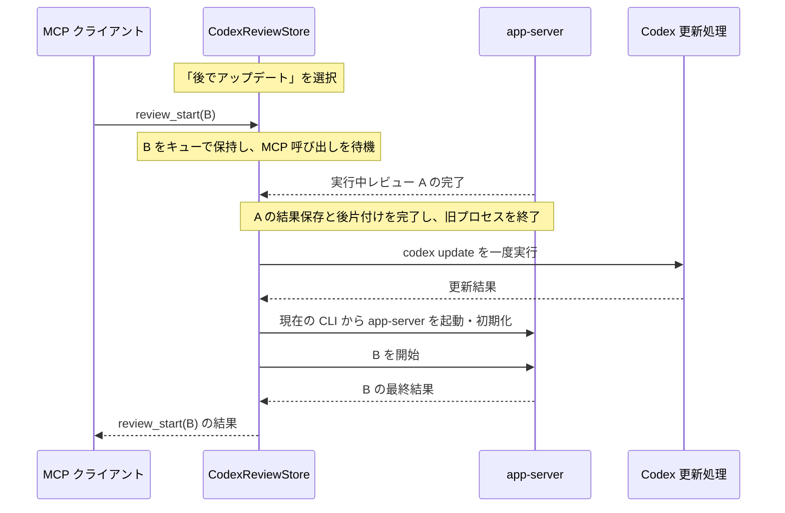

# レビューを待たせて Codex を更新する

2026-09-26 に承認した設計。基準 commit は
`b19308aa72492797cb4fd7abfbbb28735b4d7cd0`、実装の分割は
[親 Issue #382](https://github.com/lynnswap/CodexReviewKit/issues/382) に記録する。
ここでいう変更前の動作は、この commit 時点のもの。
現在の構成は [architecture.md](architecture.md#codex-updates) を参照。

「後でアップデート」を選ぶと、実行中のレビューを最後まで続け、以後の要求を
`CodexReviewStore` のキューに入れる。レビューが終わったら Codex を更新し、
app-server を再起動してキューのレビューを開始する。Monitor と MCP セッションは
その間も維持する。

## 一度の呼び出しで受付から結果を待つ

クライアントは従来どおり `review_start` を一度呼ぶ。Store は要求を検証し、
ジョブ ID とセッションの所有権を割り当て、履歴を保存する。更新予約中は
`Queued` と表示し、app-server のスレッドや turn の作成を待たせる。

MCP 呼び出しは、キュー待ち、更新、レビュー実行を通して同じジョブの結果を待つ。
クライアントに要求を再送させない。状態確認とキャンセルは更新中も使える。


```mermaid
sequenceDiagram
    participant L as MCP クライアント
    participant S as CodexReviewStore
    participant C as app-server
    participant U as Codex 更新処理
    Note over S: 「後でアップデート」を選択
    L->>S: review_start(B)
    Note over S: B をキューで保持し、MCP 呼び出しを待機
    C-->>S: 実行中レビュー A の完了
    Note over S,C: A の結果保存と後片付けを完了し、旧プロセスを終了
    S->>U: codex update を一度実行
    U-->>S: 更新結果
    S->>C: 現在の CLI から app-server を起動・初期化
    S->>C: B を開始
    C-->>S: B の最終結果
    S-->>L: review_start(B) の結果
```

予約後の新規要求はすべてキューに入るため、要求が続いても更新を始められる。
予約前に起動処理へ進んだレビューは完了を待つ。履歴保存中の要求は、保存後に
更新状態を確認して実行か待機を決める。

更新後は Store の受付順でレビューを開始する。履歴の保存完了順は使わない。
開始後は通常どおり並行実行し、先のレビューが終わるまで次を止めることはしない。

### MCP の待機上限は540秒

`review_start` と `review_await` の上限は、キュー待ちを含めて540秒とする。
完了しなければ既存形式のジョブ ID と `queued` / `running` を返し、クライアントは
`review_await` で同じジョブを待てる。時間切れや接続切断でキューへ再投入しない。
HTTP heartbeat は接続維持に使い、LLM 向けのメッセージを増やさない。

540秒を超える場合は追加の待機呼び出しが必要になる。これをなくすには、固定の
タイムアウトを持つクライアント側の契約も変更する必要がある。

## 受付と実行開始を分ける

| 変更前の動作 | この設計での変更 |
| --- | --- |
| `beginReview` は保存後すぐに worker を作り、`running` にする | 受付・保存と worker 開始を分け、更新予約中は待たせる |
| `hasRunningJobs` はすべての未完了ジョブと待機処理を含む | 更新は app-server を使用中のレビューと後片付けだけを待つ |
| `admitRuntimeReplacement` は受付を閉じ、保存中の開始要求をキャンセルする | 更新では受付・参照・キャンセルを維持し、実行開始を保留する |
| app-server 終了時に未完了レビューをまとめてキャンセルする | 更新では実行前のキューを保持する。アプリ終了とサインアウトの契約は保つ |
| `store.shutdown()`、更新、Monitor 全体の再起動を行う | Kit が app-server だけを入れ替え、MCP セッションを維持する |
| 起動時と確認後20時間ごとに確認し、設定画面には確認操作がない | 起動時と起動から8時間ごとに確認し、設定画面からも同じ checker を使う |

関連する実装:

- [レビューの受付と worker 開始](../Sources/CodexReview/Store/CodexReviewStoreReviews.swift)
- [Store の runtime 差し替えと未完了判定](../Sources/CodexReview/Store/CodexReviewStore.swift)
- [レビュー処理の登録と終了](../Sources/CodexReview/Store/ReviewStoreLifecycle.swift)
- [更新処理](../Tools/ReviewMonitor/CodexReviewMonitor/ReviewMonitorCodexUpdater.swift)
- [停止確認](../Tools/ReviewMonitor/CodexReviewMonitor/CodexReviewMonitorApp.swift)

## Store がキューと更新操作を持つ

既存の package と target を使い、レビューと runtime の状態を Store に集約する。

| 処理・状態 | 担当 |
| --- | --- |
| 更新予約、レビュー完了待ち、キュー、再開 | `CodexReviewStore` |
| 受付・実行開始・終端の保存 | 履歴 coordinator と `CodexReviewPersistence` |
| app-server の終了・生成・初期化、設定の引き継ぎ | Store の runtime 差し替え処理と `CodexReviewHost` |
| CLI の解決とプロセス I/O | Host / AppServer 層 |
| 更新可否の確認、`codex update` の実行 | 既存の更新処理を Store へ渡す |
| 自動・手動確認とその結果 | `ReviewMonitorCodexUpdater`。設定画面とサイドバーで共有する |
| MCP 呼び出しと完了待機 | MCP adapter と Store |
| 更新待ち・進行・失敗の表示と操作 | アプリと `ReviewUI` |

キューは受付済みのジョブを参照し、対象・cwd・モデルを受付時の要求から保持する。
アプリに再投入用の一覧や UI 専用ジョブを作らない。更新の段階も Store の一つの
操作で管理し、Updater に複製しない。

### アプリから呼ぶ API

設計時の利用例:

```swift
try await store.updateCodex(when: .afterCurrentReviews) {
    try await installer.install(plan)
}
```

`updateCodex` は ApplicationHostSupport SPI とし、タイミングは
`afterCurrentReviews` と `immediately` を用意する。呼び出し側は一度呼んで
結果を待ち、キューの停止・再開を個別に操作しない。汎用のメンテナンス API は
追加しない。

`installer.install(plan)` は `codex update` の完了を返す。テストではこれと
backend transport を差し替え、Store のキューと runtime の処理を本番と同じ
経路で確認する。

## 終了を確認してから更新する

更新操作は実行中レビューの結果保存と backend の後片付けを待つ。
既存の cleanup timeout を使い、待機ジョブまで含む「全未完了ジョブがゼロ」を
開始条件にしない。

旧 app-server の終了を確認した後で `codex update` を実行する。取得と
インストールを分離できないため、レビューと並行してダウンロードを先行させない。
専用のダウンロード状態や二重のキャッシュも設けない。

更新後は CLI を再探索し、認証・設定を読み直して runtime を起動する。
起動に成功したらキューを worker 開始処理へ渡す。ボタンを再度押した場合や
MCP の待機上限に達した場合も、同じ更新操作とジョブを維持する。

### 失敗時も待機ジョブを保持する

| 状況 | 動作 |
| --- | --- |
| 更新失敗後に現在の CLI で起動できる | エラーを表示してキューを再開する。旧版へ戻ったとは扱わない |
| 旧 app-server の終了を確認できない | インストールを始めず、状態と残ったプロセスを報告してキューを保持する |
| 更新後の起動・認証・設定復元に失敗する | MCP とキューを維持し、既存の再試行で復旧後に再開する |
| 待機ジョブをキャンセルする、または所有セッションを明示終了する | app-server へ送る前にキャンセルし、履歴と待機呼び出しへ結果を返す |
| アプリを明示終了する | 終了処理に参加する。実行中の更新コマンドは結果が確定するまで待つ |

アカウント切替・サインアウト・手動再起動は更新と直列化する。既存の確認と
キャンセルを保ち、待機要求を別アカウントへ移さない。状態参照は更新完了を
待たずに使える。

## 待機中も履歴とキャンセルの対象にする

受付時刻と実行開始時刻を分け、`queued` の間は実行時間を計測しない。
受付履歴の保存に失敗したら要求を失敗として返し、メモリだけに受理済みジョブを
残さない。既存の履歴保存にキューと実行開始を加え、新しい保存ファイルは作らない。
古い履歴は従来どおり実行済みとして読めるようにする。

アプリを継続稼働させている間の更新を対象とする。クラッシュや終了後は既存の
復元処理で中断した履歴を表示し、以前の MCP セッションのジョブを自動実行しない。

## 画面と更新確認

レビュー中は「後でアップデート」と「レビューを停止してアップデート」を提示する。
前者は更新を予約する操作とし、予約後はサイドバーに更新待ち、新規ジョブに
`Queued` を表示する。実行中レビューがなければそのまま更新に進む。
更新開始後は進行中の表示へ変え、完了後に通常表示へ戻す。

既存のウィンドウ、ログ、アカウント表示を保ち、待機・更新中・失敗・再開を
`#Preview` と UI テストで確認する。

自動確認は起動直後と、起動から8時間、16時間、24時間の時点で行う。
確認にかかった時間や手動確認で周期をずらさない。スリープなどで時刻を過ぎたら
復帰後に一度確認し、過ぎた回数分を連続実行しない。

自動・手動確認はアプリ全体で一つの処理を共有し、重なれば進行中の確認を待つ。
インストール中に予定時刻が来たら更新後に一度確認する。設定画面を閉じても
周期を維持し、開くたびに監視タスクを作らない。CLI の起動時チェック設定で
Monitor の確認を停止しない。

設定画面の手動ボタンは確認だけを行う。インストール、レビュー停止、キュー予約は
始めない。「確認中」「更新あり」「最新」「確認できない」「確認失敗」を区別し、
最終確認時刻とエラーを示す。CLI 選択の失敗や未対応のインストール方法を「最新」と
表示しない。結果はサイドバーの Update 表示にも反映する。

## 実装と検証の順序

1. Kit の受付と実行開始を分ける。キュー、履歴、キャンセル、MCP の完了待機を
   実装し、通常時の並行実行を保つ。
2. MCP を維持する更新操作を実装する。レビュー完了待ち、runtime 終了、
   更新、新 runtime の起動、キュー再開を Store が管理する。
3. 更新 UI と確認周期を接続する。Monitor 再起動用ヘルパーと失敗起動引数を
   削除し、Preview と利用文書を更新する。

親 Issue で順序と完了条件を管理し、各単位を一つの Ready PR にする。
ローカル codex-review、リモートレビュー、CI を通してから main へ統合する。

回帰テストは既存の fake backend、transport、時計、gate を使う。
予約と受付の競合、履歴保存中の要求、複数セッション、待機ジョブのキャンセル、
更新・終了・再起動の失敗を対象にする。固定時間の経過だけで同期しない。

最終確認では同じ MCP セッションで A を実行中に更新を予約し、B と C を受け付ける。
A の結果を返した後、更新が一度だけ実行され、同じセッション・ジョブ ID で
B と C が完了することを確認する。540秒以内なら再送や追加の待機呼び出しは不要とする。

手動時計で起動直後・8時間・16時間の確認を検証する。途中の手動確認が周期を
変えないこと、重複実行しないこと、設定画面とサイドバーの結果が一致することも確かめる。
