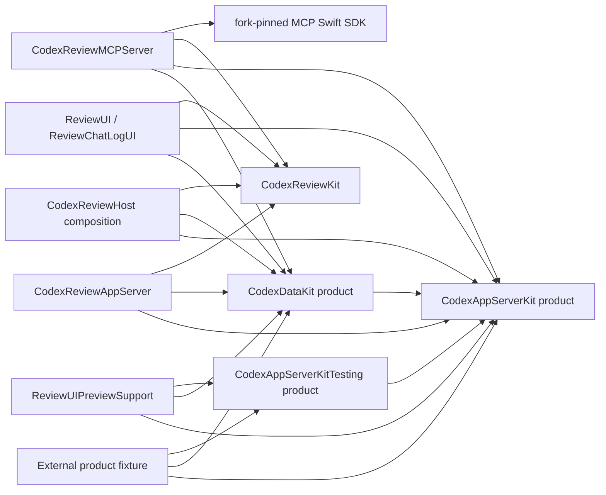

# CodexKit / CodexReviewKit / MCP dependency rearchitecture design（2026-07-10）

> [!NOTE]
> This document is a historical design baseline. Its separate-repository and
> package-topology decisions are superseded by the approved
> [CodexKit Integration Design](codexkit-integration.md), which is the only
> source of truth for the integrated repository/package topology. The evidence
> and runtime/API decisions recorded here remain historical context unless the
> newer design explicitly supersedes them.

| 項目 | 内容 |
|---|---|
| Status | **Approved — design gate 承認済み（2026-07-10）** |
| Evidence baseline | [`design-audit-2026-07-10.md`](design-audit-2026-07-10.md) |
| CodexKit baseline | `3f6216c01c91bf14737e6fe40c30efef7a5bbd04` |
| CodexReviewKit rollback point | `baabd19cbda014dc869f34e0c18121a9fc33a65d` |
| upstream contract | codex `8347b8de2144133f49fd18a20f4ca176deef1d3c` |
| MCP dependency baseline | `modelcontextprotocol/swift-sdk` `0.12.1` / `a0ae212ebf6eab5f754c3129608bc5557637e605`（request child join欠損。fork revisionはdesign承認後に作成して記録） |
| Toolchain | Xcode 26.6 / Apple Swift 6.3.3 |

この文書は `rearchitect` Phase 2 の canonical design doc である。実装中に API、owner、依存方向、互換方針を変える必要が生じた場合は、実装より先にこの文書を更新して design gate の差分を確認する。

## 1. Scope contract

### Outcome

この移行の成果は、次の consumer story を推測や fallback なしで完遂できることである。

1. ReviewMonitor が current upstream v2 の turn outcome、connection termination、login、review identity を typed contract だけで処理できる。
2. CodexDataKit の query、mutation、load、observation がそれぞれ単一 owner を持ち、同じ判断を call site ごとに再実装しない。
3. fake / preview / test が production と同じ wire DTO、request lifecycle、list semantics、cancellation semantics を通る。
4. app-server process、router task、server-request task、observation task、MCP protocol request task の全 retaining handle から明示的な close completion へ到達できる。
5. ReviewMonitor app と MCP server が、同じ typed review identity と CodexChat projection を使用し、review output や thread identity を別々に再導出しない。

### Compatibility policy（承認対象）

- この変更系列では **source-breaking migration を許可**し、CodexKit と repo 内の全 CodexReviewKit consumer を同時に移行する。repo 内互換 shim は置かない。
- runtime wire contract は pinned upstream の **current v2 only** とする。`turn/failed`、`turn/cancelled`、`item/updated`、`agent/message`、legacy `item/fileChange/outputDelta` を通常 router と default fixture から削除する。future/malformed schema を検証する raw test escape hatch は明示 API として残す。
- MCP の外部 tool 名と response field shape（`review_start` / `review_await` / `review_read` / `review_list` / `review_cancel`）は維持する。内部 identity の nested type 化は MCP boundary で既存 field へ flatten する。
- ReviewMonitor の product cancellation-wins、review worker generation guards、MCP session contract、UI の見た目は維持する。
- DataKit sort surfaceは Foundation `SortDescriptor` から `CodexSortDescriptor` へsource-breaking移行し、optional DateとString comparatorを含む現行consumer storyを維持する。
- Review rollout表示はexact UI維持を優先し、typed companion relationで候補を限定した1箇所のtext equalityだけを§13のupstream affordance待ちとして残す。reasoning/general text pairingとraw payload decodeは削除する。
- CodexKit の repository 外 consumer は確認できていない。互換 shim の根拠となる実在 consumer はない。clean external fixture は consumer need の証拠ではなく、public product の compile/link contract proof として追加する。
- `thread/rollback` の upstream replacement と structured interrupt-race error は pinned upstream に存在しない。両項目は §13 の外部契約待ちとして隔離し、存在しない replacement を発明しない。
- MCP Swift SDK 0.12.1の`Server`はrequest childrenをjoinしないため、公式sourceの最小forkをexact revision pinしてawaitable stop contractを追加する。CRKの`.build` checkoutだけをpatchする一時解は採用しない。

### Consumers

| Surface | 第一 consumer | 第二 consumer | Verification |
|---|---|---|---|
| `CodexAppServerKit` | `CodexReviewAppServer`: review session lifecycle | `CodexReviewHost`: account/model/login/connection lifecycle | 別 package `Fixtures/CodexKitProductConsumer` |
| `CodexDataKit` | ReviewMonitor UI | MCP CodexChat projection | 同 fixture |
| `CodexAppServerKitTesting` | CodexKit tests | CodexReviewKit preview / tests | deterministic external fixture run |
| `CodexReviewKit` core | ReviewMonitor app | `CodexReviewMCPServer` | module tests + app tests |
| forked MCP `Server.stop()` | `CodexReviewMCPServer` HTTP lifetime | fork package contract tests | exact-revision dependency fixture + CRK stop tests |
| private `LoginSession` | `LiveCodexReviewStoreBackend` | なし。public abstraction に昇格しない縮退モード | Host lifecycle tests |
| `ReviewChatLogUI` presentation owner | ReviewMonitor detail UI | なし。typed input を consume する internal owner として維持 | ReviewUI tests |

private `LoginSession` と presentation owner には第二の外部 consumer がない。再利用 framework 化を目的にせず、第一 consumer の call site と state ownership の改善だけを acceptance とする縮退モードを適用する。この縮退も design gate の承認対象である。

### Non-goals

- Appendix B の未検証 low 35 件。
- `TextTransitions`、ReviewMonitor の visual redesign、Tools の配布方式。
- client-initiated `fs/*`、`mcpServer/*`、skills、plugins、exec/process、realtime、remoteControl の新 surface。pinned current-v2 が送る inbound `mcpServer/elicitation/request` の response contract は server-request lifecycle の一部としてscope内。
- raw JSON-RPC send escape hatch。
- 外部 process 変更を自動 ingest する live list。今回の freshness contract は「同一 context の mutation は live、外部変更は explicit refresh」で固定する。
- upstream にまだない rollback replacement や structured interrupt error の独自 protocol。
- push、PR、release、tag。local implementation と commit を完了する。portable fork revision pinにはremote fork publishが必要なため、design承認後の実装中にその外部変更だけ別の明示承認を取る。

## 2. Phase 1 baseline

### Repositories and tests

- CodexReviewKit HEAD `baabd19`、local CodexKit HEAD `3f6216c`、MCP Swift SDK exact 0.12.1、exact audit checkout と upstream checkoutをbaselineにする。
- CodexKit `swift test --build-system swiftbuild --no-parallel`: pass。
- CodexReviewKit 同 command: `detailLogKeepsBottomFilledForMultilineStreamDuringLiveWindowResize` が全体実行で 1 回失敗し、単独再実行は pass。監査対象外の既存 flake として移行後比較に残す。
- Phase 1 instrumentation は使用していない。

### Topology and size

| Repository / target | Swift files | LOC | access baseline |
|---|---:|---:|---|
| CodexAppServerKit | 10 | 10,802 | public 597 / package 718 / private+fileprivate 307 |
| CodexAppServerKitTesting | 1 | 1,130 | public 67 / package 9 / private 29 |
| CodexDataKit | 11 | 8,888 | public 203 / package 161 / private+fileprivate 309 |
| CodexReviewKit | 33 | 6,413 | public 97 / package 523 / private 182 |
| CodexReviewAppServer | 2 | 897 | package 21 / private 52 |
| CodexReviewHost | 4 | 2,852 | public 27 / package 18 / private 135 |
| CodexReviewMCPServer | 10 | 2,144 | package 47 / private 73 |
| ReviewChatLogUI | 13 | 11,289 | package 10 / private 525 |
| ReviewUI | 30 | 8,093 | public 9 / package 37 / private 406 |

Largest owner files:

- CodexKit: `CodexDomainTypes.swift` 2,873、`AppServerRequests.swift` 2,342、`CodexAppServerNotificationRouter.swift` 1,572、`CodexModelContext.swift` 2,714、`CodexModel.swift` 2,648。
- CodexReviewKit: `LiveCodexReviewStoreBackend.swift` 2,127、`CodexReviewStoreReviews.swift` 1,401、`AppServerCodexReviewBackend.swift` 879、chat-log projection/target 816/861。
- platform gate は CodexKit 1 file、CodexReviewKit 0 files。残る 1 件は local-process default home の macOS composition policy である。
- CodexKit umbrella target に `@_exported import` が 2 件ある。production source の他の re-export はない。

### Numbered findings

1. **RA-01 — umbrella boundary**: `CodexKit` product が `CodexAppServerKit` と `CodexDataKit` を `@_exported import` で再結合し、consumer の依存選択を失わせている。
2. **RA-02 — terminal outcome owner**: `CodexTurnStatus.isFailure` と collector/progress/DataKit/CRK が completed/interrupted/failed/caller cancellation/invalid terminal を別々に分類する。
3. **RA-03 — request error owner**: transport、client、factory の error が public taxonomy に写像されず、JSON-RPC `data`、request ID、method、decode、spawn、deadline が失われる。
4. **RA-04 — resource lifecycle owner**: router task cycle、await しない stop、ownerless cancellation/server-request tasks、process backstop 不在、raw history と serializer lane の無期限保持が同じ connection lifecycle に接続されていない。
5. **RA-05 — wire compatibility owner**: invented native login、protocol-invalid default `{}`、`serverRequest/resolved` 無視、current/historical notification 混在に明示 policy がない。
6. **RA-06 — item/account merge owner**: command delta / file snapshot / optional item ID / sparse rate-limit update が境界で意味付けされず、partial value が authoritative snapshot を上書きする。
7. **RA-07 — query mutation/load owner**: mutation strategy が handler ごとに散り、concurrent `load()` が cursor/items/phase を古い generation から commit できる。
8. **RA-08 — query contract**: predicate/sort/section lowering が render 中に crash し、archived scope と external freshness が暗黙、sort signature は reflection に依存する。
9. **RA-09 — fake and fixture contract**: fake list は archived/sort を無視し、unstubbed request と cancellation を成功化し、current wire DTO が tests/preview に複製される。
10. **RA-10 — connection/observation lifecycle**: warning/retry/deprecation/termination は raw/side-channel、chat observation は一 slot で release completion を await できない。
11. **RA-11 — login state owner**: Host の 9 state values と 8 reset clusters に単一 terminate owner がない。
12. **RA-12 — review output owner**: adapter/store/MCP が optional output、3 段 fallback、run storage、projection absence と refresh failure を重複処理する。
13. **RA-13 — review identity owner**: source/active thread と attempt identity が optional String 群へ type erase され、`"attempt-1"` と resume-to-cancel が第二経路になる。
14. **RA-14 — presentation input**: typed item kind/content/turn relationを捨て、raw payload/text equality、duplicated marker ID、full re-projection、item status 再導出を UI が所有する。
15. **RA-15 — dead/test-only surface**: 未使用 `CodexReviewHost` class/direct backend と 107/124 mechanical testing forwarders が owner boundary を曖昧にする。
16. **RA-16 — upstream affordance gaps**: deprecated rollback と interrupt race の string error は local owner 整理だけでは意味論を完結できない。
17. **RA-17 — MCP dependency lifecycle**: Swift SDK `Server.start`がrequestごとにuntracked Taskを生成し、`Server.stop()`がreceive/request childrenをjoinしないため、CRK ownerだけではshutdown completionを証明できない。

## 3. Target / product design

### Candidate A — existing packages, direct products, owner types（推奨）

- CodexKit と CodexReviewKit の別 package は維持する。別 repo、独立 version/pin、external consumer という package 境界の事実がある。
- CodexKit 内は `CodexAppServerKit`、`CodexDataKit`、`CodexAppServerKitTesting` の 3 products を consumer が直接選ぶ。
- `CodexKit` umbrella product/target/test を削除する。
- AppServerKit 内の transport/client/router/connection/replay は同 target の package/internal owner として分ける。public consumer story は 1 つであり、wire/runtime target を増やす配布上の根拠はない。
- CodexReviewKit の既存 target graph は維持し、Host class ではなく production composition function/store を entry point とする。

### Candidate B — AppServerKit を facade/wire/runtime targets に分割

依存方向を compiler で強制できる一方、同じ public session story・release cadence・platform・consumer を持つ 718 件の package contract を複数 target に固定し、wire DTO、router、client の lockstep 変更を常に跨がせる。独立 consumer も dependency isolation も確認できないため、現時点では file-bucket target 化のコストが勝つ。

### Decision

Candidate A を採用する。構造上の決め手は「別 product を選ぶ実 consumer は存在するが、AppServerKit 内部 owner を別 target として選ぶ consumer は存在しない」ことである。



umbrella 削除後の `Package.swift` は次の direct-product matrix に固定する。umbrella import で偶然見えていた ID、item、status は `CodexAppServerKit` の直接依存として宣言する。

| CodexReviewKit target | `CodexAppServerKit` | `CodexDataKit` | `CodexAppServerKitTesting` |
|---|:---:|:---:|:---:|
| `CodexReviewKit` | — | — | — |
| `CodexReviewAppServer` | ✓ | ✓ | — |
| `CodexReviewMCPServer` | ✓ | ✓ | — |
| `CodexReviewHost` | ✓ | ✓ | — |
| `CodexReviewTesting` | ✓ | — | ✓ |
| `ReviewUI` | ✓ | ✓ | — |
| `ReviewChatLogUI` | ✓ | ✓ | — |
| `ReviewUIPreviewSupport` | ✓ | ✓ | ✓ |
| AppServer / Host tests | ✓ | 必要な SUT API に限る | ✓ |
| MCP tests | ✓ | ✓ | fixture を使う場合のみ ✓ |
| ReviewUI tests | ✓ | ✓ | ✓ |

CodexKit 自身では `CodexDataKit -> CodexAppServerKit`、`CodexAppServerKitTesting -> CodexAppServerKit` の既存方向を維持する。ただし Swift module import は再 export ではないため、上表の consumer は source で直接使う module をすべて明示 import する。

`CodexAppServerKit` target 内の owner direction:

```text
CodexAppServer facade
  -> ConnectionSupervisor (only close authority, shared completion, leases)
      -> AppServerConnection (actor-confined client/router/reducer/resource references)
          -> AppServerClient (request ID, encode/decode, deadline, error mapping)
              -> JSONRPCTransport (framing/I/O/process only)
          -> AppServerNotificationDecoder (single exhaustive current-v2 switch)
          -> NotificationRouter (typed routing only; Task を所有しない)
          -> TurnReplayStore / ThreadEventHub / AccountEventHub / ServerRequestRegistry
```

## 4. Target owner map

| Owner | State / authority | Invariant |
|---|---|---|
| `ConnectionSupervisor` | child exit channel、router/control Task handles、shared close task | 唯一のTask/close authority。single shared lease objectをretainせず、childはexit signalだけをactor methodへ送り、supervisor-owned close Taskがfull closeを実行する |
| `AppServerConnectionLease` | connection全handleで共有するstrong supervisor reference、`ProcessTerminationToken` | handle→single lease→supervisorの一方向。explicit async closeだけがfull closeを保証し、last copy deinitは同期process terminate backstopだけを実行する |
| `AppServerConnection` | connection state、transport、router/reducer/client values、registry references | child/close/handler Task handlesを所有せず、supervisorが実行するchild bodyとphase operationを提供する |
| `ProcessTerminationToken` | process group identity と同期 terminate signal | explicit close を primary とし、deinit は child-process leak の backstop |
| `JSONRPCTransport` | frame read/write、inbound envelope stream、close phases、process reap | live transportはI/O reader/drain/process waiterだけ、test transportはin-memory channel waiterだけを所有し、domain decode/handler Taskを所有しない |
| `AppServerClient` | request ID、request deadline、decode/error mapping | request failure は requestID/method/data を失わない。`CancellationError` を包まない |
| `RequestSerializer` | scoped lane occupancy とcancel-aware waiter continuation | caller Taskがoperation completionを所有し、idle laneはlast leave/cancel後に除去 |
| `RequestOperationState` | pre-write / written / response-bound / cleanup-complete commit point、caller-cancel bit | caller cancellationとwire operationを分離するchecked `Sendable` value。post-writeはresponse/required cleanupまでlaneを保持してから`CancellationError`を返す |
| `AppServerNotificationDecoder` | raw method/params → current-v2 domain event | 単一 exhaustive switch。historical alias、malformed payloadを正常eventへ補完しない |
| `NotificationRouter` | typed thread/turn routing | run Task、subscriber、generation checkpoint、terminal historyを所有しない |
| `TurnReplayStore` | active raw generation、weak generation-state registrations | terminal compact snapshotをstateへ渡してraw generationを削除し、自身はterminal snapshot/leaseをretainしない |
| `ThreadEventHub` | reusable threadごとのcurrent compact generation、request前generation checkpoint、bounded subscribers | global append-only historyを持たず、early eventをcheckpointへroutingしてsuccess時だけcurrent generationへcommit。generation reset/connection closeで旧compact stateを解放する |
| `TurnGenerationHandleState` | live connection lease / terminal compact snapshot / connection terminationの排他的state | public/package handle copyが共有する唯一のgeneration transition owner。terminalでleaseをnil化し、replay storeからはweak registrationだけを受ける |
| `TurnOutcomeClassifier` | terminal response → exhaustive outcome | output の有無から unknown/nil/running を success にしない |
| `ServerRequestRegistry` | `CodexServerRequestID` → handler Task/responder | handler Taskの唯一のowner。resolved/closeでcancel + await、method-specific responseのみencode |
| `AccountEventHub` | last rate-limit snapshot、subscribers | sparse update mergeを型自身の `merging` 1 箇所で所有 |
| `ConnectionEventHub` / `ConnectionTerminationArbiter` | supervisor isolation内のbounded diagnostics、subscribers、first terminal reason | routerにhistoryを持たせず、late subscriberへcompact terminal 1件だけreplay。arbiterは`ConnectionSupervisor` actor-confined valueとして最初のsignalをawaitなしでclaimし、別actorへのhopで受理順を変えない |
| `LoginRegistry` / `LoginHandleState` | active login ID + weak state registration、ID-correlated winner、post-success account-readiness barrier、cancel/lease | login winner/readinessの唯一owner。registry→state cycleを作らず、broad account streamへcompletionを流さない |
| `CodexItemReducer` | current item snapshot + typed delta/snapshot | command append、patch snapshot、metadata preservationを1 ownerで実行 |
| `CodexThreadQueryPlan` | validation、archive scope、server/local filter、effective sort + stable typed-ID tie-break、mutation strategy | query/mutation/orderの意味論を call site に漏らさない。created/updatedはstable recency cursorで全件列挙後にlocal sort |
| `CodexModelContainer` / package `CodexModelContextCoordinator` | borrowed app server、eager MainActor context、context-family association | facadeは`Equatable` + checked `Sendable`でserver close authorityを持たない。contextは内部coordinatorを保持し、facade lifetimeへmulticastを依存させない |
| `CodexDefaultSerialModelExecutor` | private model context とserial job queue | `@unchecked Sendable`をこの型に限定し、contextをpublic getterからescapeさせず全accessを同executor jobへ閉じる |
| `FetchedResultsLoadCoordinator` | queued intent、cursor/window、in-flight completion | load intentを直列化し、stale completionをcommitしない |
| `CodexFetchedResults` | descriptor/context、current items/sections/phase、newest full old/new snapshot transaction、subscribers | query/current value/observationの単一owner。relayはbuffer newest 1、consumer mismatchはnew snapshot replace、owner deinitでfinish |
| `ChatObservationOwner` | one upstream pump、subscriber leases、upgrade-to-include-turns、close task | multi-subscriber、last closeでpump cancel + await |
| `ChatObservationReleaseSignal` | lock-protected lease-ID event queue、receiver waiter、terminate bit | `CodexChatObservation.close/deinit`からactor hopなしで同期sendできるchecked `Sendable` endpoint。ownerだけがreceiverをdrainする |
| `CodexAppServerTestThreadStore` | snapshots、archived membership、order、mutations、explicit planned start/fork fixtures | list/read/resume/archive/deleteが同じ fake stateを見る。requestからrequired ID/clock/runtime metadataをfabricateしない |
| `CodexAppServerTestNotificationEmitter` | opaque Testing current-v2 fixture + shared wire DTO encoder + test transport ingress | lossy production snapshot/reducer aggregateからwireを再構成せず、Testing fixtureが保持するcanonical DTOだけをencodeする |
| `CodexAppServerTestServerRequestInjector` | test request envelope/response completion | shared codec、registry、handler、response encoderを必ず通る |
| CRK `ReviewAttempt` | attempt ID、source/active thread、turn、model | backend attempt確立前はqueued。running/recoveryは必ずattemptを持つ |
| Host `LoginSession` | immutable purpose、operation state、root Task、shared termination completion | runtime/handle/challenge mirrorを持たず、internal Taskはterminateを呼ばない。全外部exitがreason付きasync terminateへ収束 |
| Host `LoginOperationState` | explicit phase、runtime ownership、handle、provisional terminal decision、eventual result、cleanup handoff | root TaskとMainActor sessionの共有owner。session/rootを相互retainせず、purpose別commit pointとlate bindを1つのstate machineで裁定する |
| Host `AccountRegistryStore` | registry schema/migration、immutable auth revisions、shared `auth.json` activation、active selection、account metadata、orphan GC、serialized mutation lease | load/switch/remove/sign-out/add-account/sign-in reconciliationの唯一のpersistence owner。active LoginSession中の別mutationをtyped rejectし、atomic registry replace前後のcrash semanticsを全operationで統一する |
| Host `AccountRuntimeTransitionCoordinator` | mutation/login lease、expected account/signed-out state、runtime-preserving stop/start completion、login final resolver、final-shutdown arbitration、UI publication | shared-auth mutation・unconfirmed primary login・top-level final stopとprimary AuthManager cacheの唯一のbridge。leaseをnew runtime account validationまたはdurable reconciliation-debt handoffまで保持し、double stopとold runtime eventをgeneration rejectする |
| Host `HostRuntimeSession` | accepted runtime generation、app server/model container、connection/account subscriptionsとconsumer Task handles、lifecycle callback state、shared stop completion | runtime task/callback/closeの唯一owner。nonnil/nil callbackとevent commitをgeneration-guardし、consumer childはstopを呼ばずexit signalだけ返す |
| Preview `PreviewRuntimeLifetime` | preview stream/notification Task handles、Testing runtime/container、shared stop completion | preview store backendが所有し、`CodexReviewStore.stop()`でcancel + await + TestRuntime closeを完遂する |
| `ReviewRestartCoordinator` | token state、deprecated `thread/rollback` exactly-once、restart shared completion/retry budget、retained cleanup identities | review restartの唯一owner。token single-use/invalid化とcleanup-vs-restartを裁定し、deprecated wire methodをconsumerへ漏らさない |
| `InterruptRaceResolver` | terminal-known fast path、pinned upstreamのstale/no-active message分類、固定retry budget | interrupt raceのcompat判断を1 ownerへ隔離し、parser/retry stateをSDK/CRK consumerへ複製しない |
| CRK adapter | SDK outcome/identity/error → transport-independent CRK event/attempt/failure | mapping は境界で1回だけ。output欠損もtyped failureのままstoreへ届く |
| CRK `ReviewThreadRetentionRegistry` | in-memory pending ownership/run ID + account/home + source-ordered identities、crash-cleanup journal、unpersisted cleanup quarantine、retirement completion | terminal projection/thread lifetimeをin-memory store run lifetimeへ揃える。known identityをpublication前にclaimし、routine runtime restart/account switchではdeleteせず、final store retirementまたはjournal-commit failure cleanupだけが`cleanupReview` authority |
| CodexChat projection | review output / log content | run lifecycle は transcript textを保存しない |
| `ReviewOutputPublicationBarrier` | transient completed output + terminal DataKit cursor/refresh completion | `.succeeded` publish前にCodexChat projectionへ同一nonempty outputが到達したことを検証し、完了後はtextを保持しない |
| MCP `MCPReviewSessionRegistry` | session open/closing/closed、session→run membership、shared close completions | run/session isolationとsession-close cancellationの唯一owner。closed linearization後はstart/read/await/cancelを受理しない |
| MCP `MCPHTTPServerLifetime` | listener/channel、cleanup/timeout、per-session transport/request/heartbeat Task handles、shared stop completion | HTTP/MCP長寿命Taskの唯一owner。stream callbackからownerless Taskを作らず、server stopで全session/taskをdrain |
| forked MCP protocol `Server` | receive-loop structured task group、request children、pending request continuations、shared stop completion | `stop()` return時にprotocol request child 0。handlerはstopを自己awaitせずexit signalだけ返す |
| CRK store cancellation arbiter | pending product cancellation、per-run cancellation operation handle、shared completion/waiters | accepted cancel commandをstore-owned completionまで進め、backend terminalとのraceでは既存 cancellation-winsを維持 |
| CRK `ReviewStoreRuntime` / `ReviewStoreCommitSink` | worker/cancellation Task handlesとcycle-free weak MainActor commit endpoint | store→runtime→Task、Task→immutable backend/run values + weak sinkの一方向。Taskはstore/runtimeをstrong captureしない |
| CRK `ReviewWorkerState` | attempt generation、typed execution phase、network phase、result/recovery child state、prepared restart token、held connection terminal | closed signal enumを1 parent task groupで裁定し、stale generationを拒否する |
| CRK `ReviewRunPresentation` | durable `ReviewRunCore` + transient `ReviewExecutionPhase` → status/lifecycle/cancellable | UI/MCP表示の唯一owner。stored String/mirror stateを持たない |
| `ReviewTurnPresentationPolicy` | per-turn review marker membership、user-prompt visibility、companion policy適用 | cross-item visibilityをtyped turn factsからtargeted reconcileし、document全再投影しない |
| `ReviewRolloutPresentationPolicy` | typed companion/target pairのdisplay equality | §13のscoped text比較の唯一owner。semantic identity/mergeには使わない |
| ReviewChatLogUI projection | typed item presentation | raw JSON/text identityをsemantic identityにしない |

### 4.1 Isolation and task ownership contract

各 worker は次の isolation / task lifecycle をそのまま実装する。表にない型が長寿命 Task、continuation、subscriber、process、lease を保持し始めた場合は、実装を進めず owner map を更新して design gate を再確認する。

| Owner | Isolation | Task creator | Task handle / completion owner |
|---|---|---|---|
| `ConnectionSupervisor` | package actor | `AppServerConnection.runInbound` router childと`transport.waitForProcessExit()` control childを起動 | child handles、shared close Task、first exit signal、full-close completionの唯一owner。childは`recordExitSignal` actor methodへreasonを渡すだけでfull closeをawaitしない。methodがsupervisor-owned close Taskをcreate/joinし、そのTaskはchild handle集合に含めない |
| `AppServerConnection` | supervisorから生成されるpackage actor | Taskを作らずrouter/control child bodyとphase operationを提供 | Task handle/completionを保持しない。registry actor/transport等のresource referenceだけを保持 |
| `AppServerConnectionLease` | `Synchronization.Mutex` stateを持つchecked `Sendable` final class | Taskを作らない | connection全handleが同一instanceを共有し、supervisor + process token + terminate-once bitをmutex内に閉じる。deinitは`ProcessTerminationToken.terminateOnce()`だけでactorへsignalしない。supervisorはleaseをretainしない |
| `ProcessTerminationToken` | lock-protected synchronous value | Taskを作らない | process-group identityとterminate-once bitだけを所有。async process waiter/reap completionはlive transportが所有 |
| live `ProcessJSONRPCTransport` | package actor | stdout reader、stderr drain、process waiter Tasksを生成 | reader/drain/waiter handles、pending response continuations、inbound finish completionのowner。`beginClose`はnew I/O拒否、stdin close、`ProcessTerminationToken.terminateOnce()`を開始するがbuffer済みresponseをdrainするまでrequest continuationをfinishしない。`waitUntilClosed`はreader/channel drain、`reapProcess`はprocess waiter completion |
| test `InMemoryJSONRPCTransport` | package actor | 必要なin-memory inbound pumpだけを生成 | pump handle、request/notification waiters、inbound finish completionのowner。process token/reapは持たない |
| `AppServerClient` | `AppServerConnection` actor-confined value | request/retry/deadlineはcallerのstructured task groupだけ | stored Taskを持たない。handshake completionまでfacade/leaseを公開せず、shared initialize Taskを削除 |
| `CodexItemReducer` / `NotificationRouter` | `AppServerConnection` actor-confined values | Taskを作らない | request waiterは`RequestSerializer`、subscription/replayは専用ownerへ渡す |
| `RequestSerializer` | package actor | Taskを作らない | queued waiterはcancel時即remove。active laneはpre-write cancelだけ即releaseし、written後はcorrelated response + method-required cleanupまで保持する。same operationのcleanupだけがscoped lane tokenでreentrant sendでき、last leave後にlaneを削除 |
| `RequestOperationState` | `Synchronization.Mutex` checked `Sendable` value | callerがcancellation-shielded local operation Taskを1つ生成しhandleをscope終了までawait | write acceptance/response identity/caller-cancel/cleanup completionをexactly once記録。Task handleを保存・detachせず、callerはcancel後もcompletionをawaitする |
| `TurnReplayStore` | package actor | Taskを作らない | live generation subscribers + weak handle-state registrationsを所有し、terminal snapshotをstateへ渡してraw historyを解放 |
| `ThreadEventHub` | `Synchronization.Mutex` stateを持つchecked `Sendable` final class | Taskを作らない | threadごとのcurrent compact generation、request前checkpoint、bounded subscriber channel、connection failure terminalを所有。subscription cancellation endpointは同期remove/resumeしactor hopを作らない |
| `TurnGenerationHandleState` | package actor | Taskを作らない | `.live(lease) → .terminal(compactSnapshot)` または `.terminated(error)` を一度だけ遷移し、live leaseを同transactionでrelease。collect/cancel/closeConnectionが同stateを読む |
| `ServerRequestRegistry` | package actor | configured handler Taskを生成 | handler handle/responderの唯一owner。resolved/closeでcancel + await |
| `AccountEventHub` | package actor | Taskを作らない | subscriber continuationとfinish completionを所有 |
| `ConnectionEventHub` / `ConnectionTerminationArbiter` | `ConnectionSupervisor` actor-confined package value。subscriber cancellation endpointだけ`Synchronization.Mutex` checked `Sendable` | Taskを作らない | bounded diagnostic subscriber、terminal replay、first-terminal-wins reasonを所有。supervisorのstored `firstTermination` / `firstDomainError`はarbiterへ置換し、独立actorを追加しない |
| `LoginRegistry` | package actor | cancel requestはcaller/LoginSessionのstructured Taskだけ | active ID + weak stateだけを保持し、routerが一時strong化してmatching IDへresolve |
| `LoginHandleState` | `Synchronization.Mutex` stateを持つchecked `Sendable` final class | Taskを作らない | pending/bound/successAwaitingAccountUpdate/terminal、result waiter collection、connection leaseをmutex内に閉じる。success winnerは後続account updateまでwaiterを保持し、各caller cancellation/terminalがexactly once resumeする |
| `CodexModelContainer` / package `CodexModelContextCoordinator` | containerは`Equatable` + checked `Sendable`、coordinatorは`@MainActor`。mutable main contextも`@MainActor` | Taskを作らない | containerはborrowed app serverとmain contextをeager保持。各contextはcoordinatorをstrong保持し、coordinatorはmain contextをweak登録するためcycleを作らず、facade deallocation後もlive context familyのassociationを失わない |
| `CodexDefaultSerialModelExecutor` | `final class: @unchecked Sendable, SerialExecutor` | callerが渡すexecutor jobだけをprivate serial queueへenqueue | private `CodexModelContext` + queueのowner。context getterをpublicにせず、jobだけが同unowned executor上でaccess |
| `FetchedResultsLoadCoordinator` | model-context isolationへcaller-confined、`Sendable`にしない | queued load Taskをcontext isolation上で生成 | intent、in-flight handle、caller continuation、atomic commitの唯一owner |
| `CodexFetchedResults` | model-context isolationへcaller-confined | Taskを作らない | descriptor/current values/full old/new snapshot transactionとbuffer-newest-1 subscribersを単独所有し、owner deinitでfinish |
| `ChatObservationOwner` | model-context isolationへcaller-confined、`Sendable`にしない | generation pumpとlease relayを生成 | pump handle、relay、upgrade/close completionを所有。`CodexChatObservation`はhandleだけを持つ |
| `ChatObservationReleaseSignal` | `Synchronization.Mutex` checked `Sendable` final class | Taskを作らない | lease IDのsync sendとsingle async receiveを線形化。generation pumpのstructured release childだけがreceiveし、owner closeでterminate + joinする |
| Testing store/transport/emitter/injector | public/package actor | transportだけがin-memory I/O childを生成 | 各actorが自身のrecord/channelをexplicit runtime/transport closeまでにfinish |
| production cancellation waiter token | `Synchronization.Mutex` stateを持つchecked `Sendable` value/class | Taskを作らない | request lane、login result、turn/review/account/connection iterator、load/observation waiterのcontinuation + pending/resumed bitだけを持ち、onCancelが同期exactly-once resume。shared operation/generationはcancelしない |
| Testing gate/deadline clock/waiter token | `Synchronization.Mutex` stateを持つchecked `Sendable` final class | Taskを作らない | pending/resumed/closedとcontinuationをmutex内に閉じ、caller cancellation/open/advance/closeのいずれかがexactly once resume |
| CRK `CodexReviewStore` / cancellation arbiter | `@MainActor` | `ReviewStoreRuntime`へworker/cancellation operationをinstall | storeがgeneration/attempt/cancellation transitionを直列化する。`stop()`だけがruntimeのasync drainをawaitし、isolated deinitはsynchronous cancel signalだけ |
| CRK `ReviewStoreRuntime` / `ReviewStoreCommitSink` | runtimeは`@MainActor` final class、sinkはweak storeを持つ`@MainActor` final class | runtimeがper-run worker Taskとaccepted product-cancellation Taskを生成 | runtimeがhandles/shared completionsを保持。Task bodyはimmutable backend/run/generationとweak sinkだけをcaptureし、commitごとに短くMainActorへhopする。store/runtimeをasync method全体でstrong retainしない |
| CRK adapter attempt registry | package actor | Taskを作らない | attempt ID→SDK `CodexReviewSession`のlive owner。interrupt/cleanup/restartが同sessionを操作しcleanupでremove |
| CRK `ReviewThreadRetentionRegistry` | package actor + crash journal | final store retirementまたはunpersisted-identity quarantine recovery時だけcaller-owned cleanup Taskを生成 | publication前pending claim→durable live-run entryを所有し、runtime-preserving stopでは保持。commit failureはsame runtime cleanup、二重failureはgates-closed quarantine。final stop/resetがrun resolver removal→matching runtime cleanup→journal removalをawaitし、startupはrecord復元がないため残存journalをorphan cleanupする |
| CRK `BackendReviewAttempt` | immutable Sendable value | Taskを作らない | required attempt + observed-terminal operation/probe + single finalizerを渡し、terminal state/queueを複製しない。completed barrier ownerはfinalizerだけ |
| CRK review worker / `ReviewWorkerState` | `@MainActor` parent + structured child task group | result operation / connectivity recovery childを生成 | parent workerがclosed `ReviewWorkerSignal`だけを裁定して全childをcancel + awaitし、generation/network/phaseを所有。custom unbounded input queue/event bridgeを持たない |
| `ReviewOutputPublicationBarrier` | model-context isolationへcaller-confined | Taskを保存せずworker structured scopeでterminal refresh/cursor waitを実行 | completed outputとprojection after-valueを一時比較し、success/failure completionだけを返す |
| MCP `MCPReviewSessionRegistry` | package actor | session close cancellation childをstructured task groupで生成 | membership、closed bit、close task/completionのowner。run cancellationはstore-owned cancellation completionをjoin |
| MCP `MCPHTTPServerLifetime` | package actor + NIO event-loop confinement | accept/cleanup timer、per-session request/heartbeat/stream Tasksを生成 | all handles、stream disconnect completion、shared stop taskを保持。callbackはactorへeventを送るだけでTaskを生成しない |
| forked MCP protocol `Server` | dependency actor | receive-loop task group内でrequest childを生成 | forked Serverがreceive loop/request children/pending continuationsを保持し、`stop()`がcancel + drain + joinする |
| Host `LoginSession` | `@MainActor` caller-confined class | root login Taskとdecision付きshared termination Taskを生成 | closingはprovisional decision + completion、closedだけがfinal resultを保持。root Task自身はterminateをawaitせずall callersはsame completionへ収束 |
| Host `LoginOperationState` | package actor | Taskを作らない | purpose、phase、borrowed/owned runtime、handle、first decision、eventual result、cleanup ownershipを所有。root/session双方がstrong retainするがsession/root Taskは互いをcaptureしない |
| Host `AccountRegistryStore` | package/private actor | Taskを作らない | on-disk mutationはcaller structured operationで実行。mutation lease、registry generation、atomic replace、revision GC、shared-auth activation completionを直列化する |
| Host `AccountRuntimeTransitionCoordinator` | `@MainActor` final class | account/login reconciliation/final-shutdown transition Taskを1つ生成 | shared completion、mutation/login lease、old HostRuntimeSession stop/new staging start、expected-account validation、final resolver/stop handoffを所有。consumer childからself stopをawaitしない |
| Host `HostRuntimeSession` | `@MainActor` final class | connection/account consumer Tasksを生成 | generation、sequence cancel handles、consumer handles、lifecycle callback installed bit、shared stop Taskを所有。consumer closureはsequence + immutable event sinkだけをcaptureしsession/backendをstrong captureしない |
| Preview `PreviewRuntimeLifetime` | `@MainActor` final class | preview stream/notification Tasksを生成 | Task handles、Testing runtime/container、stop Taskを所有。Task closureはruntime value/event sinkだけをcaptureしlifetime/storeをstrong captureしない |
| `ReviewRestartCoordinator` | package actor | restart operation Taskを必要時に1つだけ生成 | token context、shared restart completion、fixed retry budget、cleanup identitiesを保持。cleanup/runtime closeがin-flight restartをcancel + awaitしてlate sessionをcleanupする |
| `InterruptRaceResolver` | package actor-confined value | Taskを作らない | terminal-known fact、message parser、固定retry counterを1 operation scopeに閉じ、sleep/retry completionはcallerが所有する |
| presentation policies / adapters / classifiers / query plans | immutable `Sendable` valuesまたはcaller-confined stateless values | Taskを作らない | completion/stateを保持しない |

`@unchecked Sendable` はprivate non-Sendable model contextをqueue invariantで閉じる`CodexDefaultSerialModelExecutor`と、platform process primitiveを`Mutex` stateに格納できない場合の`ProcessTerminationToken`だけに限定する。lease、login state、gate、deadline clock、waiter tokenは`Synchronization.Mutex`でchecked `Sendable`にする。model graph、observation handle、load coordinator、Host sessionにはuncheckedを付けない。`CodexModelContainer`はapp serverのchecked SendabilityとMainActor-isolated eager contextでchecked `Sendable`にする。Taskを生成するownerとhandleを保持するownerを分ける場合は表に明記された supervisor/worker 間の移譲だけとし、fire-and-forget Taskを作らない。

## 5. Public API sketch

### 5.1 Turn terminal contract

```swift
public enum CodexTurnStatus: Equatable, Sendable {
    case inProgress
    case completed
    case interrupted
    case failed
    case unknown(rawValue: String)

    public init(rawValue: String)
    public var rawValue: String { get }
}

public enum CodexThreadStatus: Equatable, Sendable {
    case notLoaded
    case idle
    case systemError
    case active(activeFlags: [CodexThreadActiveFlag])
    case unknown(rawValue: String)

    public init(rawValue: String)
    public var rawValue: String { get }
}

public struct CodexTurnSnapshot: Identifiable, Equatable, Sendable {
    public enum State: Equatable, Sendable {
        case inProgress
        case completed
        case interrupted
        case failed(CodexTurnError)
        case unknown(rawValue: String, error: CodexTurnError?)
    }

    public var id: CodexTurnID
    public var state: State
    public var itemsLoadState: CodexTurnItemsLoadState
    public var items: [CodexThreadItem]
    public var startedAt: Date?
    public var completedAt: Date?
    public var duration: Duration?
    public var status: CodexTurnStatus { get }
    public var error: CodexTurnError? { get }

    public init(
        id: CodexTurnID,
        state: State,
        itemsLoadState: CodexTurnItemsLoadState = .full,
        items: [CodexThreadItem] = [],
        startedAt: Date? = nil,
        completedAt: Date? = nil,
        duration: Duration? = nil
    )
}

public struct CodexGenerationOptions: Equatable, Sendable {
    public var model: String?
    public var approvalMode: CodexApprovalMode?
    public var sandbox: CodexSandbox?
    public var cwd: URL?
    public var effort: CodexReasoningEffort?
    public var serviceTier: String?
    public var summary: CodexReasoningSummary?
    public var outputSchema: CodexJSONValue?
    public var personality: CodexPersonality?
    public var clientUserMessageID: String?

    public init(
        model: String? = nil,
        approvalMode: CodexApprovalMode? = nil,
        sandbox: CodexSandbox? = nil,
        cwd: URL? = nil,
        effort: CodexReasoningEffort? = nil,
        serviceTier: String? = nil,
        summary: CodexReasoningSummary? = nil,
        outputSchema: CodexJSONValue? = nil,
        personality: CodexPersonality? = nil,
        clientUserMessageID: String? = nil
    )
}

public enum CodexTurnOutcome: Equatable, Sendable {
    case completed(CodexResponse)
    case interrupted(CodexResponse)
    case failed(CodexFailedTurn)
    case invalidTerminalStatus(
        rawStatus: String,
        error: CodexTurnError?,
        response: CodexResponse
    )

    public var response: CodexResponse { get }
}

public struct CodexFailedTurn: Equatable, Sendable {
    public var response: CodexResponse
    public var error: CodexTurnError

    package init(response: CodexResponse, error: CodexTurnError)
}

package enum CodexTurnEvent: Equatable, Sendable {
    case started(CodexTurnID)
    case snapshot(CodexTurnSnapshot)
    case terminal(CodexTurnOutcome)
    // item/message/usage/diagnostic cases
}

package enum CodexReviewEvent: Equatable, Sendable {
    case turnStarted(CodexTurnID)
    case snapshot(CodexTurnSnapshot)
    case terminal(CodexTurnOutcome)
    // item/message/usage/diagnostic cases
}

package enum CodexReviewProgress: Equatable, Sendable {
    case running(
        transcript: CodexTranscript,
        usage: CodexTokenUsage?
    )
    case terminal(CodexTurnOutcome)
}

package struct CodexResponseStream: AsyncSequence, Sendable {
    package typealias Element = CodexTurnEvent
    package func collect(timeout: Duration? = nil) async throws -> CodexTurnOutcome
    package func cancel() async throws -> CodexTurnCancellation
    package func closeConnection() async
}

public struct CodexThread: Identifiable, Sendable {
    // Options/ResumeOptions and id/workspace/model remain baseline-public.
    public func respond(
        to prompt: CodexPrompt,
        options: CodexGenerationOptions = .init(),
        timeout: Duration? = nil
    ) async throws -> CodexTurnOutcome
    public func respond(
        to prompt: String,
        options: CodexGenerationOptions = .init(),
        timeout: Duration? = nil
    ) async throws -> CodexTurnOutcome
    public func respond(
        options: CodexGenerationOptions = .init(),
        timeout: Duration? = nil,
        @CodexPromptBuilder prompt: () throws -> CodexPrompt
    ) async throws -> CodexTurnOutcome
    public func startReview(
        target: CodexReviewTarget,
        delivery: CodexReviewDelivery = .inline
    ) async throws -> CodexReviewSession
    public func cancelActiveTurn(
        expectedTurnID: CodexTurnID? = nil
    ) async throws -> CodexTurnCancellation
    public func read(includeTurns: Bool = false) async throws -> CodexThreadSnapshot
    public func listTurns(_ query: CodexTurnQuery = .init()) async throws -> CodexTurnPage
    public func rename(to name: String) async throws
    public func compact() async throws
    public func archive() async throws
    public func unarchive() async throws -> CodexThreadSnapshot
    public func delete() async throws
    public func closeConnection() async

    package func rollback(turnCount: Int = 1) async throws
}

public struct CodexReviewSession: Identifiable, Sendable {
    public var id: CodexTurnID { get }
    public let threadID: CodexThreadID
    public let turnID: CodexTurnID
    public let reviewThreadID: CodexThreadID
    public let model: String?
    public let initialTurn: CodexTurnSnapshot
    public var identity: CodexReviewIdentity { get }
    public var sourceThreadID: CodexThreadID { get }
    public var activeTurnThreadID: CodexThreadID { get }
    public var associatedThreadIDs: [CodexThreadID] { get }
    public var cleanupThreadIDs: [CodexThreadID] { get }

    public func collect(timeout: Duration? = nil) async throws -> CodexTurnOutcome
    public func terminalOutcomeIfKnown() async throws -> CodexTurnOutcome?
    public func cancel() async throws -> CodexTurnCancellation
    public func closeConnection() async
}

public enum CodexErrorInfo: Equatable, Sendable {
    case contextWindowExceeded
    case sessionBudgetExceeded
    case usageLimitExceeded
    case serverOverloaded
    case cyberPolicy
    case httpConnectionFailed(httpStatusCode: UInt16?)
    case responseStreamConnectionFailed(httpStatusCode: UInt16?)
    case internalServerError
    case unauthorized
    case badRequest
    case threadRollbackFailed
    case sandboxError
    case responseStreamDisconnected(httpStatusCode: UInt16?)
    case responseTooManyFailedAttempts(httpStatusCode: UInt16?)
    case activeTurnNotSteerable(turnKind: String)
    case other
    case unknown(rawValue: String)
}

public struct CodexTurnError: Error, Equatable, LocalizedError, Sendable {
    public var message: String
    public var info: CodexErrorInfo?
    public var additionalDetails: String?

    public init(
        message: String,
        info: CodexErrorInfo? = nil,
        additionalDetails: String? = nil
    )
}

public struct CodexResponse: Identifiable, Equatable, Sendable {
    public var turnID: CodexTurnID
    public var transcript: CodexTranscript
    public var usage: CodexTokenUsage?
    public var startedAt: Date?
    public var completedAt: Date?
    public var duration: Duration?
    public var id: CodexTurnID { get }

    public init(
        turnID: CodexTurnID,
        transcript: CodexTranscript = .init(),
        usage: CodexTokenUsage? = nil,
        startedAt: Date? = nil,
        completedAt: Date? = nil,
        duration: Duration? = nil
    )
}
```

Rules:

- server-side interrupt is `.interrupted`; terminal failed is `.failed`; caller Task cancellation throws `CancellationError`.
- `CodexResponseStream.collect()` / iterator の Task cancellation と early break は local consumption だけを止め、server turn を暗黙に interrupt しない。server-side stop は `cancel()` だけが所有する。
- handle を返さない `CodexThread.respond(...)` convenience は開始した turn の completion owner なので、caller cancellation / overall timeout 時に turn interrupt とその acknowledgement を完了してから throw する。
- current-v2 status decoderが認識するraw valueは `completed` / `interrupted` / `failed` / `inProgress` だけとする。`success` / `succeeded` / `cancelled` / `aborted` / `started` 等のhistorical aliasは正規化せず `.unknown(rawValue)` として保持し、terminal位置では `.invalidTerminalStatus` にする。
- `CodexTurnStatus.inProgress.rawValue` は`"inProgress"`である。`CodexThreadStatus`も`notLoaded/idle/systemError/active`だけを既知としてdecodeし、historical `closed`を`.notLoaded`へaliasしない。
- terminal notification の `.inProgress` / unknown status は `.invalidTerminalStatus`。required status欠損やturn payload decode失敗は `CodexAppServerError.malformedNotification` であり、空の `CodexResponse` をfabricateしない。
- raw statusが`failed`なのにrequired `Turn.error` が欠けるpayloadもmalformed notificationであり、`.failed`を生成しない。`CodexFailedTurn.error` がclassifier boundaryでnon-optionalになるためconsumer guardは不要である。
- raw statusがknown `inProgress/completed/interrupted`なのに`Turn.error`がnonnilのpayloadもillegal current-v2 productとしてmalformed notificationにし、errorをsilent dropしない。future `.unknown(rawValue:error:)`だけはunknown statusに付随するoptional errorを保持し、terminal classifierの`.invalidTerminalStatus(rawStatus:error:response:)`までlosslessに渡す。
- pinned current-v2 `Turn` のrequired `status`はdecoder boundaryで必ず`CodexTurnSnapshot.State`へ変換する。`failed`だけがassociated `CodexTurnError`を要求し、`inProgress/completed/interrupted`はerrorを保持できない。future raw statusだけはforward-compatibleな`.unknown(rawValue:error:)`へlosslessに投影する。`startedAt/completedAt/durationMs`はそれぞれ`Date?/Date?/Duration?`へ変換し、response timingと同じ値を保持する。production snapshotはwire DTOそのものではなく、この合法状態だけを公開するdomain projectionである。
- transport EOF/connection close before terminal is `CodexAppServerError.connectionTerminated`, not an outcome and not synthetic success/failure。
- response/session handle の `collect(timeout:)` は `.turnDeadlineExceeded(turnID:duration:)` をthrowしてhandleを維持し、callerが`cancel()`を選べる。handleを返さない`respond(timeout:)`は上記cleanupを完了する。
- `CodexTurnCancellation` はinterrupt controlが対象にしたthread/turnのcorrelation valueで、terminal outcomeが`.interrupted`だった証明ではない。generation stateが既にterminalならsession `cancel()`はwire requestを送らず同target valueを返し、cached outcomeを変更しない。product側は先にcommitしたpending cancellationとcached backend outcomeをCRK arbiterで裁定する。generic `CodexThread.cancelActiveTurn`はgeneration stateを持たないためterminal-known shortcutを使わない。
- `CodexTurnStatus.isFailure`、current `turnFailed` event、`.closed/.notLoaded` outcome synthesis を削除する。
- `CodexChat` はgeneric load phaseからcompactな `CodexChatPhase` へ分ける。terminal response/transcriptはturn/itemsだけが所有し、phaseはturn IDとclassifierが確定したdispositionだけを保持する。
- upstream `TurnError.message/codexErrorInfo/additionalDetails` は `CodexTurnError` にlossless decodeする。`CodexResponse.errorMessage` は削除し、failed outcomeだけが `CodexFailedTurn.error` をnon-optionalで公開する。表示文はそのtyped errorからderiveする。既知のJSON-RPC error `data` 内に同じshapeがある場合も同じdecoderを使い、`CodexServerError.data` のraw bytesも保持する。
- strict-status testsは分ける: historical alias、required status欠損、terminal `inProgress`、failed+missing error、known nonfailed+nonnil error、future unknown+error preservation、turn payload malformed。malformed caseがoutcome streamへ到達しないことも検証する。

### 5.2 Error and deadline contract

```swift
public enum CodexAppServerError: Error, Equatable, LocalizedError, Sendable {
    case launch(CodexLaunchFailure)
    case request(CodexRequestFailure)
    case connectionTerminated(CodexConnectionTermination)
    case turnDeadlineExceeded(turnID: CodexTurnID, duration: Duration)
    case malformedNotification(CodexMalformedNotification)
    case reviewRestartUnavailable(CodexReviewRestartToken.ID)
    case loginAlreadyInProgress
}

public struct CodexRequestFailure: Error, Equatable, LocalizedError, Sendable {
    public var requestID: Int
    public var method: String
    public var purpose: CodexRequestPurpose
    public var kind: Kind

    public enum Kind: Equatable, Sendable {
        case encode(message: String)
        case write(CodexTransportFailure)
        case transport(CodexTransportFailure)
        case server(CodexServerError)
        case invalidResponse(expectedType: String, message: String, rawData: Data?)
        case deadlineExceeded(Duration)
        case overloadRetryExhausted(last: CodexServerError, attempts: Int)
    }
}

public enum CodexRequestPurpose: Equatable, Sendable {
    case handshake
    case operation(String)
}

public struct CodexServerError: Error, Equatable, LocalizedError, Sendable {
    public var code: Int
    public var message: String
    public var data: Data?
    public var turnError: CodexTurnError?

    public init(
        code: Int,
        message: String,
        data: Data? = nil,
        turnError: CodexTurnError? = nil
    )
}

public enum CodexTransportFailure: Error, Equatable, LocalizedError, Sendable {
    case closed
    case io(errno: Int32?, message: String)
    case framing(message: String, rawData: Data?)
    case protocolViolation(message: String, rawData: Data?)
    case contractViolation(message: String)
}

public enum CodexLaunchFailure: Error, Equatable, LocalizedError, Sendable {
    case executableNotFound(command: String, searchedPath: String?)
    case scaffold(path: String, message: String)
    case spawn(executable: String, errno: Int32?, message: String)
}

public struct CodexMalformedNotification: Error, Equatable, LocalizedError, Sendable {
    public var method: String
    public var message: String
    public var rawData: Data?
}

package struct CodexAppServerClock: Sendable {
    package var now: @Sendable () -> Date

    package init(now: @escaping @Sendable () -> Date = { Date() })
}

package struct CodexDeadlineClock: Sendable {
    package var sleep: @Sendable (Duration) async throws -> Void

    package static var continuous: Self { get }
}

public struct CodexReviewCleanupFailure: Equatable, Sendable {
    public var threadID: CodexThreadID
    public var message: String

    public init(threadID: CodexThreadID, message: String)
}

public struct CodexReviewCleanupResult: Equatable, Sendable {
    public var attemptedThreadIDs: [CodexThreadID]
    public var failures: [CodexReviewCleanupFailure]
    public var succeeded: Bool { get }

    public init(
        attemptedThreadIDs: [CodexThreadID],
        failures: [CodexReviewCleanupFailure]
    )
}

public actor CodexAppServer {
    public struct Configuration: Sendable {
        public struct Deadlines: Equatable, Sendable {
            public var handshake: Duration?
            public var request: Duration?

            public init(
                handshake: Duration? = nil,
                request: Duration? = nil
            )
        }

        public var localProcess: LocalProcess
        public var clientName: String
        public var clientVersion: String
        public var deadlines: Deadlines
        package var clock: CodexAppServerClock
        package var serverRequestHandler: CodexAppServerRequestHandler?

        public init(
            localProcess: LocalProcess = .init(),
            clientName: String = "CodexAppServerKit",
            clientVersion: String = "1",
            deadlines: Deadlines = .init()
        )

        package init(
            localProcess: LocalProcess = .init(),
            clientName: String = "CodexAppServerKit",
            clientVersion: String = "1",
            deadlines: Deadlines = .init(),
            clock: CodexAppServerClock = .init(),
            serverRequestHandler: CodexAppServerRequestHandler?
        )
    }

    public init(configuration: Configuration = .init()) async throws
    public func startThread(
        in workspace: URL,
        instructions: CodexInstructions? = nil,
        options: CodexThread.Options = .init()
    ) async throws -> CodexThread
    public func startReview(
        in workspace: URL,
        target: CodexReviewTarget,
        instructions: CodexInstructions? = nil,
        options: CodexThread.Options = .init(),
        delivery: CodexReviewDelivery = .inline
    ) async throws -> CodexReviewSession
    public func resumeThread(
        _ id: CodexThreadID,
        options: CodexThread.ResumeOptions = .init()
    ) async throws -> CodexThread
    public func resumeReview(
        _ identity: CodexReviewIdentity,
        threadOptions: CodexThread.ResumeOptions = .init()
    ) async throws -> CodexReviewSession
    public func prepareReviewRestart(
        _ identity: CodexReviewIdentity,
        threadOptions: CodexThread.ResumeOptions = .init()
    ) async throws -> CodexReviewRestartToken
    public func restartPreparedReview(
        _ token: CodexReviewRestartToken,
        target: CodexReviewTarget,
        delivery: CodexReviewDelivery = .inline,
        threadOptions: CodexThread.ResumeOptions = .init()
    ) async throws -> CodexReviewSession
    public func discardPreparedReviewRestart(
        _ token: CodexReviewRestartToken
    ) async -> [CodexReviewIdentity]
    public func discardAllPreparedReviewRestarts()
        async -> [CodexThreadID: [CodexReviewIdentity]]
    @discardableResult
    public func cleanupReview(
        _ identity: CodexReviewIdentity,
        additionalCleanupThreadIDs: [[CodexThreadID]] = []
    ) async -> CodexReviewCleanupResult
    public func forkThread(
        _ id: CodexThreadID,
        options: CodexThread.Options = .init()
    ) async throws -> CodexThread
    public func unarchiveThread(_ id: CodexThreadID) async throws -> CodexThread
    public func archiveThread(_ id: CodexThreadID) async throws
    public func deleteThread(_ id: CodexThreadID) async throws
    public func listThreads(
        _ query: CodexThreadQuery = .init()
    ) async throws -> CodexThreadPage
    public func models(includeHidden: Bool = false) async throws -> [CodexModel]
    public func account(refreshToken: Bool = false) async throws -> CodexAccount?
    public func configuration() async throws -> CodexConfiguration
    public func updateConfiguration(_ patch: CodexConfigurationPatch) async throws
    public func rateLimits() async throws -> CodexRateLimits
    public func logout() async throws
}
```

`cleanupReview` は review lifecycle cleanup の唯一の public authority である。attempt順・source-last順と各delete failureをtyped resultで返し、failureが1件でもある場合はrestart coordinatorのretained identityを保持してdurable callerの再試行を可能にする。resultを使わないbest-effort callerは`@discardableResult`で同じcontractを呼ぶ。failureを捨ててretained identityも破棄するvoid overloadや、別名の`cleanupReviewReportingFailures`は置かない。

`prepareReviewRestart` / `restartPreparedReview` / `discardPreparedReviewRestart` / `discardAllPreparedReviewRestarts`は`ReviewRestartCoordinator`へ委譲し、tokenごとのstateを次に固定する。後二者は別packageのCRK adapterとHost runtimeがinvalidation完了とretained identity移譲をawaitするためのpublic close authorityであり、coordinator stateやHost固有型は公開しない。

```swift
package actor ReviewRestartCoordinator {
    package struct Context: Sendable {
        package let token: CodexReviewRestartToken
        package let interruptedIdentity: CodexReviewIdentity
        package let rollbackThreadID: CodexThreadID
        package var rollbackCompleted: Bool
        package var restartAttemptsUsed: Int
    }

    package enum State: Sendable {
        case preparing(
            Context,
            completion: Task<PreparationOutcome, Never>,
            invalidationRequested: Bool
        )
        case prepared(Context)
        case restarting(
            Context,
            signature: RestartInvocationSignature,
            completion: Task<RestartExecutionOutcome, Never>,
            invalidationRequested: Bool
        )
        case invalidating(
            Context,
            completion: Task<Void, Never>
        )
    }

    package func invalidate(
        _ token: CodexReviewRestartToken
    ) async -> [CodexReviewIdentity]
    package func invalidateAllAndWait()
        async -> [CodexThreadID: [CodexReviewIdentity]]
}
```

`prepareReviewRestart`は検証/登録だけではない。active reviewをresume→interruptし、typed interrupted terminal acknowledgementまでawaitしてcleanup identitiesをsource-keyed ordered registryへretainした後にだけtokenを返す。`.preparing` shared completionがこのentire operationを所有し、concurrent prepareはrejectする。caller cancellation/cleanupはinvalidation bitを先にlinearizeしcompletionをcancel + awaitするため、外へ返していないtoken/sessionを残さない。intentional interrupted terminalはcoordinator acknowledgementでありCRK product terminalへ再送しない。

`restartPreparedReview`はfull token ID + interrupted identityを検証し、`.prepared`だけがattempt budgetを1消費して`.restarting`へ進む。`rollbackCompleted == false`ならdeprecated `thread/rollback(turnCount: 1)`をexactly once成功させ、flagを**次のawaitより前**にactor stateへcommitしてからsource resume/startへ進む。coordinatorはdelay/automatic retryをしない。最大2 restart invocationのうちCRK recoveryは1回だけを使い、2回目はexplicit public caller retry専用である。

同じtokenへのconcurrent restartはtarget/delivery/optionsから作る`RestartInvocationSignature`が同一なら`.restarting`のshared completionへjoinし、異なればbusy/unavailableをthrowする。waiter Task cancellationはwaiterだけを外しshared operationを止めない。successはnew review identityをsource-keyed retained cleanup listへ追加し、token entryを同じactor turnでremoveしてconceptual consumedにする。operation failure/cancellationがlate `CodexReviewSession`を得た場合はそのsessionをinterrupt/closeしてidentityをretained listへ追加してからprepared/invalidated completionを返す。

failure dispositionは次で固定する。

| Failure point | Token disposition |
|---|---|
| restart claim前のcaller cancellation | `.prepared`維持、budget未消費 |
| rollbackの明示server rejection | budget残ありなら`.prepared(rollbackCompleted:false)` |
| rollback write/responseが不明なconnection termination / invalid response | token invalid化。二重rollbackしない |
| rollback成功後のsource resume failure | budget残ありなら`.prepared(rollbackCompleted:true)` |
| `review/start` pre-write failure / 明示server rejection | budget残ありなら`.prepared(rollbackCompleted:true)` |
| `review/start` post-write response loss / invalid identity response | token invalid化。duplicate reviewを推測して再startしない |
| session取得後のcaller/cleanup cancellation | late session interrupt/release/identity retain後にinvalid化 |
| budget exhaustion | invalid化 + `.reviewRestartUnavailable` |

final run retirement、CRK cancellation、Host runtime closeはtoken invalidation authorityである。invalidationが`.preparing/.restarting`と競合した場合は`invalidationRequested`を線形化してnew callerを拒否し、`.invalidating(shared completion)`でoperationをcancel + awaitし、late replacement sessionをidentity listへ取り込んでからreturnする。restart completionがinvalidation後にsessionをpublishする経路はない。CRK cancellationとpreserving runtime closeは返されたidentitiesをsame in-memory runの`ReviewThreadRetentionRegistry` journalへmergeし、threadをdeleteしない。durable ownership + run publicationを終えたidentityはtop-level final store stop/resetだけが全runをresolver/UIからatomic retireした後に`cleanupReview`へ渡す。publication前journal failureのquarantine cleanupはこのlifetime policyの例外で、visible runを削除するのではなくownership確立不能なupstream artifactを即時rollbackする。consumed/invalidatedはconceptual terminalで、identitiesをcaller/retentionへ移した同じactor turnにtoken mapからentryを削除しcoordinator内tombstoneを蓄積しない。missing/consumed/invalidated/budget exhaustedは同じtyped unavailableで、別source tokenへfallbackしない。runtime closeは`invalidateAllAndWait()`→retention mergeをadapter registry releaseより先に完了する。

Request ID は encode より先に採番するため、encode/write/server/decode/timeout/retry exhaustion のすべてが `requestID`、`method`、`purpose` を持つ。server busy と retry exhaustion のtop-level caseは置かない。transport readのterminal failureは接続全体の `connectionTerminated`、特定requestのencode/write/decode/server failureは `request`、turnを待つ期限だけは `turnDeadlineExceeded` がownerである。

`.write` はencode済みoutbound envelopeのI/O write失敗、`.transport(.contractViolation)` はsend seamがresponseを開始する前に同期的に拒否したcontract failure（strict test fake等）だけに使う。production inbound framing/protocol/EOF failureはconnection-wide terminationであり、個別requestへ二重包装しない。

`CodexAppServerClock` は `currentTime/read` response用wall clockだけである。handshake/request/turn deadlineはpackage `CodexDeadlineClock.sleep` だけを使い、live compositionは `ContinuousClock`、testsはmanual monotonic clockを注入する。wall clockのadvanceや`Task.sleep`でdeadlineを試験しない。

`deadlines.handshake` が設定されている場合は initialize request送信から initialized notification write完了までの全handshakeを囲み、generic request deadlineより優先する。nilなら `deadlines.request` をinitializeにも適用する。どちらの場合もinitialize request IDをcorrelation IDとし、failureは `purpose: .handshake` で返す。default deadline は `nil` とし、inter-event-gap timeout は設けない。`CancellationError` はどの層でも包まず、retry queueからも除去する。

caller cancellationはrequest write acceptanceをcommit pointに分ける。queued lane waiterまたはtransportがrequestを受理する前ならoperationを除去してlaneをreleaseし、wire effectなしで`CancellationError`を返す。write acceptance後はlocal `RequestOperationState`へcancel bitだけを立て、caller-owned cancellation-shielded operation Taskがcorrelated response/connection terminalを観測するまでlaneを保持する。通常requestはresponseをdecodeしてshared stateをcommitせず`CancellationError`を返す。handle-producing/mutating operationは次のcleanup matrixを同じscoped lane token内で完遂してからthrowする。local Task handleは必ずcaller scopeがawaitし、client/serializerへ保存もdetachもしない。

| Post-write cancelled operation | Required completion before `CancellationError` |
|---|---|
| standalone `startThread` | returned thread IDをbindし、同lane tokenでdelete acknowledgementまでawait |
| `forkThread` | returned fork IDをbindし、delete acknowledgementまでawait |
| workspace/thread `startReview` | review response identity/sessionをbindし、interrupt→terminal acknowledgementをawait。workspace convenienceはcreated source+detached threadをcleanup、existing `CodexThread` methodはdetached threadだけcleanupしsourceを残す。review request前にcancelならworkspace convenienceの作成済みsourceだけdelete |
| `loginChatGPT` | start response ID/URLを`LoginHandleState`へbindし、URLを開かずcancel winner→connection lease releaseまでawait |
| resume/read/list/config/account等 | correlated response/terminalまでlaneを保持し、resultをcallerへ返さずthrow。server effectを推測でrollbackしない |

same-scope次operationは上表completionより先にlaneへ入れない。post-write response自体がconnection terminalで失われた場合はfull connection closeがserver-side orphan cleanup authorityとなり、そのcompletion後に`CancellationError`ではなくfirst terminal `CodexAppServerError.connectionTerminated`を返す。

### 5.3 Internal transport contract

```swift
package enum CodexServerRequestID: Hashable, Sendable, Codable {
    case integer(Int64)
    case string(String)
}

package protocol JSONRPCTransport: Sendable {
    func send(_ request: JSONRPC.RequestEnvelope) async throws
        -> JSONRPC.ResponseEnvelope
    func notify(_ notification: JSONRPC.NotificationEnvelope) async throws
    func nextInboundEvent() async throws -> JSONRPC.InboundEvent?
    func respond(
        to requestID: CodexServerRequestID,
        with response: JSONRPC.ServerResponse
    ) async throws
    func beginClose() async
    func finishPendingResponsesAfterInboundDrain(
        _ failure: CodexTransportFailure
    ) async
    func waitForProcessExit() async -> Int32?
    func waitUntilClosed() async
    func reapProcess() async
}

package extension JSONRPC {
    enum InboundEvent: Sendable {
        case notification(NotificationEnvelope)
        case serverRequest(
            id: CodexServerRequestID,
            method: String,
            params: Data
        )
    }
}
```

process transport は framing、I/O、stdout/stderr reader、pending response continuation、process signal/wait/reap だけを所有し、notification decode、server-request handler、in-flight registryを所有しない。`ConnectionSupervisor` は `AppServerConnection.runInboundEvents()` を実行する唯一のrouter Taskを生成・保持し、connectionは `ServerRequestRegistry` referenceを保持するがhandler Task handleは持たない。registryだけがserver-request handler Tasks/responderを生成・保持する。test transportも同じprotocolを実装するため、fake request injectionだけがdomain handlerを直呼びする経路は存在しない。

`AsyncThrowingStream` の暗黙unbounded bufferはtransport seamに使わない。live stdout readerとtest injectorはresponse / notification / server requestを区別しないraw inbound frameとして同じcapacity 16のactor mailboxへ`await send`し、reader自身はrequest continuationをresumeしない。live readerはfd readinessごとに最大64 KiBのraw chunkだけをproducer Task内へread-aheadし、そのchunkをline parserへ逐次渡して各frameの`send` completionをawaitする。未transfer bytesが残る間はfdから次のchunkを読まない。routerだけがsingle-consumer `nextInboundEvent()`でwire orderどおりdrainする。response frameならtransport-owned pending continuationをその場でresumeしてloopし、notification/server requestだけをconnectionへ返す。connectionは返されたeventのdecoder/reducer/registry処理を完了してから次の`nextInboundEvent()`を呼ぶため、wire上notification→responseの順ならnotification state commitがcancel/start response waiterより必ず先になる。early start event、login completion vs cancel response、test fakeもこのsingle causal laneを通る。

mailbox fullではproducerをsuspendしてlive pipe/kernel bufferまでbackpressureし、notification/item delta/server request/responseをdropしない。transport-owned capacityはready buffer 16 + **global accepted overflow slot 1**の最大17 frameで、producer数に比例させない。`send(frame)`はまずpayloadを渡さないcancel-aware admission tokenを取得する。readyに空きがあればそのactor turnでframeをaccept、ready fullでもglobal overflowが空なら1 frameだけをacceptしてtransport ownershipへ移す。両方fullならcaller Taskがframeを所有したままadmission waiter tokenだけを登録し、slotが空くまでtransferはまだ線形化しない。closeはunaccepted waiterをtyped closedでresumeするため、それらのframeはtransport drain対象ではない。

open中にglobal overflowへaccept済みの1 frameはcloseと競合してもreject/dropせずreadyへpromoteし、routerがdrainしてsend completionをsuccessにする。closingへlinearizeした後のnew transferだけをrejectする。slot promotion時はFIFO waiterを1つだけwakeし、そのcallerがopenを再確認してframeをtransferする。waiter cancellationはtokenを同期removeしframe ownershipをcallerへ保つ。test concurrent producersは各send completionをawaitする。live readerがmailbox fullでsuspendした場合は、その時点で既にread済みの同一raw chunk remainderだけをproducer Taskが保持し、新しいfd readを行わない。closeはmailboxへtransfer済みの最大17 frameだけをlosslessにdrainし、close linearization後も未transferのraw chunk remainderはproducer-owned inputとしてdropできる。transport mailboxが保持するpayload数は常に17以下であり、transport全体のbounded input memoryはこの17 frame、最大16 MiBのin-progress line、最大64 KiBのraw read-ahead chunkから増えない。

JSON line parserは1 frame 16 MiBを上限とし、超過はraw bytesを保持しないtyped framing failureでconnectionを終了する。EOF/explicit close/failureはnon-droppable terminal stateとしてnew sendを拒否するが、buffer済みframeとaccepted-sender slots、それらに対応するrequest continuationは先にrouterがdrainする。`nextInboundEvent()` はresponseをwire orderでresumeしながらdomain eventだけを返し、全accepted frame後にnil/terminalを返す。その後supervisorだけが`finishPendingResponsesAfterInboundDrain`を1回呼び、まだ未解決のresponse continuationをtyped failureでresumeする。preconditionはmailbox terminal observed + buffer/accepted slots emptyで、早いcallはcontract violationである。二つ目のconcurrent `nextInboundEvent()` はcontract violationにする。test emitter/injector/queued responseも同じasync mailbox send completionをawaitするためlive/testで順序とbackpressureが一致する。

live stdout/stderrは`O_NONBLOCK` fdを`DispatchSourceRead`のreadinessで駆動し、polling sleepやFoundation `FileHandle.bytes`のshared async queueへ依存しない。sourceの`cancel()`は非同期なので、fdをevent handlerと競合してcloseしない。source cancel handlerだけが対応fdをcloseしてcancellation completionをsignalし、reader/drain Taskはそのcompletionをcancellation-shieldedにawaitしてから完了する。`waitUntilClosed()`は両cancel handler完了後にだけreturnする。`read` / `waitid` / final `waitpid`の`EINTR`は同じowner内でretryし、readinessやreapを偽のterminal failureへ変換しない。process exitは`DispatchSourceProcess(.exit)`でwakeし、`waitid(WNOWAIT)`のcompact observationを保存してからtransport ownerが`waitpid`をexactly once実行する。

raw response envelopeはinteger client request IDと、`result` / `error`のexactly oneを要求する。`error`はinteger `code`とString `message`をrequiredとし、欠損や型違いをfallback値へ補完しない。JSON `null`は`{}`へ変換せずraw `null`として保持する。booleanをFoundation bridgeでinteger ID/codeとして受理せず、malformed envelopeはraw frame付き`CodexTransportFailure.protocolViolation`でconnectionを終了する。

outbound client request IDはSDKが採番する `Int` のまま、inbound server-request IDはJSON-RPC contractどおりinteger/stringをlosslessに扱う `CodexServerRequestID` とする。transport envelope、registry key、responder、resolved notification、test injectorの全経路で同じ型を使い、string IDを整数へ変換しない。

close order は `ConnectionSupervisor` だけが実行し、new outbound/handler work拒否 → registry/controlへclosing signal → `beginClose()`（mailboxをclosingにしてbuffer済み/accepted frameは保持）→ routerをnormal decodeまたはresponses-only drain modeでtransport terminalまでawait → first terminal causeに対応するfailureで`finishPendingResponsesAfterInboundDrain` → process-exit以外のcontrol Tasks cancel + await → `ServerRequestRegistry.cancelAllAndWait()` → router/reducer/handler quiescence確認後にdomain streamsをconnection terminationでfinish → `waitUntilClosed()` → process-exit child join → `reapProcess()` → supervisor/resource stateをclosedへcommit、で固定する。buffer済みserver requestはclosing registryがhandlerをspawnせずdrop + diagnosticとし、writerを再開してresponseしない。supervisorは外部lease objectをretainしないためclose sequenceがleaseをreleaseするとは書かず、generation stateはtyped termination transitionで自分のleaseをnil化し、root/thread handleのclosed leaseは最後のcopy dropまで無害に残る。domain terminal publish後にinbound reducerが走る経路はない。外部callerからどのphaseでreentrant `closeConnection()`してもsupervisorの同じshared completionをawaitする。childは`recordExitSignal`だけをawaitしてreturn/drainし、shared close completionをawaitしない。

router/control Task自身はfull closeを呼ばない。EOF、router infrastructure failure、process exitはtyped `ConnectionExitSignal` を`ConnectionSupervisor.recordExitSignal`へ渡し、supervisorだけが上記close Taskを開始する。decoder/reducer failure時のrouterはsignal後に**responses-only drain mode**へ移り、response frameはtransportがwire orderでcontinuationへ届け、notification/server requestはmethod/request IDだけdiagnosticしてdomainへ適用せず、mailbox terminalまで`nextInboundEvent()`をsingle-consumeしてからreturnする。これによりmalformed eventの後ろにbufferされたresponseも失わない。request-local configured handler throwは`ServerRequestRegistry`がそのrequestへ`-32603`をexactly once返してdiagnosticをemitするだけで、connection exit signalにはしない。handlerがcaptured handleから `closeConnection()` を呼ぶ場合はTask-local owned-contextを検出し、supervisorへclose signalを送った時点でそのchild callだけをreturnさせる（typed diagnosticをemitする）。child自身がshared completionをawaitすることは禁止し、return後にregistry/supervisorがそのchildをcancel + awaitしてfull completionを閉じる。通常のconsumer/root/handle callerは従来どおりshared completionをawaitする。initializeはfactoryのstructured scopeで完了させ、成功後にだけfacade/first leaseを公開するため、shared initialize Task handleは保持しない。

live transportのprocess waiterはexit statusをcompact cacheし、supervisor-owned process-exit childだけが`waitForProcessExit()`をawaitする。unexpected exitは`.processExited(status:)`をfirst-terminal arbitrationへclaimし、explicit close/transport failure後のexitはlate diagnosticにする。in-memory transportはclose terminal後にnilを返し、nilはprocess-exit claimを作らない。

`beginClose()` はlive transportでstdin writerをcloseし、process-group terminate-once signalを同期開始してmailboxをclosingへ遷移するが、buffer済みframeより先にclosed terminalをdeliveryしない。test transportも同phaseでin-memory mailboxをclosingにし、buffer drain後にterminalを出す。spawn後のhandshake/initialize/factory failureではfacadeが未公開でもfactoryがsupervisorのfull-close completion（reader/drain/handler cleanupとprocess reapを含む）をawaitしてからtyped launch/request failureをthrowし、partial processを残さない。

`AppServerNotificationDecoder`はpinned SHA `8347b8d…` の`server_notification_definitions!`を次の閉じたdisposition tableで網羅する。同じrowに列挙したmethodもswitchでは個別caseとcanonical DTO decoderを持つ。known methodのpayload decode failureはすべて`CodexAppServerError.malformedNotification`でconnection exitをclaimし、正常値やempty itemへ補完しない。unknown future methodだけをbounded `CodexConnectionEvent.unknown`へ送る。

| Pinned current-v2 notification method | Disposition / owner |
|---|---|
| `error` | `CodexItemReducer`のturn diagnosticへroute。`willRetry`を保持し、trueはretrying表示、falseも`turn/completed`より先にterminalをfabricateしない |
| `thread/started`, `thread/status/changed`, `thread/archived`, `thread/deleted`, `thread/unarchived`, `thread/name/updated`, `thread/tokenUsage/updated` | thread/account model reducerへroute |
| `thread/closed` | thread lifecycle reducerへrouteしloaded/subscription stateだけを閉じる。turn completed/failed outcomeを合成しない |
| `turn/started`, `turn/completed`, `turn/diff/updated`, `turn/plan/updated` | `TurnReplayStore` / `CodexItemReducer`へroute。terminalは`turn/completed`だけがclassifierへ進む |
| `item/started`, `item/completed`, `item/agentMessage/delta`, `item/plan/delta`, `item/reasoning/summaryTextDelta`, `item/reasoning/summaryPartAdded`, `item/reasoning/textDelta`, `item/commandExecution/outputDelta`, `item/fileChange/patchUpdated`, `item/mcpToolCall/progress` | current-v2 item reducerへroute |
| `serverRequest/resolved` | `ServerRequestRegistry`へrouteしmatching handlerをcancel + awaitしてresponse writeを抑止 |
| `account/updated`, `account/rateLimits/updated` | 前者はpost-successならまず`LoginRegistry`で`authMode == .chatGPT` readinessをarbitrateし、その同じcausal transactionから`AccountEventHub`へinvalidationをroute。後者は`AccountEventHub`でsparse merge |
| `account/login/completed` | `LoginRegistry`へID-correlated routeしbroad account streamへ流さない |
| `warning`, `guardianWarning`, `deprecationNotice`, `configWarning` | typed/bounded connection diagnosticへroute |
| `skills/changed`, `thread/goal/updated`, `thread/goal/cleared`, `thread/settings/updated` | canonical payloadを検証後、現consumerがないためexplicit ignore + bounded debug counter |
| `hook/started`, `hook/completed`, `item/autoApprovalReview/started`, `item/autoApprovalReview/completed`, `rawResponseItem/completed` | canonical payloadを検証後explicit ignore。item/turn lifecycleへ代替eventをfabricateしない |
| `command/exec/outputDelta`, `process/outputDelta`, `process/exited`, `item/commandExecution/terminalInteraction`, deprecated `item/fileChange/outputDelta` | canonical payloadを検証後explicit ignore。SDKが開始していないstandalone process/legacy streamをdomain itemへ混ぜない |
| `mcpServer/oauthLogin/completed`, `mcpServer/startupStatus/updated`, `app/list/updated`, `remoteControl/status/changed` | canonical payloadを検証後explicit ignore。MCP review session lifecycleとは別protocol |
| `externalAgentConfig/import/progress`, `externalAgentConfig/import/completed`, `fs/changed` | canonical payloadを検証後explicit ignore |
| deprecated `thread/compacted` | canonical payloadを検証後explicit ignore。current-v2 `ContextCompaction` itemだけをdomain route |
| `model/rerouted`, `model/verification`, `turn/moderationMetadata`, `model/safetyBuffering/updated` | canonical payloadを検証後connection diagnosticへrouteし、model/turn stateを推測で書き換えない |
| `fuzzyFileSearch/sessionUpdated`, `fuzzyFileSearch/sessionCompleted` | canonical payloadを検証後explicit ignore |
| `thread/realtime/started`, `thread/realtime/itemAdded`, `thread/realtime/transcript/delta`, `thread/realtime/transcript/done`, `thread/realtime/outputAudio/delta`, `thread/realtime/sdp`, `thread/realtime/error`, `thread/realtime/closed` | canonical payloadを検証後explicit ignore。realtime APIはscope外 |
| `windows/worldWritableWarning`, `windowsSandbox/setupCompleted` | canonical payloadを検証後connection diagnosticへroute |

pin更新時はmacro inventoryからmethod setを生成するpackage contract testでtable/switchの追加漏れをfailさせる。explicit-ignore caseもpayload fixtureを1つ持ち、単なるdefault branchへ落とさない。

### 5.4 Connection lifecycle and diagnostics

```swift
public enum CodexConnectionEvent: Equatable, Sendable {
    case warning(CodexDiagnostic)
    case retrying(CodexRetryDiagnostic)
    case deprecation(CodexDeprecationNotice)
    case unknown(CodexRawNotification)
    case terminated(CodexConnectionTermination)
}

public enum CodexConnectionTermination: Equatable, Sendable {
    case closedByCaller
    case transportFailure(CodexTransportFailure)
    case processExited(status: Int32?)
}

public struct CodexDiagnostic: Equatable, Sendable {
    public var message: String { get }
    public var method: String? { get }
    public var details: String? { get }
}

public struct CodexRetryDiagnostic: Equatable, Sendable {
    public var requestID: Int { get }
    public var method: String { get }
    public var attempt: Int { get }
    public var delay: Duration { get }
    public var serverError: CodexServerError { get }
}

public struct CodexDeprecationNotice: Equatable, Sendable {
    public var summary: String { get }
    public var details: String? { get }
}

public struct CodexConnectionEvents: AsyncSequence, Sendable {
    public typealias Element = CodexConnectionEvent
    public func makeAsyncIterator() -> Iterator
    public func cancel() async

    public struct Iterator: AsyncIteratorProtocol {
        public mutating func next() async -> CodexConnectionEvent?
    }
}

public struct CodexAccountEvents: AsyncSequence, Sendable {
    public typealias Element = CodexAccountEvent
    public func makeAsyncIterator() -> Iterator
    public func cancel() async

    public struct Iterator: AsyncIteratorProtocol {
        public mutating func next() async throws -> CodexAccountEvent?
    }
}

public enum CodexAccountEvent: Equatable, Sendable {
    case accountChanged
    case rateLimitsUpdated(CodexRateLimits)
    case malformed(method: String, message: String)
    case unknown(CodexRawNotification)
}

public actor CodexAppServer {
    public func connectionEvents() -> CodexConnectionEvents
    public func accountEvents() -> CodexAccountEvents
    public func close() async
}

public struct CodexThread {
    public func closeConnection() async
}

package struct CodexTurn {
    package func closeConnection() async
}

package struct CodexResponseStream {
    package func closeConnection() async
}

public struct CodexReviewSession {
    public func closeConnection() async
}
```

- `CodexDeprecationNotice` は pinned `DeprecationNoticeNotification` の `summary` / `details` をlosslessに保持する。`details` はmigration stepsまたはrationaleを含み得るため、`feature` / `replacement` を推測で合成しない。
- connection/account sequencesはroot-bound non-retaining subscriptionで、connection leaseを持たずapp-server processを延命しない。sequence/iteratorのtask cancellation、`cancel()`、最後のcopy releaseはいずれもそのsubscriberだけをunsubscribeする。root `CodexAppServer`の明示closeはconnection sequenceへ`.terminated(.closedByCaller)`を必達させて両sequenceをfinishし、transport/process failureはconnection sequenceへtyped terminalをyieldしたうえでaccount iteratorを`CodexAppServerError.connectionTerminated`で終了する。
- `ConnectionTerminationArbiter`は`ConnectionSupervisor` isolation内のvalueであり、supervisor methodが最初に受理したterminal causeを別actorへのawait前に固定する。explicit close requestがEOF/process exit signalより先なら`.closedByCaller`、transport failureが先なら`.transportFailure`、process waiter exitが先なら`.processExited`である。malformed notificationやreplay contract violationは具体的なcauseをdiagnosticへ残し、arbiterへ対応する`.transportFailure(.protocolViolation/.contractViolation)`をclaimする。全generation/account sequenceは同じwinnerから`CodexAppServerError.connectionTerminated`で終了し、別の`firstDomainError`をclosure payloadとして保持しない。後着causeはdiagnosticへ残すだけでpublic terminalを上書きしない。hubはwinnerから派生したbounded diagnosticsとcompact terminalだけを保持し、late connection subscriberへterminal 1件をreplayしてfinishする。
- `close()` は `ConnectionSupervisor` のshared close taskへ収束し、§5.3の固定順序を最後まで完了する。
- rootと全live-capable child handleはconnectionごとに1つの同じ `AppServerConnectionLease` instanceをstrong retainし、leaseはsupervisorをstrong参照する。supervisorはlease objectをretainしないため、handle→single lease→supervisor→connectionの一方向である。public `CodexThread` / `CodexReviewSession`、package `CodexResponseStream` / `CodexTurn` の `closeConnection()` とroot `close()` は同じsupervisor completionへ到達し、root valueのARC解放だけで有効なchild handleを壊さない。
- router / `AppServerConnection` は Task handleを保持しない。`ConnectionSupervisor` がrouter/control run Taskを生成・保持し、closeでcancel + awaitする。
- response/review/per-turn handleの全value copyは同じpackage actor `TurnGenerationHandleState`をstrong retainする。stateは`.live(AppServerConnectionLease)`から`.terminal(CompactTurnSnapshot)`または`.terminated(CodexConnectionTermination)`へ一度だけ遷移し、terminal transitionと同じactor transactionでstrong connection leaseをreleaseする。`TurnReplayStore`はstateをweak registrationだけで参照し、terminal snapshot valueを渡してstate transitionをawaitした後にraw generationを削除するためcycleを作らない。strong graphはlive時`handle → generation state → lease → supervisor → connection → replay store ⇢ weak state`、terminal時`handle → generation state → compact snapshot`である。
- TTL/LRU は採用しない。consumer がterminal handleを保持する限り repeated late `collect()` / `result()` を保証し、最後の handle/state解放でsnapshotも解放する。reusable `CodexThread` はID + connection leaseだけを保持しgeneration stateをretainしない。requestのstructured local scopeから返却されたresponse/review handleへgeneration stateを移譲し、`TurnReplayStore`はraw routing中もweak registrationだけを持つため、connection→state→lease cycleと過去snapshot蓄積を作らない。
- terminalへ切り替わったper-turn handleの `closeConnection()` はidempotent no-opである。再利用可能なthread/rootは引き続きshared authorityを閉じられる。
- package review-event/response/progress iteratorはsubscriberごとにcapacity 256のbounded relayを `TurnReplayStore` へ登録する。incremental event overflow時はそのsubscriberのpending incremental eventsをcurrent accumulated `CodexTurnSnapshot` 1件へatomic compactし、snapshot以後のeventsだけを後置する。terminalはreserved non-droppable control slotを使い、必要ならfinal snapshot→terminalの順でdeliveryしてfinishする。slow subscriberはrouterや別subscriberをblockせず、overflowはdiagnosticへ記録する。public `CodexReviewSession`はincremental sequenceを公開せず、cached `collect/cancel/closeConnection`と、wire request・waiter・別cacheを作らず同じgeneration stateを読む`terminalOutcomeIfKnown()`だけを提供する。
- late review/response iteratorはraw historyをreplayせず、compact terminal snapshot→terminal eventの最大2件をyieldしてfinishする。package progress projectionはcumulative snapshotなのでbuffer newest 1 + reserved terminalとし、incremental item/delta projectionへ使わない。
- reusable threadのpackage event sequenceは `ThreadEventHub` が所有する。`withThreadEventGeneration` はrequest送信前にopaque `ThreadEventGenerationCheckpoint`を登録し、request中のearly eventをそのcheckpointのbounded compact stateへroutingする。response successはcheckpointをcurrent generationへatomic commitし、failure/cancellationはexplicit discardする。`Int` history cursor、post-response global-history slicing、detached bridge Taskは残さない。detached reviewだけはresponseで確定したturn IDを `beginGeneration(including:)` へ渡し、hub内の同turn compact stateを採用する。
- `ThreadEventHub` はthreadごとにcurrent generationを最大1件だけ保持し、subscriberごとにcapacity 256のbounded channelを持つ。257件目ではknown incremental eventsをcurrent `CodexTurnSnapshot` + newest token usage/statusへatomic compactし、unknown diagnosticsはbounded newest slotsだけを残す。terminal/closedは**current generation内**のnon-droppable control eventで、`final snapshot → terminal → post-terminal status/unknown → closed`の因果順を保つ。同一turnの同値terminalはexactly-once、異なるterminalはcontract violationである。新generationのcommit/resetは、bounded/nonblockingを維持するため未消費controlを含む旧generation queue全体をnew compact generationでatomic supersedeする。generation resetまたはconnection closeで旧stateを解放する。
- thread event sequence/iteratorのtask cancellation、explicit cancel、最後のcopy releaseはsynchronous cancellation endpointでそのsubscriberだけをremoveし、待機continuationをresumeする。hub、sequence、routerはTaskやconnection leaseを保持しない。connection failureはpending raw eventsを破棄して全subscriberとlate subscriberを同じ `CodexAppServerError.connectionTerminated` で終了し、thread/closedはcompact stateをdelivery後にnormal finishする。
- connection subscriberはwarning/retry/deprecation/unknownのnewest 32件 + reserved terminalだけを持つ。terminalは過去diagnosticをsupersedeして次deliveryとなり、late subscriberへ1件replayしてfinishする。
- `AccountEventHub` はsparse rate-limit updateをfull `CodexRateLimits`へmergeしてfan-outし、payloadがfull accountでない`account/updated`はcoalescible `.accountChanged` invalidationとしてnewest 1件を保持する。full accountが必要なconsumerは`account()`をexplicit refetchする。subscriber bufferはnewest account invalidation 1 + newest rate-limit 1 + newest diagnostic 16とする。login terminalはbroad account streamへ入れずID-correlated `CodexLoginHandle.result()`だけが所有する。connection terminalをdropせず、raw sparse updateやunbounded historyをsubscriberへ移さない。
- 再利用可能な `CodexThread` はconnection leaseだけを保持し、active/terminal generationを保持しない。各 response/review handleが自分のgeneration stateとterminal snapshotを所有するため、threadで次のturnを開始しても既存handleのlate resultを壊さない。
- start/resume/review operation は request送信前に per-turn generation leaseとthread generation checkpointを登録し、request中に届くearly eventを同じownerへroutingする。routerのglobal append-only historyから後で拾う経路は残さない。
- 全logical handle/value copyはconnection-wide single leaseを共有する。connection closeは残る全active generationをtyped terminationにする。
- explicit `closeConnection()` completionが唯一のgraceful-close contractである。single leaseの最後のcopyが明示closeなしにdropされた場合、deinitはactor hopやownerless Taskを作らず`ProcessTerminationToken.terminateOnce()`だけを同期実行してchild-process leakを防ぐ。domain stream finish/task join/reap completionは保証しないため、tests/production compositionは必ず明示closeをawaitする。

### 5.5 Typed server requests and stock login

```swift
package enum CodexAppServerRequest: Sendable {
    case commandExecutionApproval(CodexCommandExecutionApprovalRequest)
    case fileChangeApproval(CodexFileChangeApprovalRequest)
    case userInput(CodexUserInputRequest)
    case mcpElicitation(CodexMCPElicitationRequest)
    case permissions(CodexPermissionsRequest)
    case dynamicToolCall(CodexDynamicToolCallRequest)
    case chatGPTAuthTokensRefresh(CodexChatGPTAuthTokensRefreshRequest)
    case attestationGenerate(CodexAttestationGenerateRequest)
    case currentTimeRead(CodexCurrentTimeReadRequest)
    case unknown(CodexRawServerRequest)
}

package enum CodexAppServerRequestResolution: Sendable {
    case approval(CodexApprovalDecision)
    case userInput(CodexUserInputResponse)
    case permissions(CodexPermissionsResponse)
    case dynamicToolCall(CodexDynamicToolCallResponse)
    case mcpElicitation(CodexMCPElicitationResponse)
    case chatGPTAuthTokensRefresh(CodexChatGPTAuthTokensRefreshResponse)
    case attestationGenerate(CodexAttestationGenerateResponse)
    case currentTimeRead(CodexCurrentTimeReadResponse)
    case rejectUnknown(code: Int, message: String)
}

package typealias CodexAppServerRequestHandler =
    @Sendable (CodexAppServerRequest) async throws -> CodexAppServerRequestResolution

public enum CodexLoginOutcome: Equatable, Sendable {
    case succeeded
    case authenticationCommittedNeedsConnectionReconciliation(
        CodexLoginReconciliationReason
    )
    case failed(message: String?)
    case cancelled
}

public enum CodexLoginReconciliationReason: Equatable, Sendable {
    case connectionTerminated(CodexConnectionTermination)
    case accountReadinessDeadlineExceeded(Duration)
    case chatGPTAccountUnavailableAfterSuccess
    case malformedAccountUpdateAfterSuccess(CodexMalformedNotification)
    case cancelOutcomeUnknown(CodexRequestFailure?)
}

public struct CodexLoginHandle: Identifiable, Equatable, Sendable {
    public struct ID:
        RawRepresentable,
        Hashable,
        Codable,
        Sendable,
        ExpressibleByStringLiteral
    {
        public var rawValue: String
        public init(rawValue: String)
        public init(stringLiteral value: String)
    }

    public var id: ID { get }
    public var authenticationURL: URL { get }

    public func result() async throws -> CodexLoginOutcome
    @discardableResult
    public func cancel(
        acknowledgementTimeout: Duration? = nil
    ) async throws -> CodexLoginOutcome
    public func closeConnection() async
}

public actor CodexAppServer {
    public func loginChatGPT(
        accountReadinessTimeout: Duration? = nil
    ) async throws -> CodexLoginHandle
}
```

- registry は request case と resolution case の一致を検証する。不一致、handler throw、response encode failureはrequest元へJSON-RPC internal errorを1回返し、typed connection diagnosticもemitする。`serverRequest/resolved` が先に届いたrequestはhandlerをcancel + awaitしてresponseを送らない。connection closeも全handlerをcancel + awaitする。
- repo内のproduction consumerはcustom inbound request policyを設定していないため、handler/request/resolution familyとConfiguration handler injectionはpackageにする。public hostは下表のbuilt-in current-v2 policyだけを使う。external fixtureはpublic needの根拠にせず、将来interactive hostの実在consumerが現れた時だけAPI-first gateを経てmethod-specific familyをpublicへ昇格する。
- unsupported provider/unknown methodはJSON-RPC `-32601`、handler throw/case mismatch/response encode failureは `-32603` を使う。どのpathも同じrequest IDへresult/errorを高々1回だけwriteする。
- configurationのhandlerがnilなら表のbuilt-in policyを使い、非nilなら全typed casesのpolicy ownerはそのhandlerへ移る。built-in `currentTimeRead` だけはconfigurationの `CodexAppServerClock` を使う。
- pinned current-v2 server-request inventoryとdefault policyは次で固定する。client capability/providerを注入した場合だけunsupported defaultを置換できる。

| Wire method | Typed case | Default policy |
|---|---|---|
| `item/commandExecution/requestApproval` | `commandExecutionApproval` | method-specific decline |
| `item/fileChange/requestApproval` | `fileChangeApproval` | method-specific decline |
| `item/tool/requestUserInput` | `userInput` | `{ answers: [:] }` |
| `mcpServer/elicitation/request` | `mcpElicitation` | MCP cancel response |
| `item/permissions/requestApproval` | `permissions` | empty permission profile、turn scope、strict auto-review false |
| `item/tool/call` | `dynamicToolCall` | `success:false` + one typed text failure item |
| `account/chatgptAuthTokens/refresh` | `chatGPTAuthTokensRefresh` | provider未設定のexplicit unsupported JSON-RPC error |
| `attestation/generate` | `attestationGenerate` | provider未設定のexplicit unsupported JSON-RPC error |
| `currentTime/read` | `currentTimeRead` | injected clockのUnix seconds |
| unknown current/future method | `unknown` | method-not-found JSON-RPC error |

legacy `applyPatchApproval` / `execCommandApproval` requestはcurrent-v2 inventoryから除外する。§1のMCP non-goalはclient-initiated `mcpServer/*` APIの追加を指し、serverから受ける `mcpServer/elicitation/request` はこのinbound lifecycleのscopeである。

- stock login は `account/login/start`、`account/login/cancel`、`account/login/completed` notificationだけを使う。SDKの `CodexNativeWebAuthentication`、native callback metadata、`account/login/complete`、`completeLogin` を削除する。Hostはchallenge URLを一度だけinjected URL openerへ渡し、callback interceptionやweb-session tokenを持たない。
- `loginChatGPT(accountReadinessTimeout:)` はrequest前に`LoginRegistry`へpending slotを確保し、pending/boundを問わずliveな既存stateがあればwire requestを送らずID-less `.loginAlreadyInProgress`をthrowする。start response前はIDがまだないため、conflict errorへIDをfabricateしない。start failureまたはpre-write caller cancellationはpending slotとleaseを同じcleanupでreleaseする。post-write caller cancellationはslot/stateを維持し、response ID/URLをbind→URLを開かずcancel winnerをawait→lease/slot release後に`CancellationError`を返す。registryはpending tokenまたはactive ID + weak stateだけを持ち、nilなら次start時にslotをclearする。structured start request scopeから返却`CodexLoginHandle` / Host `LoginSession`へstateのstrong ownershipを移し、strong graphを`handle/session → login state → lease → supervisor → connection → registry ⇢ weak state`に固定する。readiness timeoutはwaiter propertyではなくこのshared login operationのimmutable configurationで、複数`result()` waiterがdeadlineを競合・短縮しない。
- start responseのID/URLを同じstateへbindし、routerは`account/login/completed`をID一致するweak stateから一時strong化してexactly once applyする。wire failureは直ちに`.failed(message:)` terminal、successは**winnerをsuccessにclaimするがpublic resultをまだresumeせず**`.successAwaitingAccountUpdate`へ進む。pinned upstream `account_processor.rs` はsuccess notification送信後に`AuthManager.reload()`し、そのcacheから`account/updated { authMode, planType }`を送るため、same causal inbound laneで次にdecodeしたpost-success updateをactive success stateへ先に渡す。stock browser loginに一致する`authMode == .chatGPT`だけがreadiness acknowledgementで、そこから`AccountEventHub`へfan-outする同transactionで初めて`.succeeded`をresolveする。これによりhandle success直後の`account()`がno-auth→newでnil、A→Bで旧Aまたは別auth providerを返すraceをAPI boundaryで閉じる。
- matching ID payload malformed、sole active browser login中のmissing IDはそのhandleをtyped malformed/connection failureへresolveし、successをfabricateしない。mismatched/unknown IDはcancel→new-login raceの旧notificationかもしれないためdiagnostic + dropに留め、新active stateを失敗させない。success claim後のaccount update payload malformedは`.authenticationCommittedNeedsConnectionReconciliation(.malformedAccountUpdateAfterSuccess(...))`、well-formedでも`authMode == nil`または`.chatGPT`以外なら`.authenticationCommittedNeedsConnectionReconciliation(.chatGPTAccountUnavailableAfterSuccess)`へresolveしてactual modeをbounded diagnosticへ残す。success notificationがauth disk mutationを既に報告しているため、どちらもordinary `.failed`や`.cancelled`へ戻さない。global/API-key completionや既存broad account snapshotへfallbackしない。success readinessをackできるのはsuccess notificationより**後ろ**かつ`.chatGPT`のaccount updateだけで、先行/stale updateは無視する。
- `result()`はbrowser/user login pending全体にはdeadlineを掛けず、explicit cancel/Host stop/connection terminalまで待てる。login start時のoptional readiness timerはsuccess notificationがwinnerをclaimして`.successAwaitingAccountUpdate`へ入った瞬間にだけ開始する。late/repeated awaitでもsame compact outcomeを返し、success claim前のconnection failureはtyped terminationをthrowするが、success pending中のconnection terminal/deadline/nil-or-malformed account acknowledgementはauth disk commitを巻き戻せないため`.authenticationCommittedNeedsConnectionReconciliation`へresolveする。Hostはprimary sign-inならruntime full restart後にactual accountを読みforward reconciliation、isolated add-accountならregistry commitせずstaging cleanupする。
- result caller Taskのcancellationはそのwaiter tokenだけを同期remove + `CancellationError` resumeし、shared loginや別waiterをcancelしない。server/explicit lifecycle cancellationは`CancellationError`を偽装せず`.cancelled` valueである。`cancel(acknowledgementTimeout:)`だけがcancel request/ackへfinite deadlineを掛ける。最初にactor上でcancelをclaimしたcallerのtimeoutをshared cancel operationがimmutableに所有し、後続cancel callerは引数でdeadlineを変更せずsame completionへjoinする。response/write outcomeが不明なら`.cancelOutcomeUnknown`としてprimary runtime stop/restart + account reconciliationへ進む。success claim前のdefinite canceled ackだけを`.cancelled`とする。
- `cancel()` は同handle IDの`account/login/cancel` responseをdecodeする。`.canceled` ackはpending stateを`.cancelled`へresolveする。`.notFound`もmatching active loginがserverに存在しないauthoritative ackなので、success winner claim前なら`.cancelled`、既にfailure/success winnerがあればそのwinnerを維持する。特に`.successAwaitingAccountUpdate`ではcancel responseが後着してもsuccess winnerを変えずreadinessを待つ。matching completionとcancel responseはfirst-terminal-winsで、後着側はdiagnostic correlationだけを残す。cancelはwinnerのready outcomeを返し、terminal/closeでstateはlease/registry slotをreleaseする。

### 5.6 DataKit query/load/observation

#### Apple API evidence and adaptation rule

Xcode 26.6 DocumentationSearch、macOS 26.5 SDK interface、Swift 6 strict-concurrency probeを照合した。`ResultsObserver` / `HistoryObserver`を含むApple APIは、CodexDataKitで同名・同形の型を実装するためではなく、owner、identity、isolation、更新契約を評価するための設計資料として扱う。DocumentationSearchに存在してinstalled SDKに未収録のAPIも設計資料としては参照する一方、実装availabilityの根拠にはしない。

- `ModelContext: Equatable, SendableMetatype`とunavailable `Sendable`から、context instanceは1 isolation domainに閉じ、metatypeだけを境界越しに使える契約を採る。`CodexModelContext`も同じconformanceとidentity equalityを持ち、model instanceをactor間へ渡さずtyped ID / immutable snapshotを渡す。
- `ModelContainer: Equatable, @unchecked Sendable`の表面形はコピーしない。Codex containerはcompilerがchecked `Sendable`を証明できるため、`CodexModelContainer: Equatable, Sendable`を維持する。`Sendable`は`SendableMetatype`を含むので重複conformanceを足さない。
- Core Dataの`NSManagedObjectContext: Sendable`は`perform`へ仕事を投入するqueue-scheduling handleの契約であり、同期的にcontext-local graphを操作するCodex contextへ転用しない。Core Data/SwiftDataのsave、rollback、fault、persistent-history tokenも、remote app-server authorityに対応する実契約がないため模倣しない。
- `ResultsObserver`から採るのは、query criteria・context・current results・更新通知を1 ownerへ閉じること、差分計算へstable identity orderingを要求すること、typed section identityを使うこと、caller isolationを明示することだけである。型名、section-key primary sort、cross-process automatic history ingestionは採らない。
- Codexのsection contractは、global query order/offset/limitを先に確定し、そのwindowをsectionへgroupするprojectionである。section順は最初のmemberの出現順、section内はglobal relative orderを維持する。workspace section keyをprimary sortへ暗黙追加してglobal recency semanticsを変えない。
- app-serverにdurable history tokenがないため、同一contextのmutationだけをlive反映し、別process/clientの変更はexplicit `refresh()`で取得する。network streamのgeneration/sequence、snapshot barrier、bounded delta、明示closeは`CodexChatObservation`固有の契約として維持する。

```swift
public enum CodexFetchValidationError: Error, Hashable, LocalizedError, Sendable {
    case unsupportedModel(String)
    case unsupportedPredicate(String)
    case unsupportedSort(String)
    case unsupportedSection(String)
    case invalidArchiveScope(String)
    case negativeFetchLimit(Int)
    case negativeFetchOffset(Int)
}

public enum CodexFetchFailure: Error, Equatable, LocalizedError, Sendable {
    case validation(CodexFetchValidationError)
    case appServer(CodexAppServerError)
}

public enum CodexFetchPhase: Equatable, Sendable {
    case idle
    case loading
    case loaded
    case failed(CodexFetchFailure)
}

public enum CodexModelContextError: Error, Equatable, Sendable {
    case unsupportedModelType(String)
    case modelIsDetached
}

public struct CodexReviewInput: Sendable {
    public var target: CodexReviewTarget
    public var instructions: CodexInstructions?
    public var options: CodexThread.Options
    public var delivery: CodexReviewDelivery

    public init(
        target: CodexReviewTarget,
        instructions: CodexInstructions? = nil,
        options: CodexThread.Options = .init(),
        delivery: CodexReviewDelivery = .inline
    )
}

public enum CodexTurnTerminalDisposition: Equatable, Sendable {
    case completed
    case interrupted
    case failed
    case invalid(rawStatus: String)
}

public enum CodexChatPhase: Equatable, Sendable {
    case idle
    case loading
    case running(turnID: CodexTurnID)
    case terminal(
        turnID: CodexTurnID,
        disposition: CodexTurnTerminalDisposition
    )
    case failed(CodexFetchFailure)

    public var turnID: CodexTurnID? { get }
}

public final class CodexModelContainer: Equatable, Sendable {
    public let appServer: CodexAppServer
    @MainActor public let mainContext: CodexModelContext

    @MainActor public init(appServer: CodexAppServer)
}

public protocol CodexModelActor: Actor {
    nonisolated var modelContainer: CodexModelContainer { get }
    nonisolated var modelExecutor: CodexDefaultSerialModelExecutor { get }
}

public final class CodexDefaultSerialModelExecutor:
    @unchecked Sendable,
    SerialExecutor
{
    public init(modelContainer: CodexModelContainer)
    public func enqueue(_ job: consuming ExecutorJob)
    public func asUnownedSerialExecutor() -> UnownedSerialExecutor
}

public extension CodexModelActor {
    nonisolated var unownedExecutor: UnownedSerialExecutor { get }
    var modelContext: CodexModelContext { get }
}

public final class CodexModelContext: Equatable, SendableMetatype {
    public init(_ container: CodexModelContainer)

    public nonisolated(nonsending) func fetch<Model: CodexPersistentModel>(
        _ descriptor: CodexFetchDescriptor<Model>
    ) async throws -> [Model]
    public func fetchedResults<Model: CodexPersistentModel>(
        for descriptor: CodexFetchDescriptor<Model>,
        sectionedBy: CodexSectionDescriptor<Model>? = nil
    ) -> CodexFetchedResults<Model>

    public func model(for id: CodexThreadID) -> CodexChat
    public func registeredModel(for id: CodexThreadID) -> CodexChat?
    public func model(for id: CodexWorkspaceID) -> CodexWorkspace?
    public func registeredModel(for id: CodexWorkspaceID) -> CodexWorkspace?
    public func model(for id: CodexWorkspaceGroupID) -> CodexWorkspaceGroup?
    public func registeredModel(for id: CodexWorkspaceGroupID) -> CodexWorkspaceGroup?

    public nonisolated(nonsending) func refresh(
        _ group: CodexWorkspaceGroup
    ) async throws
    public nonisolated(nonsending) func refresh(
        _ workspace: CodexWorkspace
    ) async throws
    public nonisolated(nonsending) func refresh(
        _ chat: CodexChat,
        includeTurns: Bool = true
    ) async throws
    public nonisolated(nonsending) func observe(
        _ chat: CodexChat,
        includeTurns: Bool = true
    ) async throws -> CodexChatObservation

    @discardableResult
    public nonisolated(nonsending) func startChat(
        in workspace: CodexWorkspace,
        input: CodexChatInput = .init()
    ) async throws -> CodexChat
    @discardableResult
    public nonisolated(nonsending) func startReview(
        in workspace: URL,
        input: CodexReviewInput
    ) async throws -> CodexStartedReview
    @discardableResult
    public nonisolated(nonsending) func startReview(
        in workspace: CodexWorkspace,
        input: CodexReviewInput
    ) async throws -> CodexStartedReview
    @discardableResult
    public nonisolated(nonsending) func send(
        _ input: CodexChatMessageInput,
        in chat: CodexChat
    ) async throws -> CodexTurnOutcome
    public nonisolated(nonsending) func cancelActiveTurn(
        in chat: CodexChat
    ) async throws
    public nonisolated(nonsending) func archive(_ chat: CodexChat) async throws
    public nonisolated(nonsending) func unarchive(_ chat: CodexChat) async throws
    public nonisolated(nonsending) func delete(_ chat: CodexChat) async throws
}

@available(*, unavailable, message: "CodexModelContext instances cannot be shared across concurrency domains. Use CodexModelActor or typed model IDs.")
extension CodexModelContext: Sendable {}

// CodexDataKit model (not the package-only live AppServerKit handle)
public final class CodexTurn: CodexPersistentModel {
    public private(set) var error: CodexTurnError?
}

public final class CodexItem: CodexPersistentModel {
    // All baseline identity/content/owner accessors remain public.
    public private(set) var origin: CodexThreadItem.Origin
    public private(set) var semanticRelation: CodexThreadItem.SemanticRelation?
}

public final class CodexChat: CodexPersistentModel {
    // All baseline identity/metadata/relationship/query accessors remain public.
    public private(set) var phase: CodexChatPhase
    public func transcript(in turnID: CodexTurnID) -> CodexTranscript
    // lastErrorDescription is deleted; phase is the only failure owner.
}

public struct CodexSortDescriptor<Model: CodexPersistentModel>: Hashable, Sendable {
    public init<Value: Comparable>(
        _ keyPath: any KeyPath<Model, Value> & Sendable,
        order: SortOrder = .forward
    )

    public init<Value: Comparable>(
        _ keyPath: any KeyPath<Model, Value?> & Sendable,
        order: SortOrder = .forward
    )

    public init(
        _ keyPath: any KeyPath<Model, String> & Sendable,
        comparator: String.StandardComparator = .localizedStandard,
        order: SortOrder = .forward
    )

    public init(
        _ keyPath: any KeyPath<Model, String?> & Sendable,
        comparator: String.StandardComparator = .localizedStandard,
        order: SortOrder = .forward
    )
}

public struct CodexSectionDescriptor<Model: CodexPersistentModel>: Hashable, Sendable {
    public init<Value: Hashable>(
        _ keyPath: any KeyPath<Model, Value> & Sendable
    )
    public init<Value: Hashable>(
        _ keyPath: any KeyPath<Model, Value?> & Sendable
    )
}

public extension CodexSectionDescriptor where Model == CodexWorkspace {
    static var workspaceGroup: Self { get }
}

public extension CodexSectionDescriptor where Model == CodexChat {
    static var workspaceGroup: Self { get }
    static var workspace: Self { get }
}

public struct CodexFetchDescriptor<Model: CodexPersistentModel>: Sendable {
    public var predicate: Predicate<Model>?
    public var sortBy: [CodexSortDescriptor<Model>]
    public var fetchLimit: Int?
    public var fetchOffset: Int?
    public var includeContextChanges: Bool

    public init(
        predicate: Predicate<Model>? = nil,
        sortBy: [CodexSortDescriptor<Model>] = [],
        fetchLimit: Int? = nil,
        fetchOffset: Int? = nil,
        includeContextChanges: Bool = true
    )
}

package enum CodexFetchPlanResult<Model: CodexPersistentModel> {
    package struct Signature: Hashable, Sendable {
        // canonical archive/predicate/field/order/section/limit/offset facts
    }

    case valid(signature: Signature, plan: CodexThreadQueryPlan<Model>)
    case invalid(signature: Signature, failure: CodexFetchValidationError)

    package var signature: Signature { get }
}

public struct CodexQueryResults<Model: CodexPersistentModel>: RandomAccessCollection {
    public typealias Index = Array<Model>.Index
    public typealias Element = Model
    public var items: [Model]
    public var sections: [CodexFetchSection<Model>]
    public var phase: CodexFetchPhase

    public init(
        items: [Model] = [],
        sections: [CodexFetchSection<Model>] = [],
        phase: CodexFetchPhase = .idle
    )
    public var startIndex: Index { get }
    public var endIndex: Index { get }
    public subscript(position: Index) -> Model { get }
}

@MainActor
@propertyWrapper
public struct CodexQuery<Model: CodexPersistentModel>: DynamicProperty {
    public var wrappedValue: CodexQueryResults<Model> { get }

    public init(
        _ descriptor: CodexFetchDescriptor<Model> = .init(),
        sectionBy: CodexSectionDescriptor<Model>? = nil
    )
    public init(
        filter: Predicate<Model>? = nil,
        sort: [CodexSortDescriptor<Model>] = [],
        sectionBy: CodexSectionDescriptor<Model>? = nil
    )
    public init<Value: Comparable>(
        filter: Predicate<Model>? = nil,
        sort keyPath: any KeyPath<Model, Value> & Sendable,
        order: SortOrder = .forward,
        sectionBy: CodexSectionDescriptor<Model>? = nil
    )
    public init<Value: Comparable>(
        filter: Predicate<Model>? = nil,
        sort keyPath: any KeyPath<Model, Value?> & Sendable,
        order: SortOrder = .forward,
        sectionBy: CodexSectionDescriptor<Model>? = nil
    )
    public init(
        filter: Predicate<Model>? = nil,
        sort keyPath: any KeyPath<Model, String> & Sendable,
        comparator: String.StandardComparator = .localizedStandard,
        order: SortOrder = .forward,
        sectionBy: CodexSectionDescriptor<Model>? = nil
    )
    public init(
        filter: Predicate<Model>? = nil,
        sort keyPath: any KeyPath<Model, String?> & Sendable,
        comparator: String.StandardComparator = .localizedStandard,
        order: SortOrder = .forward,
        sectionBy: CodexSectionDescriptor<Model>? = nil
    )
    public mutating func update()
}

public extension EnvironmentValues {
    var codexModelContext: CodexModelContext? { get set }
}

public extension View {
    func codexModelContainer(_ container: CodexModelContainer) -> some View
    func codexModelContext(_ context: CodexModelContext) -> some View
}

public struct CodexFetchedResultsIndexPath: Sendable, Hashable {
    public var section: Int
    public var item: Int
    public init(section: Int, item: Int)
}

public struct CodexFetchedResultsSnapshot<ItemID: Hashable & Sendable>:
    Sendable,
    Hashable
{
    public struct Section: Identifiable, Sendable, Hashable {
        public var id: CodexFetchSectionID
        public var title: String?
        public var itemIDs: [ItemID]
        public init(id: CodexFetchSectionID, title: String?, itemIDs: [ItemID])
    }

    public var sections: [Section]
    public init(sections: [Section] = [])
    public var sectionIDs: [CodexFetchSectionID] { get }
    public var itemIDs: [ItemID] { get }
    public func itemIDs(in sectionID: CodexFetchSectionID) -> [ItemID]?
}

public enum CodexFetchedResultsSectionChange: Sendable, Hashable {
    case insert(sectionID: CodexFetchSectionID, index: Int)
    case delete(sectionID: CodexFetchSectionID, index: Int)
    case move(sectionID: CodexFetchSectionID, from: Int, to: Int)
    case update(sectionID: CodexFetchSectionID, index: Int)
}

public enum CodexFetchedResultsItemChange<ItemID: Hashable & Sendable>:
    Sendable,
    Hashable
{
    case insert(itemID: ItemID, indexPath: CodexFetchedResultsIndexPath)
    case delete(itemID: ItemID, indexPath: CodexFetchedResultsIndexPath)
    case move(
        itemID: ItemID,
        from: CodexFetchedResultsIndexPath,
        to: CodexFetchedResultsIndexPath
    )
    case update(itemID: ItemID, indexPath: CodexFetchedResultsIndexPath)
}

public enum CodexFetchedResultsTransactionReason: Sendable, Hashable {
    case initialFetch
    case refresh
    case pageAppend
    case insert
    case archive
    case remove
    case revalidate
}

public struct CodexFetchedResultsTransaction<Model: CodexPersistentModel>:
    Sendable,
    Hashable
{
    public typealias ItemID = Model.ID
    public var reason: CodexFetchedResultsTransactionReason
    public var oldSnapshot: CodexFetchedResultsSnapshot<ItemID>
    public var newSnapshot: CodexFetchedResultsSnapshot<ItemID>
    public var sectionChanges: [CodexFetchedResultsSectionChange]
    public var itemChanges: [CodexFetchedResultsItemChange<ItemID>]
    public var isInitialFetch: Bool { get }
    public var hasChanges: Bool { get }

    public init(
        reason: CodexFetchedResultsTransactionReason,
        oldSnapshot: CodexFetchedResultsSnapshot<ItemID>,
        newSnapshot: CodexFetchedResultsSnapshot<ItemID>,
        sectionChanges: [CodexFetchedResultsSectionChange],
        itemChanges: [CodexFetchedResultsItemChange<ItemID>]
    )
}

@Observable
public final class CodexFetchedResults<Model: CodexPersistentModel> {
    public let modelContext: CodexModelContext
    public private(set) var fetchDescriptor: CodexFetchDescriptor<Model>
    public private(set) var sectionBy: CodexSectionDescriptor<Model>?
    public private(set) var items: [Model]
    public private(set) var sections: [CodexFetchSection<Model>]
    public private(set) var nextCursor: String?
    public private(set) var backwardsCursor: String?
    public private(set) var phase: CodexFetchPhase
    public var snapshot: CodexFetchedResultsSnapshot<Model.ID> { get }
    public var transactions: AsyncStream<CodexFetchedResultsTransaction<Model>> { get }

    public nonisolated(nonsending) func performFetch() async throws
    public nonisolated(nonsending) func refresh() async throws
    public nonisolated(nonsending) func loadNextPage() async throws
}

public struct CodexChatObservationSnapshot: Equatable, Sendable {
    public var thread: CodexThreadSnapshot
    public var phase: CodexChatPhase
}

public struct CodexChatObservationEvent: Equatable, Sendable {
    public enum Payload: Equatable, Sendable {
        case snapshot(
            CodexChatObservationSnapshot,
            reason: CodexChatSnapshotReason
        )
        case update(CodexChatUpdate)
    }

    public var generation: UInt64 { get }
    public var sequence: UInt64 { get }
    public var payload: Payload { get }
}

public struct CodexChatUpdates: AsyncSequence, Sendable {
    public typealias Element = CodexChatObservationEvent
    public struct AsyncIterator: AsyncIteratorProtocol {
        public mutating func next() async -> Element?
    }

    public func makeAsyncIterator() -> AsyncIterator
}

public final class CodexChatObservation {
    public let chat: CodexChat
    public let updates: CodexChatUpdates
    public nonisolated(nonsending) func close() async
}

public extension CodexChat {
    nonisolated(nonsending) func observe(
        includeTurns: Bool = true
    ) async throws -> CodexChatObservation
}

public enum CodexChatSnapshotReason: Equatable, Sendable {
    case initial
    case refresh
    case includeTurnsUpgrade
    case generationRestart
    case bufferOverflow
    case upstreamFailure
}

public enum CodexChatUpdate: Equatable, Sendable {
    case turnInserted(CodexTurnSnapshot, index: Int)
    case turnUpdated(CodexTurnSnapshot, index: Int)
    case turnRemoved(id: CodexTurnID)
    case itemInserted(item: CodexThreadItem, turnID: CodexTurnID, index: Int)
    case itemUpdated(item: CodexThreadItem, turnID: CodexTurnID, index: Int)
    case itemRemoved(CodexChatItemLocator)
    case itemTextAppended(CodexChatItemLocator, delta: String)
    case statusChanged(CodexThreadStatus?)
    case phaseChanged(CodexChatPhase)
}

public struct CodexChatItemLocator: Equatable, Hashable, Sendable {
    public let id: String
    public let kind: CodexThreadItem.Kind
    public let turnID: CodexTurnID
}
```

- Foundation `Predicate` surfaceは維持する。Foundation `SortDescriptor` のprivate layoutを `Mirror` で読む実装は削除し、CodexDataKitが意味論を所有する `CodexSortDescriptor` へsource-breaking移行する。Xcode Documentationの `SortDescriptor.keyPath` は `PartialKeyPath<Compared>?` で、`Compared` がNSObjectでない場合はnilと明記されるため、pure Swift Codex modelのstable lowering keyにはできない。
- `CodexModelContainer` はMainActor compositionでmain contextをeager生成し、baselineのlazy getter / pending transaction buffer / fire-and-forget delivery Taskを削除する。HostとfixtureはMainActorでcontainerを作り、`AppServerCodexReviewBackend`はcontainerとconcrete executorをrequired注入してactor内部default生成をしない。containerはborrowed `CodexAppServer`だけを受け取り、serverを内部生成するconvenience initializerは削除する。process/runtimeのclose authorityはserver ownerに残し、containerから`appServer.close()`を要求する二重owner APIを作らない。
- container facadeとcontext-family coordinationを同一lifetimeにしない。package `CodexModelContextCoordinator`がapp server associationとweak main-context registrationを持ち、各contextはcoordinatorをstrong保持する。これによりcontainer→mainContext→container cycleを作らず、callerがmain contextだけを保持してもmulticast contractをsilentに失わない。public `context.container`は、facade lifetimeを意味論へ誤って持ち込むため公開しない。`CodexModelContext: Equatable, SendableMetatype`、identity equality、unavailable `Sendable`を公開契約とし、`CodexModelContainer: Equatable, Sendable`はchecked conformanceを維持する。
- generic public `CodexModelExecutor` / `CodexSerialModelExecutor` protocolsとそれら旧protocolのpublic context getterは削除する。実consumerが使う`CodexModelActor` requirementをconcrete `CodexDefaultSerialModelExecutor`へ縮め、executorのprivate contextはserial queue上のjobからだけaccessする。actor-isolated `CodexModelActor.modelContext` computed propertyはactor body内でだけ使用でき、non-Sendable contextをcross-actorへ返すcallはSwift 6 compile failureにする。`@unchecked Sendable` invariantはprivate context、private queue、`enqueue` entryだけで閉じ、negative compile fixtureでescape不能を検証する。
- `CodexFetchDescriptor`を唯一のcanonical query valueとする。Core Dataのentity/result/fault/batch/prefetch/copy semanticsを持たず、descriptorと同じ5 propertyを複製するだけのmutable `CodexFetchRequest`は削除する。`includePendingChanges`も永続化unit-of-workを示す誤った語彙なので、server snapshotから欠落したactive/observed/loading modelをcontext graphからmergeする実意味に合わせて`includeContextChanges`へsource-breaking renameする。
- `CodexQuery` のkey-path convenience initializer familyも`CodexSortDescriptor`と同じrequired/optional ComparableおよびString comparator + `SortOrder`へ置換する。`CodexQueryResults` / `CodexFetchedResults`の`lastErrorDescription`は削除し、read-only `CodexFetchPhase`だけをfailure ownerにする。environmentにcontextがない状態は空の`.idle`へ落とさずcomposition errorとしてfail fastする。transaction適用に使われていない`animation` initializer parameterは削除する。
- ordered transactionのconsumer storyはAppKit sidebarに実在するが、別ownerは不要である。`CodexFetchedResults`がquery criteria、items/sections/phase、snapshot、`oldSnapshot/newSnapshot` transaction relayを一意に所有し、全property/methodを転送するだけの`CodexFetchedResultsController`は削除する。public streamは`bufferingNewest(1)`とし、consumerのcurrent snapshotがtransaction.oldと一致すればgranular changesを適用し、不一致ならnew snapshotへreplaceする。owner deinitでstreamをfinishし、unbounded relayを残さない。
- 新descriptorはFoundation 26.5 `.swiftinterface` のconstructor setに合わせ、required/optional `Comparable` とrequired/optional `String` + `String.StandardComparator`（`.localizedStandard` / `.localized` / `.lexical`）と`SortOrder`を保持する。optional valueのnil orderingもFoundation parity（forwardはnil first、reverseはnil last）に固定する。`Hashable & Sendable` で、planはkey pathをsupported field IDへlowering/validationする。`CodexFetchDescriptor.sortBy`、`CodexQuery` initializers、README/全consumerを同じwaveで `[CodexSortDescriptor<Model>]` へ移す。Foundation APIの完全なparallel DSLは作らない。
- `CodexSectionDescriptor` initializerはunresolved key pathだけを保持し、model-specific supportはload時にtyped validationする。initializerで `preconditionFailure` しない。
- plan constructionはthrowing ownerを持つ一方、SwiftUI update比較には成功/失敗どちらにもstable hashable signatureを持つpackage `CodexFetchPlanResult` を返す。同じinvalid descriptorがbody更新ごとに新しいfailure/refreshを発火しない。
- `CodexFetchPhase.failed(CodexFetchFailure)` がquery failureの唯一のsource of truthである。別の `failure` / `lastErrorDescription` property、generic `CodexDataPhase.failed(String)` は削除する。presentation textはphaseのtyped failureからderiveする。`CodexChat` は別の `CodexChatPhase` を使い、fetchとturn lifecycleを混ぜない。
- `CodexChatPhase.terminal` はfull `CodexTurnOutcome/CodexResponse` を保持しない。classifierのdispositionとturn IDだけをcopyし、typed turn error/transcript/itemsは `CodexTurn` / `CodexItem` graphから読む。observation/load failureだけは `.failed(CodexFetchFailure)` がownerである。
- DataKit `CodexTurn.errorDescription` は削除し、lossless `CodexTurnError?` に置換する。status `.failed` ではerrorがrequired、running/completed/interruptedではnilというinvariantをsnapshot/event reducerが守り、failed+missing errorはmodelへcommitする前にmalformed contract failureとする。
- explicit fetch/loadはtyped errorをthrowし、SwiftUI `CodexQuery` は同じfailureを `.failed` phaseへ投影してrender-time crashをなくす。`CancellationError` はphaseへ保存せず、直前のstable phaseへ戻す。
- nil predicate は active-only。明示 predicate が archive 条件を含まない場合は active+archived を literal に評価する。implicit `archived == false` 注入は行わない。
- 全query orderingはquery-plan ownerがstable semantic ID tie-breakを末尾へ追加する。明示sortが空なら`createdAt` descending + thread ID descendingをeffective defaultとする。pinned upstreamのcreated/updated cursorはthread IDを含まず同timestamp page boundaryで欠落し得るため、その2 sortとlocal predicate/sort pathは`recencyAt` + thread ID cursorでserver endまでenumerateしてからrequested effective sortをlocal適用する。server-ordered pagingを使えるのはupstream cursorと同じ`recencyAt` + thread ID orderingだけである。workspace/group local sortも同値時はtyped IDで決着し、transaction diffの順序を入力配列の偶然へ依存させない。
- `.both` archive scopeはserver cursorを共有できないmulti-scope queryとして扱う。`archived:false` と `archived:true` を別々にserver endまで全page取得し、eligible active/observed/loading context modelsをmerge（`includeContextChanges == false` なら省略）→ thread IDでdedupe → literal predicate → local effective sort → local offset → local limitの順に適用する。server-ordered single-page pathや一方のcursorをもう一方へ流用する経路へ入れない。`.both` resultは取得時点でserver endなので、そのsnapshotに対する `loadNextPage()` はno-opである。
- sectioningはeffective global sort、offset、limitの後に行うprojectionである。section keyをprimary sortへ挿入しない。同じsection IDのitemsは1 sectionへ集約し、section順はfirst occurrence、member順はglobal orderを維持する。この差異をApple `ResultsObserver`のsection-contiguity contractとの意図的な相違としてREADMEへ記録する。
- freshness は同一 context の mutation/observationだけ live。外部 processの list changeは `refresh()` が必要。
- load intents はcontext-isolated coordinator内で直列化する。initial `performFetch()` はpage 1を取得する。2回目以降の `performFetch()` と `refresh()` / mutation refreshは実行開始時のloaded countをtarget windowとしてcaptureするが、targetが0でも必ずserver page 1を取得し、その後eligible merged resultがtarget以上またはserver endになるまで全pageをstagingする。これによりempty snapshot後の新規itemも発見する。items/cursors/phaseは成功時に1回だけatomic commitし、途中pageをobservable stateへ出さない。
- queued intentのcaller cancellationはqueueから除去する。in-flight cancellationはstagingを破棄し、旧items/cursors/stable phaseを維持してfailureを保存しない。`loadNextPage()` は実行開始時のcurrent cursorを読み、nilならno-op、成功時だけappend + cursorをatomic commitする。coordinatorから別actorへnon-Sendable modelを送らない。
- mutation strategy は query plan が `.applyLocally` / `.removeLocally` / `.refreshLoadedWindow` を決め、各 handlerは実行だけ行う。
- 同じ chat の `ChatObservationOwner` はcontext isolation内で `starting / active(includeTurns:) / upgrading / closing` を遷移する。`observe(false)` のstart中に来た `observe(true)` は同じstart Taskへjoinし、その後true upgrade completionまでawaitしてからhandleを返す。upgrade failureはtrue requesterだけへthrowし、既存false lease/pumpは維持する。
- `includeTurns` はsubscriber visibility filterではなくupstream hydrationのminimum hintである。false subscriberも同じchat graphを観測し、別subscriberがtrueへupgradeした後はturn snapshot/updateを受け取り得る。turn非表示はpresentation consumerが選び、owner内でsubscriber別のsemantic graphを作らない。
- `observe` はmodel-context isolation上でsubscriber queueを登録し、現在のimmutable full projectionをcaptureして`.snapshot(..., reason: .initial)`をenqueueするまでsuspensionしない。その後にだけdelta fan-outを許す。handle returnからiterator開始までのupdateも同queueへ溜まる。`observation.chat` はsemantic action/identity ownerへのhandleでありpresentation baselineではない。consumerは最初のsnapshot eventからrenderし、続くupdateをそのimmutable baselineへ順に適用するため、live graphの先行mutationとdeltaの二重適用を起こさない。1 observationは1 subscriber / 1 iteratorで、2回目のiterator生成はfail-fastする。複数consumerは`observe`を別々に呼ぶ。
- generationはupstream pumpのstart/rebindごとに増え、新generationはsequence 0の`.generationRestart` snapshotから始まる。sequenceはgeneration内のmodel mutation / global barrier revisionとしてstrictly increaseする。通常updateは直前event + 1でなければならず、snapshotだけが未消費rangeを飛び越えられ、そのsequenceまでのcomplete stateを含む。join時initial snapshotとslow-subscriber overflow snapshotはcurrent revisionをmaterializeするだけでglobal sequenceを進めない。explicit refresh / include-turns upgradeはowner revisionを1進め、既存全subscriberへそれぞれ`.refresh` / `.includeTurnsUpgrade` snapshotを送る。
- update payloadはその`(generation, sequence)`時点のafter-valueだけでimmutable baselineへ適用できるself-contained domain valueにする。turn insert/updateはfull `CodexTurnSnapshot` + after-index、item insert/updateはtyped `CodexThreadItem` + after-index、status/phaseはnew valueを持ち、text appendだけは直前sequenceのtextへのdeltaである。current-v2 item updateのturn IDはrequiredとし、item indexはそのturn snapshotのitems内after-indexである。remove/text appendは`CodexChatItemLocator`のturn ID + kind + raw item IDで直前baselineのtargetを一意に特定する。同turnでentered/exited review markerが同じraw IDを持てるためraw ID単独には戻さない。consumerがlive `observation.chat`を再読しないと適用できないID-only insert/updateは削除する。insert先に同locatorが存在する、update/remove/text targetが直前baselineにない、indexが範囲外、turnがない場合はすべてcontract violationとする。snapshot compactionはそのcursor以下のupdatesを破棄するため、正当なduplicate removeは生じない。
- subscriber leaseごとにcapacity 256のbounded queueを作り、`includeTurns` はfalse→trueへ単調upgradeする。257件目ではそのsubscriberのpending eventsをatomicに最新graph + current `(generation, sequence)`の`.snapshot(..., reason: .bufferOverflow)` 1件へcompactし、以後はそのcursorより後だけを後置する。同generation snapshotはpending eventのうち`sequence <= snapshot.sequence`を破棄し、新generation sequence 0 snapshotは全旧generation eventを破棄して、snapshotを必ず次deliveryにする。snapshot + suffixが再度fullなら、より新しいcomplete snapshotで古いsnapshotとsuffixをsupersedeする。別subscriberとupstream pumpは遅いconsumerにblockされず、overflow rangeはdiagnosticへ記録する。
- 各leaseは`ChatObservationReleaseSignal`の同期sender endpointとownerが発行したnonempty lease IDだけをhandleへ渡す。明示 `close()` はendpointへ`.release(leaseID, acknowledgement)`を同期sendして、そのlease queue finishとrelease acknowledgementをawaitする。last leaseだけがgeneration pump cancel + completion awaitも所有し、残る全relayはpump終了後にfinishする。generation pumpはstructured task group内でupstream childとsingle release-receiver childを同時に待ち、release childがowner isolation上でlease removalをcommitする。receiver handleはownerが保持してclose時にterminate + joinし、stream callback/deinitから`Task { ... }`を生成しない。close中の新規observeはshared close completion後に新generationを開始する。`chatObservationAlreadyActive` とconsumer側のprevious-task awaitを削除する。
- `CodexChatUpdates` のfailure typeは`Never`である。upstream/connection failureはowner revisionを1進め、typed `.failed(.appServer(...))` phaseを含むcomplete `.snapshot(..., reason: .upstreamFailure)` を各queueの次deliveryへatomic compactしてからnormal finishする。failure-before-first-renderでも`.initial`ではなくこのself-contained failure snapshotを1件受け取る。explicit lease close/caller cancellationはfailure phaseをmodelへ保存せず当該queueだけfinishする。finished generationへの追加eventはproducer contract violationで、新しいretry/rebindは新generation sequence 0から始める。
- `CodexChatObservation` は作成元のmodel-context isolationへcaller-confinedとし、unchecked `Sendable` にしない。deinitはacknowledgementなしの`.release(leaseID)`を`ChatObservationReleaseSignal`へexactly once同期sendするだけで、actor hopやTaskを作らない。正常系はidempotent `close()` completionをawaitし、deinit releaseはpump joinを保証しないbackstopである。close/deinit raceはsignal側のreleased setでdeduplicateする。

### 5.7 Testing surface

```swift
public enum CodexAppServerTestError: Error, Equatable, LocalizedError, Sendable {
    case invalidFixture(String)
}

public struct CodexAppServerTestItem: Equatable, Sendable {
    // Opaque current-v2 wire fixture. Production CodexThreadItem is only its
    // domain projection and is never re-encoded to fabricate this value.
    public enum CommandSource: Equatable, Sendable {
        case agent
        case userShell
        case unifiedExecStartup
        case unifiedExecInteraction
    }
    public enum CommandStatus: Equatable, Sendable {
        case inProgress
        case completed
        case failed
        case declined
    }
    public enum PatchStatus: Equatable, Sendable {
        case inProgress
        case completed
        case failed
        case declined
    }
    public enum MCPStatus: Equatable, Sendable {
        case inProgress
        case completed
        case failed
    }

    public var domainProjection: CodexThreadItem { get }

    public static func agentMessage(
        id: String,
        text: String,
        phase: CodexMessagePhase? = nil
    ) throws -> Self
    public static func plan(id: String, text: String) throws -> Self
    public static func reasoning(
        id: String,
        summary: [String] = [],
        content: [String] = []
    ) throws -> Self
    public static func commandExecution(
        id: String,
        command: String,
        cwd: URL,
        processID: String? = nil,
        source: CommandSource = .agent,
        status: CommandStatus,
        aggregatedOutput: String? = nil,
        exitCode: Int32? = nil,
        duration: Duration? = nil
    ) throws -> Self
    public static func fileChange(
        id: String,
        changes: [CodexFileUpdateChange],
        status: PatchStatus
    ) throws -> Self
    public static func mcpToolCall(
        id: String,
        server: String,
        tool: String,
        status: MCPStatus,
        arguments: CodexJSONValue = .object([:]),
        resultContent: [CodexJSONValue]? = nil,
        structuredContent: CodexJSONValue? = nil,
        resultMetadata: CodexJSONValue? = nil,
        errorMessage: String? = nil,
        duration: Duration? = nil
    ) throws -> Self
    public static func enteredReviewMode(id: String, review: String) throws -> Self
    public static func exitedReviewMode(id: String, review: String) throws -> Self
    public static func contextCompaction(id: String) throws -> Self
}

public struct CodexAppServerTestTurn: Equatable, Sendable {
    public var snapshot: CodexTurnSnapshot { get }
    public var items: [CodexAppServerTestItem] { get }
    public init(
        snapshot: CodexTurnSnapshot,
        items: [CodexAppServerTestItem]
    ) throws
    public func replacingItems(
        _ items: [CodexAppServerTestItem]
    ) throws -> Self
}

public struct CodexAppServerTestThreadMetadata: Equatable, Sendable {
    public enum HistoryMode: Equatable, Sendable {
        case legacy
        case paginated
    }

    public var sessionID: String
    public var forkedFromID: CodexThreadID?
    public var parentThreadID: CodexThreadID?
    public var cliVersion: String
    public var source: CodexThreadSourceKind
    public var historyMode: HistoryMode

    public init(
        sessionID: String,
        forkedFromID: CodexThreadID? = nil,
        parentThreadID: CodexThreadID? = nil,
        cliVersion: String,
        source: CodexThreadSourceKind,
        historyMode: HistoryMode = .legacy
    )
}

public struct CodexAppServerTestThreadRuntimeMetadata: Equatable, Sendable {
    public enum ApprovalPolicy: Equatable, Sendable {
        case unlessTrusted
        case onRequest
        case granular(
            sandboxApproval: Bool,
            rules: Bool,
            skillApproval: Bool,
            requestPermissions: Bool,
            mcpElicitations: Bool
        )
        case never
    }

    public enum ApprovalsReviewer: Equatable, Sendable {
        case user
        case autoReview
    }

    public enum NetworkAccess: Equatable, Sendable {
        case restricted
        case enabled
    }

    public enum SandboxPolicy: Equatable, Sendable {
        case dangerFullAccess
        case readOnly(networkAccess: Bool)
        case externalSandbox(networkAccess: NetworkAccess)
        case workspaceWrite(
            writableRoots: [URL],
            networkAccess: Bool,
            excludeTmpdirEnvVar: Bool,
            excludeSlashTmp: Bool
        )
    }

    public struct ActivePermissionProfile: Equatable, Sendable {
        public var id: String
        public var extends: String?
        public init(id: String, extends: String? = nil) throws
    }

    public enum MultiAgentMode: Equatable, Sendable {
        case custom(String)
        case explicitRequestOnly
        case proactive
    }

    public var model: String
    public var modelProvider: String
    public var serviceTier: String?
    public var cwd: URL
    public var runtimeWorkspaceRoots: [URL]
    public var instructionSources: [URL]
    public var approvalPolicy: ApprovalPolicy
    public var approvalsReviewer: ApprovalsReviewer
    public var sandbox: SandboxPolicy
    public var activePermissionProfile: ActivePermissionProfile?
    public var reasoningEffort: CodexReasoningEffort?
    public var multiAgentMode: MultiAgentMode

    public init(
        model: String,
        modelProvider: String,
        serviceTier: String?,
        cwd: URL,
        runtimeWorkspaceRoots: [URL],
        instructionSources: [URL],
        approvalPolicy: ApprovalPolicy,
        approvalsReviewer: ApprovalsReviewer,
        sandbox: SandboxPolicy,
        activePermissionProfile: ActivePermissionProfile?,
        reasoningEffort: CodexReasoningEffort?,
        multiAgentMode: MultiAgentMode
    ) throws
}

public struct CodexAppServerTestStoredThread: Equatable, Sendable {
    public var snapshot: CodexThreadSnapshot { get }
    public var turns: [CodexAppServerTestTurn] { get }
    public var runtimeMetadata: CodexAppServerTestThreadRuntimeMetadata { get }
    public var isArchived: Bool { get }

    public init(
        snapshot: CodexThreadSnapshot,
        turns: [CodexAppServerTestTurn],
        metadata: CodexAppServerTestThreadMetadata,
        runtimeMetadata: CodexAppServerTestThreadRuntimeMetadata,
        isArchived: Bool
    ) throws
    public func replacingTurns(
        _ turns: [CodexAppServerTestTurn]
    ) throws -> Self
}

public struct CodexAppServerTestThreadPage: Equatable, Sendable {
    public var threads: [CodexAppServerTestStoredThread]
    public var nextCursor: String?
    public var backwardsCursor: String?
    public init(
        threads: [CodexAppServerTestStoredThread],
        nextCursor: String? = nil,
        backwardsCursor: String? = nil
    )
}

public struct CodexAppServerTestTurnPage: Equatable, Sendable {
    public var turns: [CodexAppServerTestTurn]
    public var nextCursor: String?
    public var backwardsCursor: String?
    public init(
        turns: [CodexAppServerTestTurn],
        nextCursor: String? = nil,
        backwardsCursor: String? = nil
    )
}

public struct CodexAppServerTestModel: Equatable, Sendable {
    public enum InputModality: Equatable, Sendable {
        case text
        case image
    }

    public struct UpgradeInfo: Equatable, Sendable {
        public var model: String
        public var upgradeCopy: String?
        public var modelLink: String?
        public var migrationMarkdown: String?
        public init(
            model: String,
            upgradeCopy: String? = nil,
            modelLink: String? = nil,
            migrationMarkdown: String? = nil
        ) throws
    }

    public struct AvailabilityNUX: Equatable, Sendable {
        public var message: String
        public init(message: String)
    }

    public struct ServiceTier: Equatable, Sendable {
        public var id: String
        public var name: String
        public var description: String
        public init(id: String, name: String, description: String) throws
    }

    public var domainProjection: CodexModel { get }

    public init(
        id: String,
        model: String,
        upgrade: String?,
        upgradeInfo: UpgradeInfo?,
        availabilityNUX: AvailabilityNUX?,
        displayName: String,
        description: String,
        hidden: Bool,
        supportedReasoningEfforts: [CodexModel.ReasoningOption],
        defaultReasoningEffort: CodexReasoningEffort,
        inputModalities: [InputModality],
        supportsPersonality: Bool,
        additionalSpeedTiers: [String],
        serviceTiers: [ServiceTier],
        defaultServiceTier: String?,
        isDefault: Bool
    ) throws
}

public struct CodexAppServerTestModelPage: Equatable, Sendable {
    public var models: [CodexAppServerTestModel]
    public var nextCursor: String?
    public init(
        models: [CodexAppServerTestModel],
        nextCursor: String? = nil
    )
}

public enum CodexAppServerTestBedrockCredentialSource: Equatable, Sendable {
    case codexManaged
    case awsManaged
}

public struct CodexAppServerTestAccount: Equatable, Sendable {
    public enum Kind: Equatable, Sendable {
        case apiKey
        case chatGPT(email: String?, planType: CodexAppServerTestPlanType)
        case amazonBedrock(
            credentialSource: CodexAppServerTestBedrockCredentialSource
        )
    }

    public var domainProjection: CodexAccount { get }
    public init(kind: Kind) throws
}

public struct CodexAppServerTestRateLimitSnapshot: Equatable, Sendable {
    public enum ReachedType: Equatable, Sendable {
        case rateLimitReached
        case workspaceOwnerCreditsDepleted
        case workspaceMemberCreditsDepleted
        case workspaceOwnerUsageLimitReached
        case workspaceMemberUsageLimitReached
    }

    public struct Window: Equatable, Sendable {
        public var usedPercent: Int32
        public var windowDurationMinutes: Int64?
        public var resetsAtUnixSeconds: Int64?
        public init(
            usedPercent: Int32,
            windowDurationMinutes: Int64?,
            resetsAtUnixSeconds: Int64?
        )
    }

    public struct Credits: Equatable, Sendable {
        public var hasCredits: Bool
        public var unlimited: Bool
        public var balance: String?
        public init(hasCredits: Bool, unlimited: Bool, balance: String?)
    }

    public struct SpendControl: Equatable, Sendable {
        public var limit: String
        public var used: String
        public var remainingPercent: Int32
        public var resetsAtUnixSeconds: Int64
        public init(
            limit: String,
            used: String,
            remainingPercent: Int32,
            resetsAtUnixSeconds: Int64
        ) throws
    }

    public var limitID: String?
    public var limitName: String?
    public var primary: Window?
    public var secondary: Window?
    public var credits: Credits?
    public var individualLimit: SpendControl?
    public var planType: CodexAppServerTestPlanType?
    public var reachedType: ReachedType?

    public init(
        limitID: String?,
        limitName: String?,
        primary: Window?,
        secondary: Window?,
        credits: Credits?,
        individualLimit: SpendControl?,
        planType: CodexAppServerTestPlanType?,
        reachedType: ReachedType?
    ) throws
}

public struct CodexAppServerTestRateLimitsResponse: Equatable, Sendable {
    public enum ResetType: Equatable, Sendable {
        case codexRateLimits
        case unknown
    }

    public enum ResetCreditStatus: Equatable, Sendable {
        case available
        case redeeming
        case redeemed
        case unknown
    }

    public struct ResetCredit: Equatable, Sendable {
        public var id: String
        public var resetType: ResetType
        public var status: ResetCreditStatus
        public var grantedAtUnixSeconds: Int64
        public var expiresAtUnixSeconds: Int64?
        public var title: String?
        public var description: String?
        public init(
            id: String,
            resetType: ResetType,
            status: ResetCreditStatus,
            grantedAtUnixSeconds: Int64,
            expiresAtUnixSeconds: Int64?,
            title: String?,
            description: String?
        ) throws
    }

    public struct ResetCreditsSummary: Equatable, Sendable {
        public var availableCount: Int64
        public var credits: [ResetCredit]?
        public init(availableCount: Int64, credits: [ResetCredit]?) throws
    }

    public var domainProjection: CodexRateLimits { get }

    public init(
        primarySnapshot: CodexAppServerTestRateLimitSnapshot,
        snapshotsByLimitID: [String: CodexAppServerTestRateLimitSnapshot]?,
        resetCredits: ResetCreditsSummary?
    ) throws
}

public enum CodexAppServerTestConfigurationLayerSource: Equatable, Sendable {
    case mdm(domain: String, key: String)
    case system(file: URL)
    case enterpriseManaged(id: String, name: String)
    case user(file: URL, profile: String?)
    case project(dotCodexFolder: URL)
    case sessionFlags
    case legacyManagedConfigTomlFromFile(file: URL)
    case legacyManagedConfigTomlFromMdm
}

public struct CodexAppServerTestConfigurationLayerMetadata:
    Equatable,
    Sendable
{
    public var source: CodexAppServerTestConfigurationLayerSource
    public var version: String
    public init(
        source: CodexAppServerTestConfigurationLayerSource,
        version: String
    ) throws
}

public struct CodexAppServerTestConfigurationLayer: Equatable, Sendable {
    public var metadata: CodexAppServerTestConfigurationLayerMetadata
    public var configuration: CodexJSONValue
    public var disabledReason: String?

    public init(
        metadata: CodexAppServerTestConfigurationLayerMetadata,
        configuration: CodexJSONValue,
        disabledReason: String?
    )
}

public struct CodexAppServerTestConfigurationReadResult: Equatable, Sendable {
    public var configuration: CodexConfiguration
    public var origins: [String: CodexAppServerTestConfigurationLayerMetadata]
    public var layers: [CodexAppServerTestConfigurationLayer]?

    public init(
        configuration: CodexConfiguration,
        origins: [String: CodexAppServerTestConfigurationLayerMetadata],
        layers: [CodexAppServerTestConfigurationLayer]?
    ) throws
}

public actor CodexAppServerTestThreadStore {
    public init(
        threads: [CodexAppServerTestStoredThread] = [],
        plannedStarts: [CodexAppServerTestStoredThread] = []
    ) throws
    public func enqueueStart(
        _ thread: CodexAppServerTestStoredThread
    ) throws
    public func enqueueFork(
        _ fork: CodexAppServerTestStoredThread,
        from sourceID: CodexThreadID
    ) throws
    public func storedThread(id: CodexThreadID) -> CodexAppServerTestStoredThread?
    public func upsert(_ thread: CodexAppServerTestStoredThread)
    public func remove(id: CodexThreadID) -> CodexAppServerTestStoredThread?
}

public enum CodexAppServerTestLoginCancellationStatus: Equatable, Sendable {
    case canceled
    case notFound
}

public struct CodexAppServerTestConfigurationWriteResult: Equatable, Sendable {
    public enum Status: Equatable, Sendable {
        case ok
        case okOverridden
    }

    public struct OverriddenMetadata: Equatable, Sendable {
        public var message: String
        public var overridingLayer: CodexAppServerTestConfigurationLayerMetadata
        public var effectiveValue: CodexJSONValue
        public init(
            message: String,
            overridingLayer: CodexAppServerTestConfigurationLayerMetadata,
            effectiveValue: CodexJSONValue
        ) throws
    }

    public var status: Status
    public var version: String
    public var fileURL: URL
    public var overriddenMetadata: OverriddenMetadata?

    public init(
        status: Status,
        version: String,
        fileURL: URL,
        overriddenMetadata: OverriddenMetadata?
    ) throws
}

public enum CodexAppServerTestOperation: Equatable, Sendable {
    case initialize
    case threadStart
    case threadResume
    case threadFork
    case threadList
    case threadRead
    case threadTurnsList
    case threadArchive
    case threadUnarchive
    case threadDelete
    case threadRename
    case threadCompact
    case threadRollback
    case turnStart
    case turnInterrupt
    case reviewStart
    case modelList
    case accountRead
    case accountRateLimitsRead
    case accountLoginStart
    case accountLoginCancel
    case accountLogout
    case configurationRead
    case configurationUpdate
}

public enum CodexAppServerTestRequest: Equatable, Sendable {
    case initialize
    case threadStart(
        workspace: URL,
        instructions: CodexInstructions?,
        options: CodexThread.Options
    )
    case threadResume(id: CodexThreadID, options: CodexThread.ResumeOptions)
    case threadFork(id: CodexThreadID, options: CodexThread.Options)
    case threadList(CodexThreadQuery)
    case threadRead(id: CodexThreadID, includeTurns: Bool)
    case threadTurnsList(threadID: CodexThreadID, query: CodexTurnQuery)
    case threadArchive(CodexThreadID)
    case threadUnarchive(CodexThreadID)
    case threadDelete(CodexThreadID)
    case threadRename(id: CodexThreadID, name: String)
    case threadCompact(CodexThreadID)
    case threadRollback(id: CodexThreadID, numberOfTurns: Int)
    case turnStart(
        threadID: CodexThreadID,
        prompt: CodexPrompt,
        options: CodexGenerationOptions
    )
    case turnInterrupt(threadID: CodexThreadID, turnID: CodexTurnID)
    case reviewStart(
        threadID: CodexThreadID,
        target: CodexReviewTarget,
        delivery: CodexReviewDelivery
    )
    case modelList(includeHidden: Bool)
    case accountRead(refreshToken: Bool)
    case accountRateLimitsRead
    case accountLoginStart
    case accountLoginCancel(CodexLoginHandle.ID)
    case accountLogout
    case configurationRead
    case configurationUpdate(CodexConfigurationPatch)

    public var operation: CodexAppServerTestOperation { get }
}

public struct CodexAppServerRecordedRequest: Equatable, Sendable {
    public var sequence: UInt64 { get }
    public var requestID: Int { get }
    public var request: CodexAppServerTestRequest { get }
}

public actor CodexAppServerTestTransport {
    // domain-typed response queue, gates and request recording
    public init()
    package func enqueueInitialized() throws
    public func enqueueThreadStart(
        _ thread: CodexAppServerTestStoredThread
    ) throws
    public func enqueueThreadResume(
        _ thread: CodexAppServerTestStoredThread,
        initialTurnsPage: CodexAppServerTestTurnPage? = nil
    ) throws
    public func enqueueThreadFork(
        _ thread: CodexAppServerTestStoredThread
    ) throws
    public func enqueueThreadList(_ page: CodexAppServerTestThreadPage) throws
    public func enqueueThreadRead(
        _ thread: CodexAppServerTestStoredThread
    ) throws
    public func enqueueThreadTurns(_ page: CodexAppServerTestTurnPage) throws
    public func enqueueThreadUnarchive(
        _ thread: CodexAppServerTestStoredThread
    ) throws
    public func enqueueThreadRollback(
        _ thread: CodexAppServerTestStoredThread
    ) throws
    public func enqueueTurnStart(_ turn: CodexAppServerTestTurn) throws
    public func enqueueReviewStart(
        _ turn: CodexAppServerTestTurn,
        reviewThreadID: CodexThreadID
    ) throws
    public func enqueueModels(_ page: CodexAppServerTestModelPage) throws
    public func enqueueAccount(
        _ account: CodexAppServerTestAccount?,
        requiresOpenAIAuth: Bool
    ) throws
    public func enqueueConfiguration(
        _ result: CodexAppServerTestConfigurationReadResult
    ) throws
    public func enqueueRateLimits(
        _ response: CodexAppServerTestRateLimitsResponse
    ) throws
    public func enqueueChatGPTLogin(
        loginID: CodexLoginHandle.ID,
        authenticationURL: URL
    ) throws
    public func enqueueChatGPTLoginCancellation(
        _ status: CodexAppServerTestLoginCancellationStatus
    ) throws
    public func enqueueConfigurationWrite(
        _ result: CodexAppServerTestConfigurationWriteResult
    ) throws
    public func enqueueSuccess(for operation: CodexAppServerTestOperation) throws
    public func enqueueServerFailure(
        _ error: CodexServerError,
        for operation: CodexAppServerTestOperation
    )
    public func holdNext(
        _ operation: CodexAppServerTestOperation,
        gate: CodexAppServerTestGate
    )
    public func holdNextIgnoringCancellation(
        _ operation: CodexAppServerTestOperation,
        gate: CodexAppServerTestGate
    )
    public func recordedRequests() -> [CodexAppServerRecordedRequest]
    public func recordedRequests(
        for operation: CodexAppServerTestOperation
    ) -> [CodexAppServerRecordedRequest]
    public func waitForRequest(
        _ operation: CodexAppServerTestOperation,
        count: Int = 1
    ) async throws
    public func waitForRequestCount(_ count: Int) async throws
    public func failConnection(_ failure: CodexTransportFailure) async
    public func close() async

    package func enqueue<Response: Encodable & Sendable>(
        _ response: Response,
        forMethod method: String
    ) throws
    package func enqueueRawResponseForTesting(method: String, payload: Data)
    package func handleRawForTesting(
        method: String,
        handler: @escaping @Sendable (Data) async throws -> Data
    )
}

public final class CodexAppServerTestGate: Sendable {
    public init()
    public func wait() async throws
    public func open()
    public func close()
    package func waitIgnoringCancellation() async throws
}

public final class CodexAppServerTestDeadlineClock: Sendable {
    public init()
    public func advance(by duration: Duration)
    public func waitForSleeperCount(_ count: Int) async throws
    public func close()
}

public struct CodexFileUpdateChange: Equatable, Sendable {
    public enum Kind: Equatable, Sendable {
        case add
        case delete
        case update(movePath: String?)
    }

    public var path: String
    public var kind: Kind
    public var diff: String

    public init(path: String, kind: Kind, diff: String)
}

public enum CodexAppServerTestAuthMode: Equatable, Sendable {
    case apiKey
    case chatGPT
    case chatGPTAuthTokens
    case headers
    case agentIdentity
    case personalAccessToken
    case bedrockAPIKey
}

public enum CodexAppServerTestPlanType: Equatable, Sendable {
    case free
    case go
    case plus
    case pro
    case proLite
    case team
    case selfServeBusinessUsageBased
    case business
    case enterpriseCBPUsageBased
    case enterprise
    case edu
    case unknown
}

public struct CodexAppServerTestAccountUpdate: Equatable, Sendable {
    public var authMode: CodexAppServerTestAuthMode?
    public var planType: CodexAppServerTestPlanType?

    public init(
        authMode: CodexAppServerTestAuthMode?,
        planType: CodexAppServerTestPlanType?
    )
}

public struct CodexAppServerTestRateLimitsUpdate: Equatable, Sendable {
    public var snapshot: CodexAppServerTestRateLimitSnapshot
    public init(snapshot: CodexAppServerTestRateLimitSnapshot)
}

public enum CodexAppServerTestLoginCompletion: Equatable, Sendable {
    case succeeded
    case failed(message: String?)
}

public actor CodexAppServerTestNotificationEmitter {
    public func emitItemStarted(
        threadID: CodexThreadID,
        turnID: CodexTurnID,
        item: CodexAppServerTestItem
    ) async throws
    public func emitItemCompleted(
        threadID: CodexThreadID,
        turnID: CodexTurnID,
        item: CodexAppServerTestItem
    ) async throws
    public func emitAgentMessageDelta(
        threadID: CodexThreadID,
        turnID: CodexTurnID,
        itemID: String,
        delta: String
    ) async throws
    public func emitPlanDelta(
        threadID: CodexThreadID,
        turnID: CodexTurnID,
        itemID: String,
        delta: String
    ) async throws
    public func emitReasoningSummaryPartAdded(
        threadID: CodexThreadID,
        turnID: CodexTurnID,
        itemID: String,
        summaryIndex: Int64
    ) async throws
    public func emitReasoningSummaryTextDelta(
        threadID: CodexThreadID,
        turnID: CodexTurnID,
        itemID: String,
        summaryIndex: Int64,
        delta: String
    ) async throws
    public func emitReasoningTextDelta(
        threadID: CodexThreadID,
        turnID: CodexTurnID,
        itemID: String,
        contentIndex: Int64,
        delta: String
    ) async throws
    public func emitMCPToolCallProgress(
        threadID: CodexThreadID,
        turnID: CodexTurnID,
        itemID: String,
        message: String
    ) async throws
    public func emitTurnCompleted(
        threadID: CodexThreadID,
        turn: CodexAppServerTestTurn
    ) async throws
    public func emitCommandExecutionOutputDelta(
        threadID: CodexThreadID,
        turnID: CodexTurnID,
        itemID: String,
        delta: String
    ) async throws
    public func emitFileChangePatchUpdated(
        threadID: CodexThreadID,
        turnID: CodexTurnID,
        itemID: String,
        changes: [CodexFileUpdateChange]
    ) async throws
    public func emitThreadStatusChanged(
        threadID: CodexThreadID,
        status: CodexThreadStatus
    ) async throws
    public func emitError(
        threadID: CodexThreadID,
        turnID: CodexTurnID,
        error: CodexTurnError,
        willRetry: Bool
    ) async throws
    public func emitAccountChanged(
        _ update: CodexAppServerTestAccountUpdate
    ) async throws
    public func emitRateLimitsUpdated(
        _ update: CodexAppServerTestRateLimitsUpdate
    ) async throws
    public func emitLoginCompleted(
        loginID: CodexLoginHandle.ID,
        completion: CodexAppServerTestLoginCompletion
    ) async throws
    package func emitRawNotificationForTesting(
        method: String,
        payload: Data
    ) async throws
}

package enum CodexAppServerTestInjectedRequestOutcome: Sendable {
    package enum NoResponseReason: Sendable {
        case resolvedNotification
        case connectionClosed
    }

    case response(CodexAppServerRequestResolution)
    case jsonRPCError(code: Int, message: String)
    case noResponse(NoResponseReason)
}

package actor CodexAppServerTestServerRequestInjector {
    package func inject(
        _ request: CodexAppServerRequest,
        requestID: CodexServerRequestID? = nil
    ) async throws
        -> CodexAppServerTestInjectedRequestOutcome
    package func emitResolved(
        requestID: CodexServerRequestID,
        threadID: CodexThreadID
    ) async throws
}

public struct CodexAppServerTestRuntime: Sendable {
    public let server: CodexAppServer
    public let transport: CodexAppServerTestTransport
    public let threadStore: CodexAppServerTestThreadStore?
    public let notificationEmitter: CodexAppServerTestNotificationEmitter
    package let serverRequestInjector: CodexAppServerTestServerRequestInjector
    public let deadlineClock: CodexAppServerTestDeadlineClock?

    public func close() async

    public static func start(
        transport: CodexAppServerTestTransport = .init(),
        configuration: CodexAppServer.Configuration = .init(),
        deadlineClock: CodexAppServerTestDeadlineClock? = nil
    ) async throws -> Self
    public static func start(
        threadStore: CodexAppServerTestThreadStore,
        transport: CodexAppServerTestTransport = .init(),
        configuration: CodexAppServer.Configuration = .init(),
        deadlineClock: CodexAppServerTestDeadlineClock? = nil
    ) async throws -> Self
    public static func start(
        threads: [CodexAppServerTestStoredThread],
        transport: CodexAppServerTestTransport = .init(),
        configuration: CodexAppServer.Configuration = .init(),
        deadlineClock: CodexAppServerTestDeadlineClock? = nil
    ) async throws -> Self
}
```

`CodexFileUpdateChange` はproduction `CodexAppServerKit` のdomain valueとして宣言し、Testingだけの複製にしない。それ以外の `ThreadStore` / `Transport` / `NotificationEmitter` / `ServerRequestInjector` は `CodexAppServerKitTesting` target の別 owner filesへ分ける。runtimeにmechanical forwarding methodsは置かず、実在external test consumerが使うstore/transport/emitterだけをpublic owner valueとして公開し、server-request injectorはCodexKit package contract testsだけにする。response queue/gate/recordingを使うlow-level testsは`transport`、archive-aware list/mutation testsは`threadStore`へ直接アクセスする。`CodexThreadSnapshot` 自体へtest-only archive flagを足さず、`CodexAppServerTestStoredThread` がfixture membershipを所有する。

public transport controlはdomain valueとclosed `CodexAppServerTestOperation`だけを受け、method string + arbitrary `Encodable`、JSON string、raw handlerをexternal consumerへ公開しない。`enqueueSuccess` はpinned responseが空objectの`.threadArchive/.threadDelete/.threadRename/.threadCompact/.turnInterrupt/.accountLogout`だけを受理する。`thread/unarchive`、`thread/rollback`、`account/login/cancel`、`config/batchWrite`を含むrequired field付きresponseは各typed enqueue以外でqueueできない。allowlistはpinned response DTO inventoryからpackage exhaustiveness testで固定し、それ以外は`invalidFixture`でfail-fastする。generic `enqueue`、`handle/stub`、`enqueueJSON/stubJSON`、`enqueueEmpty`、raw stream finishはpackageに落とし、CodexKit自身のmalformed/framing testsだけが明示`ForTesting` seamを使う。Host/ReviewUI/previewの既存raw DTO・method string setupは上のtyped methods、authoritative thread store、notification emitterへ全面移行する。

recordingもraw method/Data/`decodeParams`をpublicにしない。ASK内package shared request codecがwire envelopeと同じcanonical inputからpackage semantic `RecordedOperation`を生成し、Testing targetが1回だけclosed `CodexAppServerTestRequest`へmapする。`operation`はrequest caseからderiveして二重stateを持たない。external testsはtyped associated valuesをassertし、raw payloadと`CodexAppServerRecordedNotification`はCodexKit package codec testsだけに落とす。production targetはTesting public typeへ依存しない。

全 `start` overloadはproductionと同じ `CodexAppServer.Configuration` を受け、custom server-request handler、current-time wall clock、deadlinesをin-memory connectionへそのまま注入する。Testing側の別handler/default policyを作らない。deadline race testsはpublic manual `CodexAppServerTestDeadlineClock` を渡し、sleeper registrationを待ってから`advance`する。nilならliveと同じcontinuous clockを使う。

`CodexAppServerTestRuntime.start`はinitialize response + initialized handshakeをproductionと同じcodecで自動完了してからserverを返すため、external consumerが`enqueueInitialized`する必要はない。このcontrolはhandshake malformed/deadlineを検証するCodexKit package testsだけへ落とす。

Gate/clockはlock-protected state machineとして実装し、continuationをexactly onceだけresumeする。`wait()` / sleeper / transport waitはcancellation handlerから同期的にwaiter tokenをremove + `CancellationError` resumeするため、actor hop用のownerless Taskを作らない。package `CodexAppServerTestWaiterToken` がlock下のpending/resumed bitだけを所有し、transport actorはtoken collectionを各operationでpruneしexplicit `close()`でdrainする。`waitIgnoringCancellation` はtransportのlate-response contract testだけが使い、そのtest ownerがgate `open()`または`close()`を必ず呼ぶ。runtime `close()` はserver full close → transport/gates waiters drain → manual clock sleepers drainの順をawait/実行し、deinit cleanupをprimaryにしない。

typed emitterはshared package current-v2 wire DTOだけを構築し、item started/completed、agent/plan/reasoning/command/file/MCP delta、turn terminal、typed `error { willRetry }`、thread status、account invalidation/rate update、ID-correlated login completionをexternal testsへ提供する。account updateはpinned auth mode/planのclosed enumsを必須payloadとして受け、login success readiness fixtureは`authMode: .chatGPT`、signed-out/unavailable fixtureはexplicit nilを送る。無引数の暗黙nil/nil emitterは作らない。pinned upstream notification inventoryにない`item/updated`はtyped emitterへ追加せず、DataKitのsemantic `.itemUpdated`はstarted/delta/completed reducerまたはsnapshot差分からだけ生成する。

production `CodexThreadItem` / `CodexTurnSnapshot` / `CodexThreadSnapshot` はconsumer向けdomain projectionであり、wire-isomorphicとは扱わない。Testing targetだけがopaque `CodexAppServerTestItem` / `CodexAppServerTestTurn` / `CodexAppServerTestStoredThread`内にpackage current-v2 DTOを保持する。公開factoryはPreview/Host fixtureが実際に生成するagent message、plan、reasoning、command、file change、MCP tool call、review marker、context compactionだけをtypedに提供し、各factoryが省略可能なupstream fieldを明示的な`nil`/emptyとして所有する。HookPrompt、UserMessageの`clientId + [UserInput]`、AgentMessageの`memoryCitation`、DynamicToolCall、CollabAgentToolCall、SubAgentActivity、WebSearch、ImageView、Sleep、ImageGenerationを含むpinned全item variantはASK package codec testsがcanonical DTOを直接encode/decodeしてexhaustive round-tripする。未提供variantを`CodexThreadItem`や`rawPayload`から逆生成するpublic escape hatchは作らない。

production mapper自体もpinned全`ThreadItem` caseをexhaustive switchする。既存consumerがsemantic fieldを使うagent/plan/reasoning/command/file/MCP/review/context variantsはtyped `Content`へ投影し、HookPromptやrich UserInput/memory citation等の未採用fieldはwire DTOを保持せず`.unknown(CodexRawItem)` + bounded diagnostic/raw payloadへ明示projectする。これはdecoder default branchではなくcaseごとの意図的なlossy domain projectionである。将来そのfieldを使う実consumerが現れた場合はproduction content APIをdesign gateで追加し、Testing fixtureをwire sourceとして転用しない。

`CodexAppServerTestTurn`はopaque DTOとdomain snapshotを同時に構築し、snapshot state/timingとfixture item projectionの一致をinitializerで検証する。`CodexAppServerTestStoredThread`はrequired `sessionId/preview/ephemeral/historyMode/modelProvider/createdAt/updatedAt/status/cwd/cliVersion/source/turns`をsnapshot + explicit metadataから検証してからcanonical DTOを作る。さらに保持する`CodexAppServerTestThreadRuntimeMetadata`がpinned `ThreadStart/Resume/ForkResponse`のrequired `model/modelProvider/cwd/approvalPolicy/approvalsReviewer/sandbox/multiAgentMode`とoptional/defaulted `serviceTier/runtimeWorkspaceRoots/instructionSources/activePermissionProfile/reasoningEffort`をすべて型付きで所有し、thread DTOのmodel provider/cwdと一致することをinitializerで検証する。`cwd/runtimeWorkspaceRoots/instructionSources/writableRoots`はすべて`URL.isFileURL == true`かつabsolute filesystem pathでなければならず、`https:`等のabsolute non-file URLもrejectする。required値がnil、turn/item projectionが不一致、空required ID/model/provider/profile、Testing factoryが表現しないcustom/subagent/unknown sourceなら`invalidFixture`でrejectし、`{}`、空String、epoch、unknown sourceをfabricateしない。optional `forkedFromId/parentThreadId/recencyAt/path/threadSource/agentNickname/agentRole/gitInfo/name`だけは入力がない場合にwireの`null`を使う。queued thread start/resume/fork/list/read/turn-list/unarchive/rollback responseも`CodexAppServerTestStoredThread` / `ThreadPage` / `TurnPage`の保持済みDTOだけをencodeし、production `CodexThreadSnapshot/Page`から逆生成しない。resumeの`initialTurnsPage`だけはtyped pageを明示し、review startはpinned required `reviewThreadId`を必須引数にする。`emitTurnCompleted` は保持済みDTOを`{ threadId, turn }`へencodeし、completed/interrupted/failed以外をrejectする。lossy `CodexResponse`やreducer後aggregateからwire payloadを逆生成しない。raw emitterはpackage malformed/future-schema testsだけで使い、connection failureはtransportのtyped `failConnection`で注入する。

`CodexAppServerTestConfigurationWriteResult`はpinned `ConfigWriteResponse`を型付きで保持し、`.ok`ならoverride metadata nil、`.okOverridden`ならrequired nonempty message/layer version/effective value付きmetadataを要求する。`fileURL`とlayer file/folder URLも`isFileURL`かつabsolute filesystem pathだけを受理する。login cancellationもpinned `.canceled/.notFound`のclosed enumであり、空successへ縮退させない。これらのTesting valuesは特定responseのcanonical fixtureであって、arbitrary JSON response escape hatchではない。

model/account responseもproduction projectionからwireへ戻さない。`CodexAppServerTestModel`はpinned `Model`のrequired description/default reasoning/input modalitiesとupgrade/NUX/personality/additional speed tier/full service-tier/default tierをopaque canonical DTOに保持し、`domainProjection`だけをconsumer assert用に公開する。model/model ID、reasoning raw value、service tier IDとdefault tier referenceを検証し、`CodexModel`で欠落したdescription/name/service-tier metadataを空値で補わない。`CodexAppServerTestModelPage`だけがmodel/list responseを作る。

`CodexAppServerTestAccount`もpinned tagged account DTOを所有し、`.chatGPT`はoptional email + **required** typed plan、`.amazonBedrock`はrequired credential source、`.apiKey`はpayloadなしを表現する。production `CodexAccount`のderived ID/label/optional planから逆生成せず、`domainProjection`はshared production mapperの結果だけを返す。`enqueueAccount`はこのopaque fixtureと`requiresOpenAIAuth`を受けるため、ChatGPT planやBedrock credential sourceをfabricateしない。

rate-limit response/notificationもopaque `CodexAppServerTestRateLimitSnapshot`をwire sourceにする。required legacy primary snapshot、optional limit-ID map、credits/spend-control/reached type、reset-credit summaryをtyped valuesで保持し、Unix secondsやnullable durationをproduction `Date`/required durationから逆生成しない。`CodexAppServerTestRateLimitsResponse.domainProjection`だけがconsumer-facing merged `CodexRateLimits`を返し、`CodexAppServerTestRateLimitsUpdate`は同じsnapshotをnotification envelopeへ入れる薄いtyped valueである。

config/readは`CodexAppServerTestConfigurationReadResult`がrequired originsとoptional full layersを明示し、layer source/path/version/config JSONをtyped owner valuesからencodeする。consumer-needed `CodexConfiguration` 4 fields以外のpinned `Config` optional fieldsはこのfactory contractがすべてwire null、flattened additional mapはemptyと定義し、production valueをgeneric再encodeしない。将来consumerが追加fieldを読む時はこのfixture factoryとproduction domain APIを同じdesign gateで拡張する。config/write override metadataも同じtop-level layer source/metadata valueを使い二つ目のschemaを作らない。

server-request injector はdomain requestをshared codecで `(id, method, params)` envelopeへencodeし、test transportのinbound channel → connection-owned registry → configured handler → `respond(to:with:)` のencoded response completionを必ず通す。そのresponse/errorをshared codecで再decodeしたoutcomeとして返し、handler return valueを直接返さない。`emitResolved` はmatching in-flight handlerをcancel + awaitしてinjection waiterを`.noResponse(.resolvedNotification)`、connection closeは`.noResponse(.connectionClosed)`へexactly once完了させる。no-response pathを未完continuationとして残さない。

thread store が archived membership、upstream sort/default order、pagination、start/resume/fork/read/turn-list/archive/unarchive/delete/renameを所有する。`thread/start`はrequestだけからrequired ID/session/time/runtime metadataを生成せず、FIFO `plannedStarts` / `enqueueStart`のexplicit stored fixtureを1件consumeして初めてmembershipへinsertする。forkも`enqueueFork(_:from:)`でsource IDとcomplete fork fixtureを事前登録し、request時にsourceの不変性、fixtureの`forkedFromID/parentThreadID`、新required ID、workspace/runtime metadataを検証してinsertする。unstaged start/forkやrequest/fixture mismatchはwire-side typed contract violationで、UUID/current time/epoch/default providerを作らない。resumeは既存stored fixtureのruntime metadataを使い、requested initial pageを同じstored turnsから作る。runtime modeは`.queuedResponses`または`.authoritativeThreadStore`の排他的enumにし、`start(threadStore:)` / `start(threads:)`は後者、`start(transport:)`は前者を選ぶ。store modeでthread-owned operationへtyped transport responseをenqueueした場合は`invalidFixture`でrejectし、queue override/precedenceを作らない。非thread operationのqueue/gate/recordingは同じtransportで併用できる。unstubbed methodはfail-fast、queued/in-flight cancellationは`CancellationError`、late responseは破棄する。DataKitの `.both` testsはactive/archived両store、sort、offset、limitを組み合わせる。

Previewのstream fixture更新はopaque turn/threadの`replacingItems/replacingTurns`を使い、hidden canonical metadataを保持したままvalidated new DTOを作ってstoreへ`upsert`してからtyped notificationをemitする。このserialized fixture operationだけがstore snapshotとwire eventの両方を更新し、emitterが暗黙にstoreをmutateする二重ownerやproduction snapshot再encodeを作らない。

unstubbed outbound methodはTesting固有errorをpublic SDK callからescapeさせず、test transportが `CodexTransportFailure.contractViolation` を返し、clientがrequest ID/method/purpose付き `.request(... kind: .transport(...))` へmapする。`CodexAppServerTestError.invalidFixture` はemitter/injector/storeを直接誤用したtest control callだけがthrowする。production/testのpublic app-server request error taxonomyは同一である。

### 5.8 CodexReviewKit internal contracts

CodexReviewKit productのpublic entry pointは次だけで、残りのstate/actionはpackage contractである。

```swift
@MainActor
@Observable
public final class CodexReviewStore {
    public func start(forceRestartIfNeeded: Bool = false) async
    public func stop() async
}

package enum CodexReviewAuthenticationFailure: Error, Equatable, Sendable {
    case alreadyInProgress
    case accountMutationBlockedByAuthentication
    case runtime(message: String)
    case urlOpen(URL)
    case login(message: String?)
    case nonExportableCredentialStore
    case persistenceInconsistent(message: String)
    case accountCommit(message: String)
    case protocolViolation(message: String)
}

@MainActor
@Observable
package final class CodexReviewAuthModel {
    package struct Progress: Equatable, Sendable {
        package var title: String
        package var detail: String
    }

    package enum Phase: Equatable, Sendable {
        case signedOut
        case signingIn(Progress)
        case failed(CodexReviewAuthenticationFailure)
    }

    package private(set) var phase: Phase
    package var errorMessage: String? { get }
    // account/selection members retain their baseline package contract.
}

package extension CodexReviewStore {
    func signIn() async throws
    func addAccount() async throws
    func cancelAuthentication() async
}
```

```swift
package enum ReviewIdentityValidationError: Error, Equatable, Sendable {
    case empty(field: String)
}

package struct ReviewRunID: Codable, Hashable, Sendable {
    package let rawValue: String
    package init(validating rawValue: String) throws
    package init(from decoder: any Decoder) throws
    package func encode(to encoder: any Encoder) throws
}

package struct ReviewAttemptID: Codable, Hashable, Sendable {
    package let rawValue: String
    package init(validating rawValue: String) throws
    package init(from decoder: any Decoder) throws
    package func encode(to encoder: any Encoder) throws
}

package struct ReviewThreadID: Codable, Hashable, Sendable {
    package let rawValue: String
    package init(validating rawValue: String) throws
    package init(from decoder: any Decoder) throws
    package func encode(to encoder: any Encoder) throws
}

package struct ReviewTurnID: Codable, Hashable, Sendable {
    package let rawValue: String
    package init(validating rawValue: String) throws
    package init(from decoder: any Decoder) throws
    package func encode(to encoder: any Encoder) throws
}

package struct NonEmptyReviewOutput: Codable, Hashable, Sendable {
    package let rawValue: String
    package init(validating rawValue: String) throws
    package init(from decoder: any Decoder) throws
    package func encode(to encoder: any Encoder) throws
}

package struct ReviewThreadIdentity: Codable, Hashable, Sendable {
    package let sourceThreadID: ReviewThreadID
    package let activeTurnThreadID: ReviewThreadID

    package init(
        sourceThreadID: ReviewThreadID,
        activeTurnThreadID: ReviewThreadID
    )
}

package struct ReviewAttempt: Codable, Hashable, Sendable {
    package let attemptID: ReviewAttemptID
    package let threadIdentity: ReviewThreadIdentity
    package let turnID: ReviewTurnID
    package let model: String?

    package init(
        attemptID: ReviewAttemptID,
        threadIdentity: ReviewThreadIdentity,
        turnID: ReviewTurnID,
        model: String?
    )
}

package struct ReviewTurnFailure: Codable, Hashable, Sendable {
    package enum Code: Codable, Hashable, Sendable {
        case contextWindowExceeded
        case sessionBudgetExceeded
        case usageLimitExceeded
        case serverOverloaded
        case cyberPolicy
        case httpConnectionFailed(status: UInt16?)
        case responseStreamConnectionFailed(status: UInt16?)
        case internalServerError
        case unauthorized
        case badRequest
        case threadRollbackFailed
        case sandboxError
        case responseStreamDisconnected(status: UInt16?)
        case responseTooManyFailedAttempts(status: UInt16?)
        case activeTurnNotSteerable(kind: String)
        case other
        case unknown(rawValue: String)
    }

    package let message: String
    package let code: Code?
    package let additionalDetails: String?

    package init(message: String, code: Code?, additionalDetails: String?)
}

package enum ReviewBackendConnectionTermination: Codable, Hashable, Sendable {
    case closed
    case transport(message: String)
    case processExited(status: Int32?)
}

package struct ReviewBackendOperationFailure: Codable, Hashable, Sendable {
    package enum Operation: String, Codable, Hashable, Sendable {
        case startReview
        case interruptReview
        case prepareRestart
        case restartReview
    }

    package enum LaunchKind: String, Codable, Hashable, Sendable {
        case executableNotFound
        case scaffold
        case spawn
    }

    package enum RequestKind: Codable, Hashable, Sendable {
        case encode
        case write
        case transport
        case server(code: Int, turnFailure: ReviewTurnFailure?)
        case invalidResponse(expectedType: String)
        case deadlineExceeded
        case overloadRetryExhausted(
            lastCode: Int,
            lastTurnFailure: ReviewTurnFailure?,
            attempts: Int
        )
    }

    package enum Reason: Codable, Hashable, Sendable {
        case launch(LaunchKind)
        case request(requestID: Int, method: String, kind: RequestKind)
        case connectionTerminated(ReviewBackendConnectionTermination)
        case turnDeadlineExceeded(turnID: ReviewTurnID, duration: Duration)
        case malformedNotification(method: String)
        case reviewRestartUnavailable
    }

    package let operation: Operation
    package let reason: Reason
    package let message: String

    package init(operation: Operation, reason: Reason, message: String)
}

package enum ReviewBackendFailure: Error, Codable, Hashable, Sendable {
    case operation(ReviewBackendOperationFailure)
    case missingReviewOutput(turnID: ReviewTurnID)
    case outputPublication(ReviewOutputPublicationFailure)
    case invalidTerminalStatus(rawStatus: String)
    case turnFailed(ReviewTurnFailure)
    case interruptedByBackend(message: String?)
    case connectionTerminated(ReviewBackendConnectionTermination)
    case retentionJournal(message: String)
    case connectivityObservationEnded
    case prepareRestartCancelledUnexpectedly
    case restartCancelledUnexpectedly
    case protocolViolation(message: String)
}

package enum ReviewOutputPublicationFailure:
    Error,
    Codable,
    Hashable,
    Sendable
{
    case refreshFailed(turnID: ReviewTurnID, message: String)
    case unavailable(turnID: ReviewTurnID)
    case empty(turnID: ReviewTurnID)
    case mismatched(turnID: ReviewTurnID)
}

package enum ReviewRunCore: Codable, Sendable, Hashable {
    case queued
    case startFailed(
        endedAt: Date,
        failure: ReviewBackendFailure
    )
    case cancelledBeforeStart(
        endedAt: Date,
        cancellation: ReviewCancellation
    )
    case running(
        attempt: ReviewAttempt,
        startedAt: Date
    )
    case succeeded(
        attempt: ReviewAttempt,
        startedAt: Date,
        endedAt: Date
    )
    case failed(
        attempt: ReviewAttempt,
        startedAt: Date,
        endedAt: Date,
        failure: ReviewBackendFailure
    )
    case cancelled(
        attempt: ReviewAttempt,
        startedAt: Date,
        endedAt: Date,
        cancellation: ReviewCancellation
    )

    package var status: ReviewRunState { get }
    package var attempt: ReviewAttempt? { get }
}

package enum ReviewExecutionPhase: Equatable, Sendable {
    case starting
    case running(attemptGeneration: UInt64)
    case preparingRestart
    case waitingForNetwork(since: Date)
    case restarting
    case cancelling(ReviewCancellation)
}

package enum ReviewLifecyclePresentation: Equatable, Sendable {
    case queued
    case starting
    case running
    case waitingForNetwork(since: Date)
    case preparingRestart
    case restarting
    case cancelling(ReviewCancellation)
    case succeeded
    case failed(ReviewBackendFailure)
    case cancelled(ReviewCancellation)
}

package struct ReviewRunPresentation: Equatable, Sendable {
    package let status: ReviewRunState
    package let lifecycle: ReviewLifecyclePresentation
    package let isCancellable: Bool

    package init(core: ReviewRunCore, executionPhase: ReviewExecutionPhase?)
}

package struct ReviewCompletion: Equatable, Sendable {
    package let finalReview: NonEmptyReviewOutput

    package init(finalReview: NonEmptyReviewOutput)
}

package enum ReviewBackendTerminal: Equatable, Sendable {
    case completed(ReviewCompletion)
    case interrupted(message: String?)
    case failed(ReviewBackendFailure)
}

package struct ReviewCompletionCandidate: Equatable, Sendable {
    package let turnID: ReviewTurnID
    package let expectedOutput: NonEmptyReviewOutput
}

package enum ReviewBackendObservedTerminal: Equatable, Sendable {
    case completed(ReviewCompletionCandidate)
    case interrupted(message: String?)
    case failed(ReviewBackendFailure)
}

package struct BackendReviewAttempt: Sendable {
    package let attempt: ReviewAttempt
    package let observeTerminal:
        @Sendable () async throws -> ReviewBackendObservedTerminal
    package let observedTerminalIfKnown:
        @Sendable () async -> ReviewBackendObservedTerminal?
    package let finalizeTerminal:
        @Sendable (ReviewBackendObservedTerminal) async -> ReviewBackendTerminal

    package init(
        attempt: ReviewAttempt,
        observeTerminal:
            @escaping @Sendable () async throws -> ReviewBackendObservedTerminal,
        observedTerminalIfKnown:
            @escaping @Sendable () async -> ReviewBackendObservedTerminal?,
        finalizeTerminal:
            @escaping @Sendable (ReviewBackendObservedTerminal) async
                -> ReviewBackendTerminal
    )
}
```

- `ReviewRunID` / `ReviewAttemptID` / `ReviewThreadID` / `ReviewTurnID` / `NonEmptyReviewOutput`はtrimmed valueが空ならthrowするfailable boundaryで、保存するraw text自体はtrim/normalizeしない。各`init(from:)`はsingle Stringをdecodeした後に必ず同じvalidating initializerを呼び、synthesized `Codable`で検証を迂回しない。SDK ID→CRK mapping、persistence decode、MCP request decodeの3境界でtyped wrapperを構築し、失敗は`.protocolViolation`またはdecode failureとしてsurfaceする。run registry/key、`ReviewAttempt`、`ReviewThreadIdentity`、restart token contextはこれらのtyped IDだけを受ける。`ReviewCompletion`もadapterで`response.transcript.reviewOutputText`を取得後に`NonEmptyReviewOutput`を構築し、nil/empty/whitespace-onlyを`.missingReviewOutput`へmapする。
- adapter は `CodexReviewIdentity` と `CodexTurnOutcome` を一度だけ CRK typeへmapする。
- SDK `.completed` は`observeTerminal` / `observedTerminalIfKnown`の共通mapperで`response.transcript.reviewOutputText`から`NonEmptyReviewOutput`を一度だけ構築し、nil/emptyは`.failed(.missingReviewOutput)`、`finalAnswer` fallbackは使わない。valid completedはbarrier前の`ReviewCompletionCandidate(turnID, expectedOutput)`として`ReviewBackendObservedTerminal.completed`を返し、この時点でfinal `.completed`を生成しない。result childは通常observeでもcancellation-time probeでも得たobserved valueを同じ`finalizeTerminal`へexactly once渡す。finalizerだけが`ReviewOutputPublicationBarrier`を実行し、active review thread/turnを`CodexChat.refresh(includeTurns: true)`で**一度だけauthoritative refresh**し、そのrefresh transactionがcommitしたcursorのitemsを同じmodel-context isolationで読む。projection側も別のassistant-last heuristicを持たず、DataKitのchat ownerが構築する`chat.transcript(in: turnID).reviewOutputText`というASKの同じKEEP ownerでoutputを抽出する。projected review outputが存在しnonemptyでexpected raw valueと完全一致した場合だけ`.completed(ReviewCompletion)`を返せる。
- barrierのrefresh failure、unavailable、empty、mismatchは`finalizeTerminal`がそれぞれtyped `ReviewOutputPublicationFailure`へmapし、terminalを`.failed(.outputPublication(...))`としてstoreへ返す。expected/projected全文はdiagnosticやfailureに複製せず、turn IDとfailure kindだけを保持する。worker cancellationはrefresh waiterを外すが、finalizerは一度開始したbarrierをcancellation-shieldedに完遂し、accepted product cancellation arbiterが最終stateを裁定する。barrier完了前に`.succeeded`をpublishする経路、delay/retry/sleep、stored-core output fallbackは作らない。SDK `CodexTurnError` / status / connection terminationもobserved-terminal mapperで一度だけtransport-independent CRK failureへ変換し、`ReviewRunCore.startFailed/failed`までtyped valueを保つ。`localizedDescription` だけを保存するmailbox terminalは削除する。
- review backend operation boundaryはthrowしたoperationを保持し、SDK errorを次の表でexhaustiveにmapする。`CodexReviewBackend` 実装がthrowしてよい値は `ReviewBackendFailure` とcaller `CancellationError` だけとし、未知error typeは `.protocolViolation` + diagnosticで表面化させる。

| SDK / backend error | CRK mapping |
|---|---|
| `.launch(executableNotFound/scaffold/spawn)` | `.operation(operation, .launch(...), message)` |
| `.request` encode/write/transport/server/invalid/deadline/retry | `.operation(operation, .request(requestID:method:kind:), message)` |
| `.connectionTerminated` thrown by start/interrupt/prepare/restart operation | `.operation(operation, .connectionTerminated(...), message)` |
| `CodexReviewSession.collect()`中にoperation call外で確定したconnection terminal | `.connectionTerminated` |
| `.turnDeadlineExceeded` | `.operation(operation, .turnDeadlineExceeded(...), message)` |
| `.malformedNotification` | `.operation(operation, .malformedNotification(method:), message)` |
| `.reviewRestartUnavailable` | `.operation(operation, .reviewRestartUnavailable, message)` |
| `CancellationError` | failureへ保存せずcaller cancellation / store arbiterへ伝播 |

- request server/retry mappingはSDK `CodexServerError.turnError` があれば既存 `ReviewTurnFailure` へ変換して`RequestKind`に保持する。CRKへraw JSON dataを持ち込まず、既知code/info/additionalDetailsをStringへ落とさない。
- direct backend operationのfailureはconnection terminationを含め必ず`ReviewBackendOperationFailure.operation`を保持する。top-level `.connectionTerminated`は既に開始済みの`CodexReviewSession.collect()`がoperation call外のconnection terminalで完了した場合だけに使い、start/interrupt/prepare/restartのどのcall中かを失わない。public review event streamは存在しない。
- `BackendReviewAttempt.observeTerminal` はadapter registryが保持するSDK `CodexReviewSession`をcaptureし、`collect()`のcached typed outcomeを`ReviewBackendObservedTerminal`へmapするoperationである。`observedTerminalIfKnown`はSDK `terminalOutcomeIfKnown()`から同じgeneration handle stateのcompact SDK terminalをnonblockingに読み、同じobserved mapperへ通すpackage operationで、未知ならnilを返しwire request/collector/barrierを開始しない。このpublic SDK affordanceは別packageのCRK adapterがgeneration stateを推測・mirrorせず読むためだけのread-only操作である。これはparent phase reducerから呼ばず、result child自身がphase cancellationで`CancellationError`を受けたcatch内だけでexactly once呼ぶ。knownなら同じchildがobserved valueをsingle `finalizeTerminal`へ渡し、completed barrierをcancellation-shieldedに完遂して`.backendTerminal`をemitする。unknownの場合だけ`.resultWaitCancelled`をemitする。したがってparent drainはterminal candidateかwaiter-cancelのどちらかを1回受け、adapter側collector Task/single-assignment terminal state/event mailbox/producer bridgeやparent側の二回目refreshを追加しない。product cancellationは別のbackend interrupt→cleanup pathが所有する。SDK sessionがtyped terminalなしでfinishした場合はobserved `.failed(.protocolViolation)`、connectionが先ならobserved `.failed(.connectionTerminated)`とし、empty finishをsuccess/cancelへ補完しない。
- `observeTerminal`がthrowしてよいのは呼出Task自身の`CancellationError`だけである。SDK/transport/protocol/turn failureはobserved `.failed(ReviewBackendFailure)`へmapし、`finalizeTerminal`はnonthrowingでfinal `.failed`を返す。throwing failureと`.failed`の二重channelを作らない。
- review content/progressはCodexChat projectionがownerなのでbackend event queueへ複製しない。既存`ReviewBackendEventSession` / `BackendReviewEventMailbox` / `ReviewWorkerInputQueue` / `ReviewWorkerEventSource` / unbounded buffered eventsを削除する。adapter attempt registryはTaskを持たずSDK sessionだけをattempt IDで保持し、interrupt/cleanup/restartのauthorityを維持する。
- backend startがrequired identity付き`BackendReviewAttempt`を返したら、MainActorの`.running` publicationより**前**に`ReviewThreadRetentionRegistry`がin-memory `pendingOwnership`へrun ID + account/home + identityを同期claimし、その後atomic crash journalへcommitする。restart successもnew attemptをgeneration swapする前にsame claim→durable mergeを行う。commit成功でpending claimをpersisted entryへ置換して初めてattemptをpublishでき、known identityがregistry ownershipより先にvisibleになる経路はない。
- journal commit failureではattemptを公開せず、pending claimがcleanup authorityを保持したままsame live runtimeでinterrupt + SDK session close→`cleanupReview(identity)`完了までをawaitする。cleanup成功後だけclaimをremoveし、initial attemptは`.startFailed(.retentionJournal)`、restart attemptはcurrent run `.failed(.retentionJournal)`へ進む。cleanupも失敗した場合はclaimを`unpersistedCleanupQuarantine`へ移しHost acceptance gatesを閉じ、current runtime/identityをretainしてnew review/account transitionを拒否する。owner recovery operationはjournal commit再試行または`cleanupReview`再試行のどちらかが成功するまでshared completionを保持し、final store stopもこのcompletionを先にjoinしてruntimeを閉じない。cleanup成功またはdurable journal成功のどちらかでのみquarantineを解除するため、二重failureでもidentityをownerlessにして通常運転へ戻らない。
- every started attempt exit（completed/failed/interrupted/connection terminal/product cancel/recovery abandonment）は、worker terminal commitの成否に関係なく`defer`相当のstructured finalizationでlive attempt registryからSDK sessionをremoveし、session/generation close completionをawaitしてlive resource countを0にする。exit時は既にcommit済みのjournal entryへlate/recovery identityをmerge/updateするだけで、初回登録をterminalまで遅延しない。registryはtext/snapshotを保持しない。routine Host runtime restart/account switchではthreadをdeleteせず、new `CodexModelContainer`がattempt identityからthread/read + one authoritative refreshでCodexChatをrehydrateする。run recordをstoreが保持中はUI/MCP projection sourceも保持される。
- product run recordはこのmigrationでもin-memoryで、再起動時にrestoreしない。**published/durably-owned run**のdestructive cleanup authorityはtop-level `CodexReviewStore.stop()`または同じ意味の`resetReviewRuns`だけであり、publication前journal failure artifactのquarantine rollbackだけを別authorityとする。final stopはMCP session/workerをdrainしてnew lookupを拒否→全run IDをresolver/UIからatomic retire→matching current runtimeでretained identitiesをsource-last順に`cleanupReview`→run records + successful journal entries clear→Host runtime close、の順をawaitする。cleanup failureまたは別account transition中でmatching runtimeがないentryはidentity/account-homeだけのdurable orphan tombstoneとして残し、次回startupでvisible runを復元せずmatching home runtime起動時にcleanupしてremoveする。process crash時もjournal entryに対応するrun recordは復元されないため同じorphan recoveryとなる。routine restartではretire/cleanup 0、final stopではsucceeded recordを先にresolverから外すためvisible succeeded + missing projectionを作らない。explicit delete/indefinite retention policyは今回追加しない。
- SDK `.interrupted` はadapterでcancelledにしない。`.interrupted` のままstore cancellation arbiterへ渡し、product cancellationがpendingなら既存cancellation-winsで`.cancelled`、pendingでなければ`.failed(.interruptedByBackend)`とする。invalid statusもString failureへ落とさない。
- running attemptのterminal arbitrationはMainActor上で次に固定する。terminalをcommitする瞬間にpending cancellationがあればterminal種別を問わずcancellationが勝ち、backend terminal/failureはdiagnostic correlationだけに残す。

| Backend terminal/result | pending cancellationなし | pending cancellationあり |
|---|---|---|
| `.completed(output)` | `.succeeded(attempt, …)` | `.cancelled(attempt, …)`。outputをrun stateへ保存しない |
| `.failed(failure)` | `.failed(attempt, failure)` | `.cancelled(attempt, …)`。failureはdiagnosticのみ |
| `.interrupted(message)` | `.failed(attempt, .interruptedByBackend)` | `.cancelled(attempt, …)` |
| connection termination / protocol failure | `.failed(attempt, typed failure)` | `.cancelled(attempt, …)` |

- running cancel APIはpendingをsetしてbackend interruptをawaitする。interrupt ackが先に成功すれば`.cancelled`をcommitしてworkerをcancelし、adapter cleanup completionをawaitする。interrupt failureがterminal arbitrationより先ならpendingをclearしてtyped operation failureをthrowし、runはrunningのままにする。その後のterminalは「pendingなし」列で処理する。terminal arbitrationが先ならcancellation-winsをcommitし、後着interrupt failureでterminalを反転しない。cancel success後のcleanup failureもtyped diagnosticへ出すが`.cancelled`を反転しない。
- `cancelReview` callerはpending commit前にcancellation checkを行う。commit後は`ReviewStoreRuntime`がgenerationごとに1つのcancellation operation Task/shared completionを保持し、同じrunへの後続cancelはjoinする。caller Task cancellationはそのcompletion waiterだけを`CancellationError`で外し、受理済みproduct cancellation、interrupt、cleanupをcancelしない。`stop()`はworkerとcancellation operationの両方をcancel + awaitしてpendingだけ残るstateを作らない。`CodexReviewStore`のisolated deinitはruntimeへsynchronous cancel signalを送るだけでawait/callbackせず、async quiescenceのcontractには数えない。
- worker/cancellation Task closureはstoreや`ReviewStoreRuntime`をcaptureせず、immutable backend/run/generation valuesとweak `ReviewStoreCommitSink`だけを持つ。sinkは各commit call中だけstoreを一時strong化し、generation/stop guard後にMainActor stateを更新する。これにより`store → runtime → Task ⇢ weak sink → store`となり、dropでdeinit backstopへ到達できる。normal lifecycleは必ず`stop()`をawaitする。
- `ReviewRunCore.startFailed/failed` associated valueがrun failureの唯一のownerで、`errorMessage` / `lifecycleMessage` は削除し、UI/MCP messageをtyped coreからderiveする。store は`.succeeded`を記録するがfinal review textを保存しない。MCP/UI content ownerはCodexChat projectionである。
- run recordはbackend `startReview` await中も `.queued` のままにする。attempt未確立の失敗/cancelは `.startFailed/.cancelledBeforeStart` へだけ遷移する。`BackendReviewAttempt` がrequired `ReviewAttempt`とtyped observed-terminal operation/probe/finalizerを返し、retention ownershipをdurable commitした時点でattemptを確立し、pending cancellationがなければ `.running(attempt:startedAt:)` へ1 transactionで遷移する。その後はattempt-required terminal casesへだけ進む。`status` / `attempt` はenumからderiveし、不正なoptional/status/failure直積を表現できない。recoveryもreal attemptを得てから`.running`へ入る。decode欠損はfail-fastし、`"attempt-1"` を作らない。
- queued中の`cancelReview`はstartup cancellationをexactly onceで記録すると同時に、backend start gateを待たず `.queued → .cancelledBeforeStart` をcommitしてsubscriberへ1回だけ通知する。`cancelledBeforeStart` は「backend attemptが永遠に存在しない」ではなく「product cancellation decisionがattempt publicationより先」を表す。start worker handleはruntime ownerが保持したままcancelし、backendがcancellationを無視してlate attemptを返した場合もfire-and-forgetにせず、worker-local cleanup stateとしてinterrupt + cleanup completionまで所有する。late attemptは`.running/.cancelled`へproduct coreを書き換えず、二重terminalをemitしない。
- `startReview` awaitからMainActorへ戻った直後をpre-attempt arbitration pointとし、storeは既にcommittedなstartup cancellationとstart resultを一度だけ裁定する。non-cancellation start errorとstartup cancellationが競合した場合もproduct cancellationが勝つ。late interrupt/cleanup failureとlate start failureはtyped diagnosticへ出すが、受理済みcancellationを`.failed`へ反転しない。arbitration後、published `.running` に届いたcancellationだけを通常のattempt-required `.cancelled` pathが所有する。

| `startReview` result | arbitration時のstartup cancellation | Required transition / cleanup |
|---|---|---|
| success（required attemptあり） | なし | `.queued → .running(attempt)`、event consumption開始 |
| success（required attemptあり） | あり | product coreは既に`.cancelledBeforeStart`。attemptはworker-local cleanup-onlyとしてinterrupt + cleanupし、core/terminal通知を更新しない |
| typed non-cancellation failure | なし | `.queued → .startFailed(failure)` |
| typed non-cancellation failure | あり | product coreは既に`.cancelledBeforeStart(cancellation)`。start failureはdiagnostic correlationに残すがrun failure ownerにしない |
| `CancellationError` / worker cancelled、attemptなし | なし | `.queued → .cancelledBeforeStart(.system)` |
| `CancellationError` / worker cancelled、attemptなし | あり | `.queued → .cancelledBeforeStart(pending cancellation)` |

started attempt後はparent workerの次のclosed state/signal familyだけでresult、network、restart、cancelを裁定する。custom mailboxやString phaseを追加しない。

```swift
package struct ReviewWorkerState: Sendable {
    package struct Outage: Sendable {
        package let epoch: UInt64
        package let observedAt: ReviewWorkerClock.Instant
        package let presentationDate: Date
    }

    package enum LiveNetworkPhase: Sendable {
        case satisfied
        case pendingOutage(
            Outage,
            heldConnectionTermination: ReviewBackendConnectionTermination?
        )
    }

    package enum Stage: Sendable {
        case live(
            attempt: BackendReviewAttempt,
            network: LiveNetworkPhase
        )
        case preparingRestart(
            interruptedAttempt: ReviewAttempt,
            outage: Outage
        )
        case waitingForNetwork(
            interruptedAttempt: ReviewAttempt,
            outage: Outage,
            token: CodexReviewRestartToken,
            connectivity: WaitingConnectivity
        )
        case restarting(
            interruptedAttempt: ReviewAttempt,
            outage: Outage,
            token: CodexReviewRestartToken
        )
    }

    package enum WaitingConnectivity: Sendable {
        case unsatisfied(nextSettleGeneration: UInt64)
        case settling(generation: UInt64)
    }

    package var attemptGeneration: UInt64
    package var nextOutageEpoch: UInt64
    package var stage: Stage
}

package struct ReviewWorkerConnectivitySnapshot: Sendable {
    package enum Connectivity: Sendable {
        case satisfied
        case outage
    }

    package let connectivity: Connectivity
    package let observedAt: ReviewWorkerClock.Instant
    package let presentationDate: Date
}

package enum ReviewWorkerSignal: Sendable {
    case backendTerminal(
        generation: UInt64,
        ReviewBackendTerminal
    )
    case resultWaitCancelled(generation: UInt64)
    case networkSnapshot(
        generation: UInt64,
        ReviewWorkerConnectivitySnapshot
    )
    case networkSourceFinished(generation: UInt64)
    case outageDebounceElapsed(generation: UInt64, outageEpoch: UInt64)
    case recoverySettleElapsed(
        generation: UInt64,
        outageEpoch: UInt64,
        settleGeneration: UInt64
    )
    case prepareRestartCompleted(
        generation: UInt64,
        outageEpoch: UInt64,
        Result<CodexReviewRestartToken, ReviewBackendFailure>
    )
    case prepareRestartCancelled(generation: UInt64, outageEpoch: UInt64)
    case restartCompleted(
        generation: UInt64,
        outageEpoch: UInt64,
        Result<BackendReviewAttempt, ReviewBackendFailure>
    )
    case restartCancelled(generation: UInt64, outageEpoch: UInt64)
}
```

`Stage`がattempt closure、network、tokenの唯一のsource of truthで、直交する`executionPhase/preparedToken/networkPhase` stored propertiesを作らない。network source adapterはexisting `CodexReviewNetworkStatus.satisfied`だけを`.satisfied`、`.unsatisfied`と`.requiresConnection`の両方を`.outage`へexhaustiveに正規化してからworker signalを作る。raw status名からworkerが別挙動を推測せず、両outage sourceは同じdebounce/recovery contractを通る。`nextOutageEpoch`はsame attemptで短いoutageが復旧した後の次epochを一意にするcounterだけで、network stateを複製しない。`.live(.satisfied)`でoutageを最初に受けたactor turnにcurrent valueをOutageへ移してcounterをincrementし、new attempt generation publish時に1へresetする。phaseごとに新しいstructured task groupを開き、`.live`はresult/network-next/必要なdebounce child、`.preparingRestart`はprepare childだけ、`.waitingForNetwork`はnetwork-next/settle child、`.restarting`はrestart childだけを所有する。各phase group終了時は`cancelAll()`後`group.next() == nil`までdrainする。network sequenceはphaseごとに再購読し、current snapshotを最初にreplayするbuffer-newest-1 contractとする。

parentは**child outputだけ**を上のenumへ閉じる。signal受理前後にattempt generationとoutage epochの両方を比較し、old generation/epoch signalはdiagnostic + discardする。accepted product cancellation/stopは外部control signal用mailboxへ流さず、MainActor cancellation arbiterがphaseをcommitしてparent Taskをcancelし、parentのcancellation handlerが下表のstructured cleanupへ入る。network debounce/settleはinjected monotonic `ReviewWorkerClock`を使い、Task.sleep、unbounded queue、actor外mirrorは使わない。

phase exit helperは`cancelAll()`後に`group.next()==nil`まで返る**全signalをlocal arrayへ回収**し、tag validation後、current generationの`backendTerminal`を高々1件の`drainedTerminalCandidate`として保持する。2件目はprotocol violationである。candidateがあればexit trigger/debounce/network finish/result-wait cancellationより先に通常terminal arbitrationへ渡し、candidateがなければdrained `resultWaitCancelled`とexit causeを表どおり処理する。parentはdrain後に`observedTerminalIfKnown()`も`finalizeTerminal`も呼ばない。SDK terminalとのlast-moment raceはresult childのCancellationError catchがexactly-once observed recheck + single finalizerを行い、その出力がこのcandidateになるため、terminalをdropせずbarrierを二重実行しない。network/clock signalsがexit線形化後にdrainへ現れてもnew stageへ再適用せずdiagnostic + discardする。

terminal × network arbitrationは次で固定する。pending product cancellationがある場合は既存cancellation-wins列を先に適用する。

| Current stage / signal | Decision |
|---|---|
| `.live` / completed、turn failure/interrupted、protocol/malformed/output-publication failure | network stateに関係なく直ちにterminal arbitration。network/debounce childをcancel + drain |
| `.live(.satisfied)` / connection termination | typed connection failureを直ちにcommit |
| `.live(.pendingOutage)` / connection termination | pending stateへ1件だけholdしresult child終了を記録。network/debounceだけ継続 |
| `.live(.pendingOutage)` / network becomes satisfied | held connection terminalがあればtyped failure、なければ`.satisfied`へ戻る。短いoutageをrestartしない |
| `.live(.pendingOutage)` / matching outage debounce elapsed | phase groupをcancel +完全drainし、`drainedTerminalCandidate`があればterminalが勝つ。candidateなしでheld connection terminationまたはwaiter cancellationだけなら`BackendReviewAttempt` closureをdropして`.preparingRestart`へ進む |
| `.preparingRestart` / prepare success | old SDK sessionをlive registryからremoveしclose completionをawait、identityをsame run retentionへ登録し、closureを保持せず`.waitingForNetwork(token)`へ進む |
| `.preparingRestart` / prepare failure | pending cancellationがなければtyped failure。cancellationがあればcancellation-wins。token/resourceをownerlessに残さない |
| `.waitingForNetwork` / matching satisfied snapshot + settle elapsed | `.restarting`へ進みrestart childを1つ開始 |
| `.restarting` / restart success | terminal/cancel未commitならgenerationを+1しnew required attemptへatomic swapして`.live(.satisfied)`のnew phase groupを開始。既にcommit済みならlate attemptをinterrupt + releaseしsame run retentionへidentityをmerge |
| `.restarting` / restart failure | CRK workerは自動retryせずtyped failure、token invalidate。implicit success/fallbackを作らない |

signal reducerは次の**stage × signal exhaustive disposition**を実装する。最初にattempt generation、次にsignalが持つoutage epoch、最後にsettle generationを比較し、currentより古いtagはdiagnostic + discard、currentより新しいtagやcurrent tagなのに下表でimpossibleな組合せは`.protocolViolation`でfail-fastする。parent cancellation/accepted product cancellationが既に線形化済みなら、各stage固有decisionより先にcancellation cleanup表へ進む。表の「phase drain」は同じreducer call内で旧groupを`cancelAll()`して`next()==nil`まで読むlocal exit scopeであり、別stored state/mirror flagを追加しない。

| Stage | Signal | Required disposition |
|---|---|---|
| `.live(.satisfied)` | `backendTerminal` | completed/non-connection/connectionを上のterminal表で即commitし、groupをdrain |
| `.live(.satisfied)` | `resultWaitCancelled` | parent cancellationならcancellation cleanup。そうでなければ`.protocolViolation` |
| `.live(.satisfied)` | `networkSnapshot(.satisfied)` | no-op |
| `.live(.satisfied)` | `networkSnapshot(.outage)` | `nextOutageEpoch`をconsume + incrementして`.pendingOutage(outage, held:nil)`へ入り、同じphase groupにdebounce childを1つだけ追加 |
| `.live(.satisfied)` | `networkSourceFinished` | parent cancellationでなければgroupをdrain。`drainedTerminalCandidate`があればそれが勝ち、なければ`.connectivityObservationEnded` |
| `.live(.satisfied)` | debounce/settle/prepare/restart family | old tagならdiscard、current/future tagなら`.protocolViolation` |
| `.live(.pendingOutage)` | non-connection `backendTerminal` | outageに関係なくterminal commit + group drain |
| `.live(.pendingOutage)` | connection `backendTerminal` |最初の1件だけholdしresult child終了を記録。duplicate current terminalは`.protocolViolation` |
| `.live(.pendingOutage)` | `resultWaitCancelled` | matching debounce transitionが開始した同じlocal phase drain内ならexpected child join。parent cancellationならcancellation cleanup。それ以外は`.protocolViolation` |
| `.live(.pendingOutage)` | `networkSnapshot(.outage)` | no-op。outage epoch/debounce deadlineをresetしない |
| `.live(.pendingOutage)` | `networkSnapshot(.satisfied)` | debounce childをcancel + join。held connection terminalがあればtyped failure、なければ`.live(.satisfied)` |
| `.live(.pendingOutage)` | matching `outageDebounceElapsed` | 旧groupを完全drainし、drained terminal candidate→held connection/cancelled waiterの優先順。candidateなしならclosure drop後`.preparingRestart` |
| `.live(.pendingOutage)` | `networkSourceFinished` | groupをdrainし、drained terminal candidate→held connection terminal→`.connectivityObservationEnded`の優先順でcommit |
| `.live(.pendingOutage)` | settle/prepare/restart family | old tagならdiscard、current/future tagなら`.protocolViolation` |
| `.preparingRestart` | matching `prepareRestartCompleted(.success)` | old session close/registry removal/retention mergeをawaitして`.waitingForNetwork(..., .unsatisfied(nextSettleGeneration: 1))` |
| `.preparingRestart` | matching `prepareRestartCompleted(.failure)` | token/resource cleanup後typed failure |
| `.preparingRestart` | matching `prepareRestartCancelled` | parent cancellationならcancellation cleanup、そうでなければ`.prepareRestartCancelledUnexpectedly` |
| `.preparingRestart` | backend/result/network/debounce/settle/restart family | prior live groupはdrained済みなのでold tagだけdiscardし、current/future tagは`.protocolViolation` |
| `.waitingForNetwork(.unsatisfied(nextSettleGeneration: n))` | `networkSnapshot(.outage)` | no-op |
| `.waitingForNetwork(.unsatisfied(nextSettleGeneration: n))` | `networkSnapshot(.satisfied)` | `.settling(generation: n)`へ遷移しsettle childを1つ開始 |
| `.waitingForNetwork(.settling(g))` | `networkSnapshot(.satisfied)` | no-op。settle deadlineをresetしない |
| `.waitingForNetwork(.settling(g))` | `networkSnapshot(.outage)` | settle childをcancel + joinし`.unsatisfied(nextSettleGeneration: g + 1)`へ戻る。late timer `g`はdiscard |
| `.waitingForNetwork(.settling(g))` | matching `recoverySettleElapsed(..., g)` | network groupを完全drainして`.restarting`へ進みrestart childを1つ開始 |
| `.waitingForNetwork` | nonmatching `recoverySettleElapsed` | old settle generationならdiscard、current/future impossibleなら`.protocolViolation` |
| `.waitingForNetwork` | `networkSourceFinished` | parent cancellationでなければtoken invalidate + `.connectivityObservationEnded` terminal |
| `.waitingForNetwork` | backend/result/debounce/prepare/restart family | old tagならdiscard、current/future tagなら`.protocolViolation` |
| `.restarting` | matching `restartCompleted(.success)` | token consume、generation +1、new attemptをatomic publishし`.live(.satisfied)` |
| `.restarting` | matching `restartCompleted(.failure)` | token invalidate後typed failure。auto retry 0 |
| `.restarting` | matching `restartCancelled` | parent cancellationならcancellation cleanup、そうでなければtoken invalidate + `.restartCancelledUnexpectedly` |
| `.restarting` | backend/result/network/debounce/settle/prepare family | prior waiting groupはdrained済みなのでold tagだけdiscardし、current/future tagは`.protocolViolation` |

`networkSourceFinished`はnormal completionではない。explicit owner close時はparent cancellationが先に線形化するためcleanupへ吸収され、それ以外はconnectivity observability喪失としてrunを失敗させる。repeated outageは最初のepoch/debounceを維持し、settle中の再切断だけがsettle generationを進める。これにより古いtimerがnew satisfied windowを誤ってrestartへ進める経路はない。

既存`StaticCodexReviewNetworkMonitor`はinitial snapshotをyield直後にfinishしているため、このcontractへ移行する際に「固定状態がowner cancellationまで継続するsource」へ変更し、通常sequenceをfinishしない。consumer Task cancellationがiteratorを終了させる。`ManualCodexReviewNetworkMonitor.finish()`だけをunexpected-source-finish contract testに使い、preview/static compositionがinitial satisfiedの直後に`.connectivityObservationEnded`になる経路を残さない。

`prepareReviewRestart`がold active reviewをinterruptしてtyped acknowledgementを待つため、old result childをliveのままprepareしてはならない。そのintentional `.interrupted`を通常backend terminalとしてproduct failureにするraceを、上記phase group drain→drained terminal candidate arbitration→attempt closure drop→prepareの順序で構造的に除く。prepare開始後はold result consumerを再生成せず、coordinatorだけがold session authorityを持つ。result childがSDK terminalを観測済みならterminal mapping + output publication barrierをcancellation-shieldedに完遂してdrain candidateを返し、network phase transitionでcompleted outputを捨てない。

`ReviewExecutionPhase`はdurable `ReviewRunCore`とは別のruntime-only projectionで、storeが`ReviewWorkerState.Stage`とpending cancellationからderiveしpersistenceへencodeしない。`ReviewRunPresentation(core:executionPhase:)`のlegal productは次だけで、それ以外はcontract violationである。

| Durable core | Execution phase | Lifecycle | Cancellable |
|---|---|---|:---:|
| `.queued` | `.starting` | `.starting` | ✓ |
| `.running` | `.running(generation)` | `.running` | ✓ |
| `.running` | `.preparingRestart` | `.preparingRestart` | ✓ |
| `.running` | `.waitingForNetwork(since)` | `.waitingForNetwork(since)` | ✓ |
| `.running` | `.restarting` | `.restarting` | ✓ |
| `.queued` / `.running` | `.cancelling(cancellation)` | `.cancelling(cancellation)` | — |
| `.succeeded` | nil | `.succeeded` | — |
| `.startFailed/.failed` | nil | `.failed(failure)` | — |
| `.cancelledBeforeStart/.cancelled` | nil | `.cancelled(cancellation)` | — |

ReviewUIの文言とMCP status/message JSONはこのtyped lifecycleを各presentation boundaryでmapし、`ReviewRunCore.lifecycleMessage/errorMessage`、別Bool、polling textを保存しない。terminal commitでphaseをnilにする。decode/relaunch中のrunning coreはrecoverable-worker bootstrap phaseを明示して再開するかtyped failureへ遷移し、`.running + nil`を表示上success扱いしない。

accepted cancellationのphase別authorityは次である。どのpathも`ReviewStoreRuntime`のshared cancellation completionを後続callerがjoinする。

| Worker stage | Cancellation / stop action |
|---|---|
| startup | `.cancelling(cancellation)`→`.cancelledBeforeStart`、worker cancel、late attemptはcleanup-only |
| `.live(.satisfied)` | `.cancelling(cancellation)`をpublishしcurrent attemptへinterrupt。ack/terminal arbitration後phase group drain、session release、same run retention register |
| `.live(.pendingOutage)`、result still live | current attemptへinterruptしphase group drain |
| `.live(.pendingOutage)`、held connection terminalあり | wire interrupt 0、local cancellation commit、phase group drain/session release |
| `.preparingRestart` | `.cancelling(cancellation)`をcommitしてprepare completionへjoin。返ったtokenを即invalidateし、old session/late resource cleanupをawait。prepareをownerlessにcancel/dropしない |
| `.waitingForNetwork` | wire interrupt 0、token invalidate、old session release completionへjoin |
| `.restarting` | cancellation-winsをcommitしcoordinatorへtoken invalidationを要求。in-flight restart completionをawaitし、late replacement attemptがあればinterrupt + release + same run retention merge |
| terminal | wire action 0、cached terminalを維持 |

`stop()`も`.system` cancellationとして同じpathを走るが、全worker/cancellation/coordinator completionをawaitしてからreturnする。CRK recoveryは1 outageにつきprepare 1回 + restart 1回だけで自動retryしない。coordinatorが許す2回目restartはexplicit public caller retry専用で、new generationがliveになればnew outage epochを開始する。

- registry missでresumeしてcancelする経路は削除し、in-memory run registryのinvariant violationとして表面化する。
- `ReviewChatProjectionLookup` は `CodexReviewMCPServer` targetのpackage typeに置く。そこでだけ `.available(ReviewMCPLogProjection) / .unavailable / .refreshFailed(CodexFetchFailure)` を扱い、coreはMCP/DataKit型へ依存しない。`.unavailable`を正常なnull/absent responseとして返せるのは`.queued/.startFailed/.cancelledBeforeStart/.running/.failed/.cancelled`のpre-outputまたはnon-success stateだけである。`.succeeded`はpublication barrier通過済みなので、後続lookupの`.unavailable` / empty / identity mismatchは`ReviewMCPError.projectionInvariantViolation(runID:)`、refresh failureはtyped MCP errorとし、`finalReview: null`へdowngradeしない。

#### MCP session / HTTP lifetime contract

```swift
package actor MCPReviewSessionRegistry {
    package enum Phase {
        case open
        case closing(
            reason: MCPReviewSessionCloseReason,
            completion: Task<MCPReviewSessionCloseReport, Never>
        )
        case closed(MCPReviewSessionCloseReport)
    }

    package struct SessionState {
        package var phase: Phase
        package var members: Set<ReviewRunID>
        package var pendingStarts: Set<MCPReviewStartReservation>
        package var operations: Set<MCPSessionOperationToken>
        package var cancellationScheduled: Set<ReviewRunID>
        package var cancellationFinished: Set<ReviewRunID>
    }
}

package actor MCPHTTPServerLifetime {
    package enum Phase {
        case idle
        case staged(MCPHTTPRuntime)
        case accepting(MCPHTTPRuntime)
        case stopping(Task<Void, Never>)
        case stopped
    }

    package func activate() // synchronous/nonthrowing admission flip
    package func stop() async
}
```

HTTP transportが確立したsession identityだけがauthorityである。tool JSONのcaller-supplied `sessionID`は削除し、schema compatibility上残す期間が必要ならtransport sessionと同値であることをassertするだけで別session selectorには使わない。read/list/await/cancelはregistryのsame-session member setへselectorを先にintersectし、cross-session run IDは存在を漏らさず`runNotFound`にする。terminal runもsession closeまではmemberとして保持するためsame sessionから結果を再読できるが、store/CodexChat record自体のlifetime ownerにはならない。

`review_start`は (1) `.open`だけが`reserveStart(session)`でreservationを登録、(2) MainActorのnon-suspending `CodexReviewStore.beginReview`がrun record + worker ownershipを確立、(3) `bind(runID:reservation:)`がreservationをmemberへ変換、の3段階である。closeがreserveより先ならstore call 0、bindが先ならcloseがmemberをcancel、reserve後bind前にcloseが線形化した場合はlate runを`.sessionClosed` cleanup-only pathへ渡してcallerへrun IDを公開しない。begin failureもreservationをfinishする。close completionは`pendingStarts`が空になるまでreturnしないため、active snapshot後にlate bindされるorphanを作らない。

`open → closing`がlogical closeの線形化点で、以後start/read/list/await/cancel/new operationを非同期cleanup未完でもrejectする。最初のclose callerがshared close Taskを作り、後続callerはjoinする。driverはpending reservationがbindする可能性を含め、未処理memberをbatchごとのstructured task groupで`.sessionClosed` cancellationし、queued/startupは`.cancelledBeforeStart(.sessionClosed)`、running/recoveryは`.cancelled(..., .sessionClosed)`へ確定する。これはuser cancelと別のteardown authorityであり、interrupt failureをdiagnostic reportへ残してもrunをrunningへ戻さない。worker、accepted cancellation operation、late attempt interrupt/cleanup、adapter session release、in-flight MCP operation、pending startをすべてjoinしてから`.closed(report)`へ進む。terminal-before-closeではwire interrupt 0である。

closed sessionはHTTP request/transport drain中だけtombstoneとして残し、session context removalと同actor transactionでregistry mapから削除する。storeのterminal recordは残る。session IDをconnection lifetime中に蓄積せず、late packetはHTTP context不在としてrejectする。

`MCPHTTPRuntime`はlistener/event-loop group、fork-pinned protocol `Server`、transport、session contexts、request/POST stream/GET stream/heartbeat/cleanup tasksを全て保持する。NIO callbackはTaskを作らずMutex-backed event sinkへ同期sendし、lifetime-owned single pumpだけがactorへ届けてchildを登録する。session contextはsession ID reservationと同じactor turn、**creationの最初のawaitより前**に`initializing(creationToken)`としてmapへ登録し、後からprotocol Server/transport/registry session/streamsをbindする。phaseは`initializing → open → closing(shared completion) → closed`で、initialize response write完了前の通常requestを拒否する。

DELETE/timeout/global stopは全てsession contextの1つの`closeSession(reason:)` state machineへ収束する。最初のcallerが (1) contextをclosingへ線形化してnew request/bind/publicationを拒否、registry logical close driverを開始するがまだawaitしない、(2) bound済みper-session protocol Serverのadmission close + transport disconnect、(3) protocol request children cancel/await + receive-loop/pending continuation join、(4) handler `defer`によるoperation lease/start reservation release後にregistry close driverをawait、(5) POST/GET stream/writer/heartbeatとcreation completionをdrain、(6) closed reportを保存してcontextをmapからremove、の順をshared completionで完遂する。DELETE request自身はdrain対象operationから先に外し、domain close後に200を返す。timeoutも同じ順なので、leaseを保持するmethod handlerより先にregistry driverをawaitしない。

initializing中のcloseはcreation tokenをcancelするだけで完了扱いにせず、creation taskのstructured cleanupを必ずjoinする。Server/transportがclose線形化後にlate生成された場合、creation taskはcontext phaseを再検証してregistry/sessionへbindせず、response/session IDを公開せず、その場でServer admission close→transport disconnect→request/receive children joinを行って`closeSession` completionへhandoffする。closing後にlate `open` publishする経路はない。global snapshot時に未生成Serverだったsessionもcontext mapに既に存在するため列挙漏れにならない。

`MCPHTTPServerLifetime.stop()`はadmission gate同期close→listener/cleanup timer close→context mapのinitializing/open全sessionへ`closeSession(.serverStop)`を開始→そのshared completionsをstructured task groupで全件await→remaining runtime child channels/event-loop group close→handle clear、の順を完遂する。各`closeSession`内部でServer/request child joinがregistry driver awaitより先に行われるため、block中handler childがleaseを所有していても循環待ちしない。session close driverはrequest childから独立してlifetimeが所有し、handler自身はdriver/Server stopをawaitしない。Hostはregistryを直接closeせずこのmethodだけをawaitする。

timeoutはinjected monotonic clockを使う。active HTTP request、open POST/GET stream、pending start reservation、nonterminal member runのどれかがある間は`idleSince = nil`でtimeout対象外とし、最後のblockerが消えた瞬間からfull timeout windowを開始する。heartbeatはactivity時刻を更新しないがopen stream自体がblockerである。sweep/new request raceはlifetime actorのadmission順で裁定する。

固定中のupstream `modelcontextprotocol/swift-sdk 0.12.1`と2026-07-10時点のofficial mainは`Server.start` receive loopからrequestごとに未保持Taskを作り、`Server.stop()`もmain Taskをcancel後nilにするだけでrequest/pending dispatchをjoinしないため、上記stop contractを実現できない。Phase 0 scopeへ`swift-sdk` forkを追加し、receive-loop request childrenをstructured task groupで所有、`stop()`をadmission close→transport disconnect→child cancel/await→receive-loop join→pending request cleanupのawaitable contractへ修正したcommitをexact revisionでpinする。handler自身は`stop()`を呼ばずexit signalだけ返す。local `.build/checkouts` patchやversion-only判断は成果物にせず、fork commit・upstream diff・CRK `Package.resolved` pinを同じdependency waveで検証する。fork publishはremote state変更なので実装時に別途明示承認を取る。

private Host lifecycleは次に固定する。

```swift
private enum LoginPurpose: Sendable {
    case signIn
    case addAccountPreservingActive
}

private enum LoginRuntime: Sendable {
    case borrowedPrimary(CodexAppServer)
    case ownedIsolated(IsolatedLoginRuntime)
}

private enum LoginSessionResult: Sendable {
    enum Success: Sendable {
        case primaryAuthenticated(
            account: CodexAccount,
            registry: AccountRegistryReconciliation
        )
        case primaryAuthenticationCommittedNeedsRuntimeReconciliation(
            diagnostic: AccountRegistryDiagnostic
        )
        case accountAdded(CodexAccount)
    }

    case succeeded(Success)
    case failed(LoginSessionFailure)
    case cancelled
}

private enum LoginSessionFailure: Error, Sendable {
    case appServer(CodexAppServerError)
    case urlOpen(URL)
    case login(message: String?)
    case nonExportableCredentialStore
    case persistenceInconsistent(message: String)
    case accountCommit(message: String)
    case protocolViolation(message: String)
}

private enum LoginTerminationReason: Sendable {
    case completed
    case failed
    case explicitCancel
    case runtimeFailure
}

private enum LoginTerminalDecision: Sendable {
    case awaitingSDKWinner(LoginTerminationReason)
    case sdkFailed(message: String?)
    case primaryAuthenticationCommitted
    case addCancellationAcceptedBeforeCommit
    case productCommitted(LoginSessionResult.Success)
    case nonSDKFailure(LoginSessionFailure)
}

private enum LoginRootOutcome: Sendable {
    case final(LoginSessionResult)
    case primaryRuntimeReconciliation(CodexLoginReconciliationReason)
}

private actor LoginFinalResultCompletion {
    func wait() async -> LoginSessionResult
    func resolve(_ result: LoginSessionResult) -> Bool
}

private struct PrimaryAuthenticationReconciliationHandoff: Sendable {
    let loginGenerationID: UUID
    let mutationLease: AccountMutationLease
    let reason: CodexLoginReconciliationReason
    let finalResult: LoginFinalResultCompletion
}

private enum LoginSessionTerminationDisposition: Sendable {
    case finalized(LoginSessionResult)
    case primaryRuntimeReconciliation(
        PrimaryAuthenticationReconciliationHandoff
    )
}

private struct IsolatedLoginRuntime: Sendable {
    let appServer: CodexAppServer
    let codexHomeURL: URL
    // Factory pins upstream `cli_auth_credentials_store = "file"`.
    let authFileURL: URL
    func close() async
}

private struct LoginSessionDependencies: Sendable {
    var runtimeFactory:
        @MainActor @Sendable (LoginPurpose) async throws -> LoginRuntime
    var urlOpener: LoginURLOpener
    var accountRegistry: AccountRegistryStore
    var clock: LoginSessionClock
    var readinessTimeout: Duration = .seconds(5)
    var cancellationTimeout: Duration = .seconds(5)
}

private struct LoginSessionClock: Sendable {
    var sleep: @Sendable (Duration) async throws -> Void
}

private actor LoginOperationState {
    enum Phase: Sendable {
        case acquiringRuntime
        case runtimeBound(LoginRuntime)
        case loginPending(LoginRuntime, CodexLoginHandle)
        case upstreamSuccessObserved(LoginRuntime, CodexLoginHandle)
        case isolatedRuntimeFrozen(
            authFileURL: URL,
            account: CodexAccount
        )
        case productCommitted(LoginSessionResult.Success)
        case reconciliationHandedOff
        case resourcesTaken
    }

    func requestCancellation() -> Phase
    func bind(runtime: LoginRuntime) -> Bool
    func bind(handle: CodexLoginHandle, runtime: LoginRuntime) -> Bool
    func markUpstreamAuthenticated() -> Bool
    func markIsolatedRuntimeClosed(
        authFileURL: URL,
        account: CodexAccount
    ) -> Bool
    func claimDecision(_ decision: LoginTerminalDecision) -> LoginTerminalDecision
    func finalizeResult(_ result: LoginSessionResult) -> LoginSessionResult
    func takeResourcesForCleanup() -> LoginCleanupResources
}

private actor AccountRegistryStore {
    func beginAuthenticationMutation() throws -> AccountMutationLease
    func reconcilePrimaryAuthentication(
        account: CodexAccount?,
        lease: AccountMutationLease
    ) async -> AccountRegistryReconciliation
    func importIsolatedAuthentication(
        from authFileURL: URL,
        account: CodexAccount,
        lease: AccountMutationLease
    ) async throws
    func finishAuthenticationMutation(
        _ lease: AccountMutationLease,
        outcome: LoginSessionResult
    ) async
    func switchAccount(_ key: String) async throws
    func removeAccount(_ key: String) async throws
    func signOut() async throws
    func reorderAccounts(_ keys: [String]) async throws
    func updateAccountMetadata(_ update: AccountMetadataUpdate) async throws
    func loadAndRecover() async throws -> AccountRegistrySnapshot
}

@MainActor
private final class LoginSession {
    private enum State {
        case active
        case closing(
            decision: LoginTerminalDecision,
            completion: Task<LoginSessionTerminationDisposition, Never>
        )
        case handedOff(PrimaryAuthenticationReconciliationHandoff)
        case closed(LoginSessionResult)
    }

    private let generationID: UUID
    private let purpose: LoginPurpose
    private let dependencies: LoginSessionDependencies
    private let operationState: LoginOperationState
    private var state: State
    private var rootTask: Task<LoginRootOutcome, Never>?

    func requestCancellation() async
    func result() async -> LoginSessionResult
    func terminationDisposition(
        reason: LoginTerminationReason
    ) async -> LoginSessionTerminationDisposition
    isolated deinit
}

private typealias LoginURLOpener = @MainActor @Sendable (URL) throws -> Void
```

- `.signIn`だけはaccepted `HostRuntimeSession`のprimary `CodexAppServer`を`.borrowedPrimary`として使う。pinned upstreamの`AuthManager` cacheは外部home変更をnew-account/A→Bでreloadしないため、別processでtarget homeを書いて`account(refreshToken:)`で反映する設計は採用しない。SDK handleは`login/completed(success)`後の`account/updated` readinessまで待つため、`.succeeded`後のsame-runtime `account()`はrequired nonnil/new accountでなければprotocol failureである。`.addAccountPreservingActive`だけがunique staging CODEX_HOMEの`.ownedIsolated` runtimeを使う。CodexKit `LocalProcess`のcanonical default argsが`-c cli_auth_credentials_store=\"file\"`を強制し、Host staging factoryはcustom argsを許可しない。success後にcanonical `auth.json`がregular file・nonempty・JSON top-level objectでない場合は`.nonExportableCredentialStore`でregistry commit前に失敗する。private auth schemaをSwiftでdecode/re-encodeせずbyte-for-byte copy + source/destination fingerprint一致だけを検証し、Keyring/Auto/Ephemeralを探索・推測しない。
- add-account rootはstock login success→same isolated runtimeの`account()`→**isolated app-server full close + process reap**→immutable auth file importの順で進む。runtime close completionより前にsource authをcopy/deleteしない。`AccountRegistryStore.importIsolatedAuthentication`はsourceをregular/nonempty/JSON top-level objectとしてだけ検証し、unique revision fileを0600 + exclusive createでbyte-copy、source/destination fingerprint一致 + file/directory fsync後、account entryがそのrevisionを指しactive keyを現在値のまま保持するnext registryをtemp write/validate/fsyncし、same-filesystem atomic replaceを唯一のproduct commit pointにする。private auth fieldをdecode/re-encodeしない。commit前のfailure/cancel/crashはnew revision/stagingだけをGCしてold revision/registry/selectionを変えない。commit後のcleanup failureはdiagnostic + next-load GCで、successをrollbackしない。
- `AccountRegistryStore`はlogin helperではなく全account persistence ownerである。registryは`schemaVersion/generation/contentHash/activeAccountKey/entry→immutableRevision`を持ち、load、legacy revision-0 migration、add、switch、remove、sign-out、reorder、metadata/rate refresh、shared `auth.json` activation、orphan GCを同actorへ閉じる。shared-authを変更するmutationは**最初のexternal/disk effectより前**にbefore registry + before shared-auth fingerprint/revision + desired registry/hash + `mayApplyIrreversibleLogout`をdurable journalへwrite/fsyncし、`prepared → sharedAuthApplied → registryCommitted`をatomic replace + file/directory fsyncで進める。active remove/sign-outの`prepared` journalはdesired signed-out stateを既に持つため、upstream logout成功直後〜phase更新前にcrashしても復旧情報を失わない。recoveryはjournal phaseだけでなくdisk registryの`generation + contentHash`とshared auth fingerprintをbefore/desiredへ照合する。reversible mutationはbefore fingerprint/registryならrollback、desiredならforward。`mayApplyIrreversibleLogout`でshared authがmissing/changedならlogout successが記録前に起きた可能性を含め必ずdesired signed-outへforwardし、旧authを復元しない。unknown fingerprint/hashは推測せずtyped persistence-inconsistent stateでfail-fastする。inactive removeはregistry replace後、reorder/metadataはsingle registry replace、revision deletionはcommit後だけである。
- primary `.signIn`は例外的にupstream SDK successが先にshared authをcommitする。success + readiness後はsame-runtime `account()`からrequired new `CodexAccount`を得て、registry snapshot/write failureでもactive authenticationを旧accountへ偽装rollbackせず`AccountRegistryReconciliation.deferred(diagnostic:)`をsuccess valueに添える。success後account update前のconnection death、nil/non-ChatGPT acknowledgement、またはcancel responseのtransport outcomeが不明ならLoginSessionはfinal success/failureを作らず、mutation lease + reason + exactly-once final-result resolverを`PrimaryAuthenticationReconciliationHandoff`としてHost ownerへ移譲する。Hostの`AccountRuntimeTransitionCoordinator`がold runtimeをstop→new runtime staged start→actual shared auth/account read→registry forward repair→expected account validation→lease release→resolver completionを行う。primary runtimeを残したまま`.cancelled`やrequired accountを推測しない。store load/recoveryもshared auth fingerprintがregistry active revisionと異なる場合、それをexternal/primary-auth commitとしてunique revisionへimportしactive entryをrepairする。したがってno-auth→new、A→Bのどちらもfinal accountはnew required valueで、registry failureは認証failureではなくdurable reconciliation debtとなる。SDK success claim前のdefinite failure/cancelだけがold auth/registryを不変にする。
- `AccountRegistryStore.beginAuthenticationMutation()`がlogin generation用exclusive leaseを発行し、lease中のswitch/remove/sign-out/reorder/metadata writeと二つ目のloginはtyped `accountMutationBlockedByAuthentication` / `alreadyInProgress`でoperation-locally rejectする。逆に既存account mutation中はlogin startをrejectする。previous active keyはsession生成時にcopyせず、add-account registry transaction開始時にstore isolation内で読むため、後着selectionを上書きしない。rejectionはactive LoginSession/AuthModel phase/selectionを変更しない。leaseはdecision付きtermination completionがeventual result + registry/staging cleanupまで終えた後だけreleaseする。
- shared authを変えるswitch/active remove/sign-outは`AccountRuntimeTransitionCoordinator`の1 shared operationへ収束する。coordinatorはmutation leaseを取得しHost/MCP operation gateをclose→active review/sessionをtyped system cancellationでdrain→`AccountRegistryStore.prepareSharedAuthMutation(...)`でjournal write/fsync→active remove/sign-outならold primary runtime上のupstream logout/revoke outcomeを確定しjournal/disk fingerprintへ反映→old `HostRuntimeSession.stop(.accountTransitionPreservingRuns)` full completion→prepared transactionのregistry/shared-auth commit→new runtimeをstaged start→same-generation `account()`がswitch target account keyと一致、またはsigned-outならnilであることをvalidate→AuthModel selection/phaseをpublish→gates reopen→lease release、の順を完遂する。explicit logout rejectionかつshared authがbefore fingerprintのままならprepared transactionをabortできるが、response loss/connection deathではdisk fingerprintを照合しmissing/changedならforward recoveryする。primary processをdisk mutation後も生かして旧AuthManager cacheを使う経路はない。
- primary login reconciliation handoffも同じcoordinatorへ入り、old generationをpreserving stop→committed shared authからnew runtime staged start→actual `.chatGPT` account validation→registry repair→login mutation lease release/final resolver completion、の順で処理する。handoffは新しいaccount mutationを開始せず、LoginSessionから移された既存leaseをexactly once消費する。`.primaryAuthenticated`はnew runtime publication/gate reopenより前にresolveしない。
- reconciliation成功時だけ`.primaryAuthenticated(required account, registry)`をresolveする。committed auth後のreplacement runtime start/account validation/registry repairが失敗した場合は、before accountをfabricateせずdurable reconciliation debtをfsyncし、Hostをfailed/gates-closedに保ったうえでleaseをreleaseし、coordinatorだけが`.primaryAuthenticationCommittedNeedsRuntimeReconciliation(diagnostic)`をfinal resolverへresolveする。このsuccess variantは「認証effectはrollback不能だがruntimeは未確認」を明示し、通常LoginSession pathやreadiness前には生成できない。次のexplicit Host startがjournalからrepairする。
- top-level final store stopはcoordinatorと別のruntime stop Taskを開始せず、`.finalShutdownRequested(shared completion)`を同じstate machineへlinearizeする。in-flight account transitionがexternal/shared-auth effect前ならprepared transactionをabortし、既にold runtimeをstopしていればbefore stateからcleanup用runtimeをstaged startする。effect適用後/registry commit後またはprimary-login handoff中ならdesired stateへforward-completeしexpected accountをstaged runtimeでvalidateする。どちらもgate/callbackを再公開せず、成功時はreview retention cleanupに使えるquiescent validated sessionをfinal-shutdown continuationへ渡し、mutation/login leaseをreleaseしてからfinal retirementへ進む。cleanup runtimeを開始/validateできない場合もdurable account reconciliation debtと全retained identitiesをorphan journalへfsyncし、login resolverがあればdebt outcomeをresolve、leaseをreleaseしてresolver/UI retireを続行する。thread cleanupを成功扱いせずjournalを残す。これによりaccount transitionとfinal stopが同じ`HostRuntimeSession`を二重stopせず、commit後stateを推測rollbackせず、precommit abort後にcleanup backendをsilentに失わない。
- registry commit後のnew runtime start/account validation failureではdisk stateを旧accountへ推測rollbackせず、expected state + failureをdurable reconciliation debtへfsyncしてleaseをreleaseし、Hostをfailed/gates-closedに保つ。new operationはgateで拒否され、次のexplicit startだけがcommitted expected stateからruntimeを再構成してdebtをclearする。commit前failureはold runtimeを必要ならsame registryから再startしselection不変にする。inactive remove/reorder/metadataだけはshared auth/cacheを変えないためruntime restart不要で、atomic registry operation完了時にleaseをreleaseする。forced connection restartは同じexpected-active-account validationを行うがregistry mutationはしない。old generationのaccount eventはnew selectionを上書きしない。
- `LiveCodexReviewStoreBackend` が`activeLoginSession`とgeneration IDの唯一ownerで、MainActor上で`.starting` sessionとregistry mutation leaseを先にinstallする。cancelはhandle bind前でも`LoginOperationState`のphaseへcommitし、factory/startがcancellationを無視してlate runtime/handleを返した場合はURLを開かずpurpose規則に従ってcancel/closeする。通常resultはsame-generation termination dispositionが`.finalized`になった後、reconciliation handoffではcoordinatorがhandoffを受理してactive slotを`.reconciling(generation, finalResult)`へatomic replaceした後だけLoginSession objectをclearする。旧sessionのlate completionはnew session/reconciliationを消さない。root/sessionは同じoperation stateをretainするが互いをcaptureせず、resource bind/take/handoffはactor上でexactly onceである。
- first terminalとpurpose-specific commit pointは次で固定する。SDK handleのcompletion/cancel responseは`CodexLoginHandle`のfirst-terminal-winsをそのまま使い、Hostが後から`.cancelled`へ上書きしない。

| Purpose / operation phase | Completion vs explicit cancellation winner |
|---|---|
| either purpose、runtime/handle bind前 | cancellation bitが勝つ。late owned runtimeはfull close、borrowed primaryはcloseしない。wire effect前なら`.cancelled` |
| `.signIn`、SDK terminal前 | `handle.result()`と`handle.cancel()`のfirst terminal。cancel ackなら`.cancelled`、login failureなら`.failed` |
| `.signIn`、SDK success後 | primary-auth commit済みなのでsuccessが勝つ。後着cancelはsame handle winnerを返し、account read/registry reconciliationを止めない |
| `.addAccountPreservingActive`、SDK success後〜registry replace前 | product commit前なのでaccepted cancellationが勝つ。isolated runtime close/reap、staged revision削除をawaitしold registry/selection不変 |
| `.addAccountPreservingActive`、registry replace後 | successが勝つ。後着cancelはcleanupへjoinするだけでregistryを戻さない |
| SDK `.failed` vs Host cancel intent | SDK handleのfirst-terminal winnerをそのまま採用し、Host cancel intentで`.cancelled`へ上書きしない |
| URL open failure vs late SDK terminal | handle cancel winnerを先に確定し、late successならpurpose別success path、cancel winnerなら`.urlOpen` failure、SDK failureならそのfailure |
| non-SDK failure vs pre-commit cancellation | `LoginOperationState` actorで先にacceptedされた方。後着factはdiagnosticのみ |

- root Task closureはsessionをcaptureせず、runtime acquisition → stock login start → one-shot URL open → handle winner → purpose-specific commitをoperation stateだけで実行する。別auth notification Task/channel、challenge mirror、WebSessionを作らない。URL-open failureはhandle cancel winnerをawaitし、owned runtimeをcloseする。Host authorityがroot resultを受けて外側から`terminate`をawaitするため、rootは自分をawaitしない。
- browser/user operationを待つpre-success `handle.result()`自体は無期限で、explicit cancel/Host stop/connection terminalだけが終了させる。Hostは`loginChatGPT(accountReadinessTimeout: .seconds(5))`でshared readiness deadlineを開始時に設定し、最初のexplicit/termination cancel claimantだけが`handle.cancel(acknowledgementTimeout: .seconds(5))`を呼ぶ。injected monotonic `LoginSessionClock`のfinite 5秒deadlineはSDK success claim**後**のaccount-readiness acknowledgementとcancel acknowledgementだけに掛ける。deadline/cancel wire outcome不明ではprimary sign-inを`.cancelled`にせずHostRuntimeSession restart + actual-account reconciliationへ、isolated addはruntime full close/reap + no registry commitへ進む。testsはmanual clock sleeper registration後にadvanceし、wall clock/Task.sleepを使わない。
- 最初のtermination callerはoperation stateで現時点の`LoginTerminalDecision`をclaimし、MainActor stateを`.closing(decision:completion:)`へ一度だけ遷移する。SDK success claim後〜required account read/registry reconciliation前のdecisionは`.primaryAuthenticationCommitted`で、final `LoginSessionResult.Success`を同期fabricateしない。shared taskは (1) cancellation intent記録/root signal、(2)必要なSDK handle first-terminal確定、(3)root purpose-specific SDK/account observation完了、(4)readiness subscription finish、(5)`takeResourcesForCleanup()` exactly once、(6)owned isolated runtime full close/reap（borrowed primaryはcloseしない）、(7)staging/uncommitted revision cleanup、までを必ず行う。その後、通常pathは(8)registry commit/reconciliation、(9)`finishAuthenticationMutation` lease release、(10)`finalizeResult`→`.closed(result)`を完遂して`.finalized`を返す。unconfirmed primary authだけは(8)の代わりにlease/final resolverをhandoffへmoveしoperation stateを`.reconciliationHandedOff`、sessionを`.handedOff`にして`.primaryRuntimeReconciliation`を返す。この時点でLoginSessionはHost restartもlease releaseもawaitしない。

`result()` waiterはsame final-result completionをawaitするが、Host stop/runtime coordinatorは`terminationDisposition`だけをawaitし、handoff後のfinal resultをold runtime stopより先にawaitしない。coordinatorがstop/start→actual account validation→registry repairを終えた後に`finishAuthenticationMutation`をexactly once呼び、resolverをresolveしてactive reconciliation slotをclearする。これにより`old HostRuntimeSession.stop → LoginSession result → Host restart`の循環はない。explicit cancel、runtime failure、Host stopのconcurrent disposition callersはsame Taskへjoinし、lease deinit releaseやimplicit slot clearは使わない。
- Swift 6.3 `isolated deinit`は`rootTask?.cancel()`という同期signalだけを行う。actor-isolated `LoginOperationState`やSDK handleへTaskを作ってhopせず、owned process leakは`IsolatedLoginRuntime`内の`ProcessTerminationToken` deinitが別途同期terminateする。async handle cancel、registry lease release、process reapの保証は明示`terminate`だけなのでproduction/testsは必ずawaitする。per-handle result導入によりapp-server-wide auth notification Taskは削除する。
- Host boundaryはactive session failureをtransport-independent `CodexReviewAuthenticationFailure`へexhaustiveに一度だけmapする。SDK/isolated runtime→`.runtime`、URL→`.urlOpen`、login terminal→`.login`、missing/nonexportable auth file→`.nonExportableCredentialStore`、journal/registry corruption→`.persistenceInconsistent`、transaction failure→`.accountCommit`、concurrent login/mutation→`.alreadyInProgress/.accountMutationBlockedByAuthentication`である。active session自身のfailureだけをAuthModel `.failed`へcommitし、operation-local conflictはthrowだけでphaseを変えない。default `LoginURLOpener` はXcode Documentationで確認した`NSWorkspace.open(_:) -> Bool`をMainActorで1回呼び、falseを`.urlOpen`にする。`CodexReviewNativeAuthentication`、WebSession factory/config、callback metadata、presentation token、composition引数を削除する。

Host runtime lifecycleは`HostRuntimeSession`へ閉じる。MainActorでgeneration付きstaging sessionを先にinstallし、app server handshake→model container eager creation→connection/account sequences取得→consumer Tasks install→required bootstrap reads/account validation→visible run retention identitiesのthread/read + authoritative refresh/rebind→visible runに属さないsame-home startup orphan journal cleanup→`MCPHTTPServerLifetime` listener bind + same container/main-context projection/backend injectionの順でstagingする。succeeded runのrebind/projection validation failureはpublication前のstaging failureで、missing outputを公開しない。orphan cleanup failureだけはidentity/account-home journalを保持してbounded diagnosticを出し、visible runをrestoreせず次startup retryへ残す。MCP lifetimeはbind済みでもacceptance gateが`.staged`のためrequestを受理せず、bind/configuration failureはsession-owned rollbackで全staged resourceを逆順drainしてnonnil callbackを0回にする。MainActorでgenerationを再確認した1 transaction内でsession/bootstrap/store stateをactiveへcommitし、`appServerLifecycleHandler(container)`をnonnilで1回呼ぶ。最後にだけMCP acceptance gateを同期的・nonthrowingに`.accepting(generation)`へ開く。gateを通ったrequestは必ずfully publishedなsame-generation backend/model sourceを見る。commit後に失敗し得るbind/initialization workは残さない。

accepted generationのlower-level stopはpurposeを`.runtimeRestartPreservingRuns` / `.accountTransitionPreservingRuns` / `.loginReconciliationPreservingRuns` / `.finalStoreShutdownRetiringRuns`に分け、同じshared Taskへ収束する。top-level final stop/account mutation/login reconciliationは先に`AccountRuntimeTransitionCoordinator`で直列化し、同じgenerationへlower-level stopを二重発行しない。MainActorでstateをstoppingにし、Host/MCP acceptance gatesを同期closeしてnew HTTP/review/account operationとlate event commitを拒否し、same generationの`appServerLifecycleHandler(nil)`をexactly once old backend close前に呼ぶ（container自体はinternal drain完了までretain）。続いて (1) **`MCPHTTPServerLifetime.stop()`だけ**を呼んでregistry session cancellation + protocol/HTTP child drain、(2) remaining review workersとaccepted cancellation operationsをdrain、(3) active LoginSessionのtermination dispositionをawaitし、`.finalized`ならcleanup完了、`.primaryRuntimeReconciliation`ならhandoffをcoordinatorへ返してfinal resultはawaitしない、(4) restart coordinatorをinvalidate + returned identitiesをrun retentionへmerge、(5) live adapter registry 0を確認、(6) purposeがfinalならrun resolver retire + retention cleanup/journal update、preservingならcleanup 0、(7) connection/account sequences cancel + consumer Tasks await、(8) app-server full close/reap、(9) container/backend references release、の順で完遂する。handoffを受けたcoordinatorだけがstep 9後にreplacement runtimeをstaged startしてlogin reconciliationを完了する。HostがMCP registryを直接closeせず、session cancellation/retirement cleanupがbackendを必要とするためapp-server closeを前倒ししない。

connection/account consumerまたはMCP transport childがterminalを検出した場合はgeneration付きexit signalをMainActor ownerへ渡してreturnし、自分のTaskからstop completionをawaitしない。old generationのlate event/exit/stop completionはnew generationのmodel source/acceptance gateをclearせず、callbackもしない。explicit stop、prior-runtime replacement、runtime death、forced restart、MCP bind failureの全pathが同じstaging rollbackまたはaccepted stop順序へ収束する。

Previewは`ReviewMonitorPreviewContentSource`ではなくpreview store backendの`PreviewRuntimeLifetime`がstream/notification Tasksと`CodexAppServerTestRuntime`を所有する。source factoryはstore/backend/lifetimeを同時に組み立て、windowはsourceをretainするだけである。`await store.stop()`はstream/notification cancel + await→observation/subscriber close→TestRuntime full close→container releaseを完了し、source deinitは同期cancel signalだけのbackstopとする。production/preview app terminationは同じstore lifecycleを必ずawaitする。

### 5.9 Item origin and granular presentation

```swift
public struct CodexThreadItem: Identifiable, Equatable, Sendable {
    // Kind and Content retain their baseline public cases.
    public enum Origin: Hashable, Sendable {
        case currentV2Item
        case reviewRolloutAssistant
    }

    public enum SemanticTarget: Hashable, Sendable {
        case exitedReviewMode
    }

    public enum SemanticRelation: Hashable, Sendable {
        case companionOf(SemanticTarget)
    }

    public var id: String
    public var kind: Kind
    public var content: Content
    public private(set) var origin: Origin
    public private(set) var semanticRelation: SemanticRelation?
    public var rawPayload: Data?

    public init(
        id: String,
        kind: Kind,
        content: Content,
        rawPayload: Data? = nil
    )

    public var text: String? { get }
    public var message: CodexMessage? { get }

    package init(
        id: String,
        kind: Kind,
        content: Content,
        origin: Origin,
        semanticRelation: SemanticRelation?,
        rawPayload: Data? = nil
    )
}
```

- shared current-v2 item mapperは `kind == .agentMessage && id == "review_rollout_assistant"` だけを `.reviewRolloutAssistant` + `.companionOf(.exitedReviewMode)` にし、その他の正常current-v2 itemは `.currentV2Item` + relation nilにする。public initializerもこのmapperへ委譲してorigin/relationをforgeさせず、package persistence/reducerだけがlossless package initializerを使う。relationのscopeは同一turnであり、UUIDのreview marker IDを推測して埋めない。
- pinned upstreamは1つのreview-exit operationからUUIDの `ExitedReviewMode` と固定ID `review_rollout_assistant` のassistant itemを生成する。ただしこのrelationは「同じoperationのcompanion」であって内容同一を保証しない。review child failure等ではouter turnが`.completed`でもmarker fallbackとassistant interruption messageが異なるため、turn dispositionだけでsuppressしない。
- exact current UIを維持するため、`ReviewRolloutPresentationPolicy` 1 ownerだけが同一turnのtyped companion/target pairに対してdisplay textをnormalizeし、等しい場合だけassistantをsuppressする。異なる場合とtarget欠損時はassistantを残し、後者はdiagnosticも出す。この比較はmerge/semantic identity/reducerへ使わず、一般itemやreasoningへ適用しない。§13のupstream affordanceが得られたら削除する。
- `agent_reasoning` はlegacy fan-outで、current app-server v2はcanonical `Reasoning` itemを使う。legacy reasoning origin/relationは追加せずproduction `CodexThreadItem` へ変換しない。異なるreasoning itemはtextが同じでも別物として残す。
- item deltaは新しいorigin/relationを生成せず、base itemの値を保持して更新する。対応するbase itemがなければmalformed notificationである。relationはmerge identityに含めず、`item/started` → `item/completed` で保持されるmetadataとする。
- 固定IDは公開schemaではなくpinned upstream実装契約なので、判定はshared mapper 1箇所に閉じ、upstream pin更新時にID/emission contract testを必須にする。trimmed text、arrival order、raw JSON kindからrelationを推測しない。
- `rawPayload` はdiagnostic/future-schema保存用に残すが、ReviewChatLogUIはdecodeしない。DataKitの `CodexItem` / turn snapshot / live mergeはoriginとrelationをlosslessに保持する。
- このassignmentのevidenceはpinned upstream `core/src/tasks/review.rs`（review exit pair生成）、`core/src/event_mapping.rs`（fixed ID保持）、`app-server-protocol/src/protocol/v2/item.rs`（AgentMessage変換）、`app-server/src/bespoke_event_handling.rs`（canonical v2 item lifecycle）である。
- `ReviewTurnPresentationPolicy` はturn内の `.enteredReviewMode/.exitedReviewMode` marker countを所有し、1件以上なら同turnのuser-message blocksを非表示にする。first marker insertでは既存user blocksだけをremove、last marker removalでは保持済みtyped user itemsだけを元の位置へreinsertする。suppression中にuser itemがinsert/updateされてもmodel/indexは更新しblockは作らない。item kind replacementでmarker membershipが変わる場合も同じtransitionを適用し、turn document全体はrebuildしない。
- presentation ownerはimmutable observation snapshotと`CodexChatItemLocator`→projected block IDsのindexを持ち、次の表どおりevent payloadだけをexact cursor順に適用する。target locatorが直前baselineに見つからない場合はinvariant failureとしてtest/logで表面化し、live graphの再読、silent full reprojection、text-searchを行わない。全置換を許すのは全`CodexChatObservationEvent.Payload.snapshot` reasonだけである。

| Observation payload | Projection operation |
|---|---|
| `.snapshot(snapshot, reason: .initial/.refresh/.includeTurnsUpgrade/.generationRestart/.bufferOverflow/.upstreamFailure)` | payload snapshotからdocument/indexをreplaceし、そのcursor以前を破棄 |
| `.update(.turnInserted(snapshot, index:))` | payload turnをafter-indexへinsert。duplicate ID / invalid indexはcontract violation |
| `.update(.turnUpdated(snapshot, index:))` | same ID・same index・same item identity/value listをassertし、turn status/metadataだけreplace。item mutation/moveはitem casesが所有 |
| `.update(.turnRemoved(id:))` | indexed turnと全blocksをremove |
| `.update(.itemInserted(item:turnID:index:))` | payload itemのblocksをturn内after-indexへinsert。first review markerなら同turnのuser blocksだけremove |
| `.update(.itemUpdated(item:turnID:index:))` | payload item blocksをreplaceし、index変化なら同turn内move。marker membership変化時は同turn user blocksだけremove/reinsert |
| `.update(.itemRemoved(locator))` | locatorでindexed item blocksをremove。last review markerなら同turnのretained user itemsだけreinsert |
| `.update(.itemTextAppended(locator,delta:))` | exact prior cursorのlocator対象text blockへdeltaをappend |
| `.update(.phaseChanged(phase))` | `phase.turnID` があればindexed turnのstatus-dependent blocks/metadataだけupdate。nilならthread-level chromeだけupdate |
| `.update(.statusChanged(status))` | thread-level chromeだけupdateし、transcript documentはrebuildしない |

`phaseChanged` はturn IDを別payloadに重複させず、`.running/.terminal` のassociated valueからderiveする。turn-scoped phaseのtargetがmodel/indexに無ければproducer側のcontract violationであり、「念のため全再投影」するfallbackは作らない。

## 6. Consumer code

### CodexAppServerKit external fixture

```swift
import CodexAppServerKit
import CodexAppServerKitTesting
import CodexDataKit

@MainActor
func verifyProducts() async throws {
    guard
        let workspace = fixtureThread.workspace,
        let modelProvider = fixtureThread.modelProvider
    else {
        preconditionFailure("fixture must contain required thread metadata")
    }
    let runtimeMetadata = try CodexAppServerTestThreadRuntimeMetadata(
        model: "gpt-5-codex",
        modelProvider: modelProvider,
        serviceTier: nil,
        cwd: workspace,
        runtimeWorkspaceRoots: [workspace],
        instructionSources: [],
        approvalPolicy: .never,
        approvalsReviewer: .user,
        sandbox: .workspaceWrite(
            writableRoots: [workspace],
            networkAccess: false,
            excludeTmpdirEnvVar: false,
            excludeSlashTmp: false
        ),
        activePermissionProfile: nil,
        reasoningEffort: .high,
        multiAgentMode: .explicitRequestOnly
    )
    let storedThread = try CodexAppServerTestStoredThread(
        snapshot: fixtureThread,
        turns: fixtureTurns,
        metadata: .init(
            sessionID: "fixture-session",
            cliVersion: "fixture-cli",
            source: .appServer
        ),
        runtimeMetadata: runtimeMetadata,
        isArchived: false
    )
    let runtime = try await CodexAppServerTestRuntime.start(
        threads: [storedThread]
    )
    do {
        let container = CodexModelContainer(appServer: runtime.server)
        let context = container.mainContext
        let chats = try await context.fetch(fixtureDescriptor)
        precondition(chats.map(\.id) == [fixtureThread.id])
    } catch {
        await runtime.close()
        throw error
    }
    await runtime.close()
}
```

Fixture は別 Swift package から3 productsへ依存し、`@testable` なしでcompile/linkし、`CodexAppServerKitTesting` のin-memory transportだけでdeterministic runする。umbrella `CodexKit`、installed `codex`、auth、networkへ依存しない。実processを使うsampleは別の明示opt-in executableとし、environment gateなしにpackage test/acceptanceから起動しない。

同じfixtureはTestingのpublic controlsがraw JSONなしで完遂することもcompile/runで固定する。

```swift
let transport = CodexAppServerTestTransport()
try await transport.enqueueAccount(nil, requiresOpenAIAuth: true)
let runtime = try await CodexAppServerTestRuntime.start(transport: transport)

_ = try await runtime.server.account()
let recorded = await transport.recordedRequests(for: .accountRead)
precondition(recorded.count == 1)
guard case .accountRead(refreshToken: false) = recorded[0].request else {
    preconditionFailure("unexpected semantic request")
}

try await runtime.notificationEmitter.emitRateLimitsUpdated(
    .init(snapshot: try .init(
        limitID: "codex",
        limitName: nil,
        primary: nil,
        secondary: nil,
        credits: nil,
        individualLimit: nil,
        planType: .pro,
        reachedType: nil
    ))
)
await runtime.close()
```

### Host production composition

```swift
@MainActor
func makeApplicationWindow(
    preferences: CodexReviewRuntime.Preferences,
    showSettings: @escaping @MainActor () -> Void
) -> (CodexReviewStore, ReviewMonitorWindowController) {
    let modelSource = ReviewMonitorCodexModelSource()
    let store = CodexReviewStore.makeLiveStore(
        runtimePreferences: preferences,
        appServerLifecycleHandler: { container in
            if let container {
                modelSource.install(container: container)
            } else {
                modelSource.clear()
            }
        }
    )
    let window = ReviewMonitorWindowController(
        store: store,
        codexModelSource: modelSource,
        showSettings: showSettings
    )
    return (store, window)
}
```

application delegateは起動時に`await store.start(forceRestartIfNeeded:)`、termination時に`await store.stop()`を呼び、window/Hostが別のlifecycle stateを持たない。

Host内部のstock login operationはpurposeに応じてprimary runtimeをborrowするかfile-backed isolated runtimeをownし、SDK handleのpost-success account-readiness barrierをそのまま使う。

```swift
let loginRuntime = try await dependencies.runtimeFactory(purpose)
let handle = try await loginRuntime.appServer.loginChatGPT(
    accountReadinessTimeout: dependencies.readinessTimeout
)
try dependencies.urlOpener(handle.authenticationURL)
switch try await handle.result() {
case .succeeded:
    guard
        let account = try await loginRuntime.appServer.account(),
        account.kind == .chatGPT
    else {
        return .final(.failed(
            .protocolViolation(message: "login succeeded without ChatGPT account")
        ))
    }
    switch (purpose, loginRuntime) {
    case (.signIn, .borrowedPrimary):
        let reconciliation = await dependencies.accountRegistry
            .reconcilePrimaryAuthentication(account: account, lease: lease)
        return .final(.succeeded(.primaryAuthenticated(
            account: account,
            registry: reconciliation
        )))
    case (.addAccountPreservingActive, .ownedIsolated(let isolated)):
        await isolated.close() // process reap completes before auth file read
        try await dependencies.accountRegistry.importIsolatedAuthentication(
            from: isolated.authFileURL,
            account: account,
            lease: lease
        )
        return .final(.succeeded(.accountAdded(account)))
    default:
        return .final(.failed(
            .protocolViolation(message: "purpose/runtime mismatch")
        ))
    }
case .authenticationCommittedNeedsConnectionReconciliation(let reason):
    switch purpose {
    case .signIn:
        return .primaryRuntimeReconciliation(reason)
    case .addAccountPreservingActive:
        return .final(.failed(
            .protocolViolation(message: "isolated login readiness unavailable")
        ))
    }
case .failed(let message):
    return .final(.failed(.login(message: message)))
case .cancelled:
    return .final(.cancelled)
}
```

`account`はSDKがsuccess後`account/updated` readinessを観測した後にsame runtimeからrequired readする。sign-inのunconfirmed committed stateはHost runtime restart + actual account reconciliationへhandoffし、add-accountではregistry commitしない。URL open、account read、owned runtime close/reap、purpose commitを飛ばすfallbackはない。connection/account sequencesもHost runtime ownerがstored Taskとしてconsumeし、stop時にsequence cancel + Task completionをawaitする。

ReviewUIのauthentication actionはthrowing package operationを直接awaitし、operation-local rejectionをcatchする。

```swift
@MainActor
func performSignInCommand() async {
    do {
        try await store.signIn()
    } catch let failure as CodexReviewAuthenticationFailure {
        authenticationFailurePresenter.present(failure)
    } catch {
        preconditionFailure("unexpected authentication error: \(error)")
    }
}
```

active session自身のfailureは`CodexReviewAuthModel.phase.failed`がownerであり、上のpresenterは二重command/account-mutation conflict等のoperation-local throwだけを一回表示する。baselineの`authenticationFailureCount` polling、warning Bool/String mirror、`try?` actionは削除する。

### DataKit model actor

```swift
actor ReviewRepository: CodexModelActor {
    nonisolated let modelContainer: CodexModelContainer
    nonisolated let modelExecutor: CodexDefaultSerialModelExecutor

    init(container: CodexModelContainer) {
        modelContainer = container
        modelExecutor = CodexDefaultSerialModelExecutor(modelContainer: container)
    }

    func chat(id: CodexThreadID) -> CodexChat? {
        modelContext.registeredModel(for: id)
    }
}
```

concrete executorはこのactor storyに必要であり、generic executor protocolやpublic context getterを外部へ足さない。

### CRK adapter before / after

Before:

```swift
case .turnCompleted(let response):
    if response.status == .interrupted { /* repair */ }
    else if response.status?.isFailure == true { /* fail */ }
    else if let text = response.transcript.reviewOutputText
        ?? response.finalAnswer
        ?? response.transcript.finalAnswer { /* complete */ }
```

After:

```swift
let outcome = try await reviewSession.collect()
switch outcome {
case .completed(let response):
    let turnID = try ReviewTurnID(validating: response.turnID.rawValue)
    guard let rawOutput = response.transcript.reviewOutputText else {
        return .failed(.missingReviewOutput(turnID: turnID))
    }
    let output = try NonEmptyReviewOutput(validating: rawOutput)
    try await outputPublicationBarrier.publish(
        expected: output,
        attempt: attempt
    )
    return .completed(.init(finalReview: output))
case .interrupted:
    return .interrupted(message: nil)
case .failed(let failedTurn):
    return .failed(.turnFailed(mapTurnFailure(failedTurn.error)))
case .invalidTerminalStatus(let status, _, _):
    return .failed(.invalidTerminalStatus(rawStatus: status))
}
```

このadapterはSDK factをCRK factへ変換するだけで、product lifecycleを決めない。とくに `.interrupted` をcancelled/failedのどちらにするかはpending cancellationを所有するstore arbiterだけが決定する。

### DataKit UI

```swift
@CodexQuery(filter: #Predicate<CodexChat> { chat in
    chat.workspaceID == selectedWorkspaceID
})
private var chats

var body: some View {
    if case .failed(let failure) = chats.phase {
        QueryFailureView(failure: failure)
    } else {
        ChatList(chats)
    }
}
```

明示 predicate は archive scopeを勝手に狭めない。active-only が必要な consumer は `chat.isArchived == false` を書く。

### Chat observation

```swift
let observation = try await chat.observe(includeTurns: true)
let consumer = Task { @MainActor in
    for await event in observation.updates {
        projection.apply(event) // snapshot replacement or exact-cursor update
    }
}

// view/model teardown owner
consumer.cancel()
await observation.close()
await consumer.value
```

consumer Taskとobservation handleは同じview/model ownerがstored propertyとして保持し、teardownでcancel/close/awaitする。fire-and-forgetにしない。CRKは前observation taskの終了を待ってから次を登録する必要はないが、各自のrelease completionはawaitする。

### Preview composition

```swift
let content = ReviewMonitorPreviewContent.makeContentSource()
let window = ReviewMonitorWindowController(
    previewContent: content,
    showSettings: showSettings
)

// application/test teardown
await content.store.stop()
```

preview contentは同じproduction store/UI data flowを通り、Tools appがpublic `store`だけをidentity checkに使う。Xcode CI targetだけが`prepareForSwiftUIPreviewRendering()`と`appendPreviewChatLogStreamTickForTesting(after:)`を使う。

## 7. Access control plan

これはPhase 2で承認するplanned-public inventoryである。粒度はgenerated Swift interface上のdeclaration familyとする。`KEEP/FREEZE`はbaseline generated interfaceそのもの、`NEW`は§5の全member、`CHANGE`は「baseline public memberを既定で保持し、§5/§7で明示したremove/replace/addを適用した差分」で閉じる。したがって`CHANGE` family内の「baselineのまま」と記したmemberを再列挙しても新しい裁量は生じない。表にない宣言はpublicにしない。別package fixtureは到達可能性の検証手段であって、実在consumerのないAPIをpublicにする理由には使わない。

Actionは次で固定する。

- `KEEP`: 現行public interfaceを維持する。
- `CHANGE`: 現行public familyを記載した契約へsource-breakingに変更する。
- `NEW`: 記載したfamilyを新規publicにする。
- `PACKAGE`: package以下へ縮小し、外部interfaceから除く。
- `DELETE`: 宣言と互換経路を削除する。
- `FREEZE`: Phase 0 non-goalのため現行public interfaceを完全一致で維持する。

Phase 4ではこのinventoryを作るのではなく、recursive `public/open` scanとgenerated `.swiftinterface` をこのinventoryへ機械照合する。action変更または未記載publicが必要になった時点で実装を止め、design gateを更新する。

### 7.1 `CodexAppServerKit`

| Action | Declaration family | Planned public contract | Direct real consumer |
|---|---|---|---|
| `CHANGE` | `CodexAppServer`; nested `Configuration`, `LocalProcess` | public init/close、connection/account streams、thread start/resume/fork/list/archive/unarchive/delete、review start/resume/prepare-restart/restart/discard-one/discard-all/cleanup、model/account/rate/config read-write、stock `loginChatGPT`/logoutだけを残す。discardはretained identityを返すprepared-resource close authorityで、coordinator stateは公開しない。custom server-request handlerはpublic configurationから除く | `CodexReviewAppServer`, `CodexReviewHost`, `CodexDataKit` |
| `NEW` | `CodexAppServer.Configuration.Deadlines` | §5.2のrequest/handshake deadline configuration | Host, Testing |
| `CHANGE` | `CodexThread`; nested `Options`, `ResumeOptions` | ID/workspace/model、`respond`→`CodexTurnOutcome`、review start、read/listTurns、rename/compact/archive/unarchive/delete、`cancelActiveTurn`、`closeConnection`。`streamResponse`、public event/message/transcript/log accessors、public rollbackは除く | `CodexReviewAppServer`, `CodexDataKit` |
| `CHANGE` | `CodexReviewSession` | review/source/turn identity、`collect(timeout:)`, nonwaiting `terminalOutcomeIfKnown()`, `cancel()`, `closeConnection()`だけ。public `AsyncSequence`/progress streamを公開しない | CRK adapter |
| `KEEP` | `CodexReviewTarget`, `CodexReviewDelivery`, `CodexReviewIdentity`, `CodexReviewRestartToken`, `CodexTurnCancellation` | value semanticsと現行public construction/read surfaceを維持 | CRK adapter/restart/cancel path |
| `NEW` | `CodexReviewCleanupFailure`, `CodexReviewCleanupResult` | source-last cleanupのattempt順とfailed deletionをlosslessに返し、failure時のretained identity再試行を可能にする | CRK retention/final-stop cleanup |
| `NEW` | `CodexTurnOutcome`, `CodexFailedTurn` | §5.1のexhaustive terminal value。failed turn initializerはpackage | CRK adapter, DataKit |
| `CHANGE` | `CodexResponse` | responseはidentity/transcript/usage + `startedAt/completedAt/duration` timing。`finalAnswer`, `errorMessage`, status-derived predicatesを削除し、typed failureはoutcomeに置く | CRK adapter, DataKit, ReviewChatLogUI |
| `NEW` | `CodexTurnError`, `CodexErrorInfo` | current-v2 turn failureをlosslessに保持する§5.1 value | CRK adapter, DataKit, ReviewChatLogUI |
| `CHANGE` | `CodexAppServerError` | §5.2のtop-level layered error taxonomy | Host, CRK adapter, DataKit |
| `NEW` | `CodexRequestFailure`, `CodexRequestPurpose`, `CodexServerError`, `CodexTransportFailure`, `CodexLaunchFailure`, `CodexMalformedNotification` | request correlation/raw data/turn errorをlosslessに公開し、`CancellationError`は包まない | Host, CRK adapter, DataKit, Testing controls |
| `NEW` | `CodexConnectionEvent`, `CodexConnectionTermination`, `CodexConnectionEvents`, `CodexDiagnostic`, `CodexRetryDiagnostic`, `CodexDeprecationNotice` | §5.4のbounded diagnostic + compact first-terminal sequence | Host runtime lifecycle/recovery |
| `CHANGE` | `CodexAccountEvent` | account invalidation、merged rate limits、malformed/unknownだけ。login completionとruntime-death side channelは除く | Host account model |
| `NEW` | `CodexAccountEvents` | §5.4のcancel-aware account sequence | Host account model |
| `CHANGE` | `CodexLoginHandle`/`ID` | one-shot authentication URL、typed result/cancel、close。ChatGPT stock loginだけ | Host `LoginSession` |
| `NEW` | `CodexLoginOutcome`, `CodexLoginReconciliationReason` | succeeded / committed-needs-reconciliation / failed / cancelled terminal value。browser waitは無期限、success readiness/cancel ackだけoptional deadline | Host `LoginSession` |
| `KEEP` | `CodexPrompt`/`Part`/`CodexPromptBuilder`, `CodexInstructions`/`CodexInstructionsBuilder`, `CodexJSONValue` | current ergonomic construction/conformance surface | CRK adapter and app consumers |
| `KEEP` | `CodexSandbox`, `CodexThreadPermissions`, `CodexApprovalMode`, `CodexReasoningEffort`, `CodexReasoningSummary`, `CodexPersonality`, `CodexThreadStartSource`, `CodexThreadSource` | current-v2 prompt/thread option values | Host/CRK/DataKit |
| `CHANGE` | `CodexGenerationOptions` | obsolete `transcriptErrorHandlingPolicy`を削除し、current-v2 generation optionsだけを保持 | Host/CRK/DataKit |
| `KEEP` | `CodexThreadID`, `CodexTurnID`, `CodexThreadQuery`, `CodexTurnQuery`, `CodexThreadPage`, `CodexTurnPage`, `CodexSortDirection`, `CodexThreadSortKey`, `CodexThreadSourceKind` | identity/query/page values。archive scopeはconsumer predicate/query planで明示 | DataKit, CRK, Testing |
| `KEEP` | `CodexThreadSnapshot`, `CodexTurnItemsLoadState`, `CodexThreadActiveFlag` | current snapshot/load/active-flag interfaceを維持 | DataKit, CRK, ReviewUI, Testing |
| `CHANGE` | `CodexTurnSnapshot`, `CodexThreadStatus`, `CodexTurnStatus` | nested legal `State`でfailed errorをrequired化しtimingを保持。turn statusは`inProgress/completed/interrupted/failed/unknown`だけ、thread statusは`closed` aliasなしでclassifier helperを持たない | DataKit, CRK, ReviewUI, Testing |
| `CHANGE` | `CodexThreadItem` and nested `Kind`, `Content`; existing target/action/source values | current-v2 wireから作るconsumer domain projection。baseline content ergonomicsを保ちorigin/relationへ接続するがwire DTOとして再encodeしない | DataKit, ReviewChatLogUI |
| `NEW` | `CodexThreadItem.Origin`, `.SemanticTarget`, `.SemanticRelation`; `CodexFileUpdateChange`/`Kind` | origin/relationとfile patchのdomain facts | DataKit, ReviewChatLogUI |
| `KEEP` | `CodexTranscript`, `CodexReasoning`, `CodexMessage`/`Role`, top-level `CodexMessagePhase`, `CodexCommand`/`Source`/`Action`, `CodexFileChange`, `CodexToolCall`, `CodexRawItem`, `CodexTokenUsage`, `CodexRawNotification` | current value construction/read surfaceを維持 | CRK, DataKit, ReviewChatLogUI |
| `PACKAGE` | `CodexMessageDelta`, `CodexReasoningPart`/`Kind`, `CodexReasoningDelta` | package event/reducer projectionだけが使用し、external consumer storyなし | AppServerKit/DataKit implementation |
| `KEEP` | `CodexConfiguration`, `CodexConfigurationPatch`, `CodexRateLimits`, `CodexRateLimitWindow`, `CodexModel`/reasoning option, `CodexAccount`/`Kind` | current public value surface。sparse rate mergeはtype-owned `merging`へ集約 | Host settings/account/model UI |
| `PACKAGE` | `CodexTurn`, `CodexResponseStream`, `CodexTurnEvent`, `CodexReviewEvent`, `CodexReviewProgress`, `CodexThreadEvent`, `CodexThreadEventSequence`, `CodexThreadMessageSequence`, `CodexThreadTranscriptSequence`, `CodexThreadLogSequence`, `CodexReviewEventSequence`, `CodexReviewProgressSequence`, `CodexThreadLogEntry`, `CodexDeadlineClock`, `CodexAppServerClock`, `CodexThread.rollback`, `CodexAppServer.Configuration.defaultServerRequestHandler` | high-level thread/review/restart handlesとbuilt-in request policyの内部実装だけ | AppServerKit package implementation |
| `PACKAGE` | `CodexAppServerRequest`, `CodexAppServerRequestResolution`, `CodexAppServerRequestHandler`, `CodexServerRequestID` and all method-specific request/resolution payloads | built-in current-v2 policyとCodexKit package contract testsだけ。新しい実在interactive hostが現れた時に別design gateでpublic化を検討 | AppServerKit + Testing package tests |
| `PACKAGE` | `JSONRPCTransport`, client/router/serializer/replay/registry/lease/supervisor/wire DTO/reducer owners | §4 owner implementation。public transport seamなし | AppServerKit/Testing implementation |
| `DELETE` | raw public `CodexAppServerRequest`/`CodexAppServerResponse` factories and `decodeParams`; obsolete `CodexAppServerError.response`; `CodexNativeWebAuthentication`, `CodexChatGPTLogin`, old `CodexLoginCompletion` | package typed request familyまたはstock login handleへ置換。compat shimなし | replacement above |
| `DELETE` | `CodexReviewResumeOptions`, `CodexTranscriptErrorHandlingPolicy`, API-key/device-code/native-callback login entrypoints、root `cancelLogin/completeLogin`、old terminal aliases/predicates/response `status/finalAnswer/errorMessage`、`cleanupReviewReportingFailures` | current-v2/stock-login/typed-outcome contractとtyped-result `cleanupReview`へ全面移行 | replacement above |

### 7.2 `CodexDataKit`

| Action | Declaration family | Planned public contract | Direct real consumer |
|---|---|---|---|
| `KEEP` | `CodexPersistentModel`; `CodexWorkspaceID`, `CodexWorkspaceGroupID`, `CodexChatItemID`; `CodexWorkspaceGroup`, `CodexWorkspace`; `CodexChatInput`, `CodexChatMessageInput`, `CodexStartedReview` | current semantic model/ID/input surfaceを維持 | ReviewUI, ReviewChatLogUI, MCP, CRK adapter |
| `CHANGE` | `CodexChat`, `CodexTurn`, `CodexItem`, `CodexReviewInput` | obsolete transcript policy、String error/phase、single observation slotを除き、typed error/origin/relation/phaseへ変更 | ReviewUI, ReviewChatLogUI, MCP, CRK adapter |
| `CHANGE` | `CodexModelContainer`, `CodexModelContext`, `CodexModelContextError`, `CodexModelActor`, `CodexDefaultSerialModelExecutor` | §5.6のeager MainActor context、async fetch/action APIs、concrete executorだけ。context escapeを許さない | Host composition, adapter, external fixture |
| `DELETE` | generic `CodexModelExecutor`, `CodexSerialModelExecutor` protocols and those legacy executor protocols' public context getters | concrete executor contractへ置換。`CodexModelActor.modelContext` はactor body内だけで使えるcomputed requirementとして残す | replacement above |
| `NEW` | `CodexSortDescriptor` | supported key-path/comparator/orderを保持しFoundation parityのnil orderingを持つ | ReviewUI queries, fixture |
| `CHANGE` | `CodexSectionDescriptor`, `CodexFetchDescriptor`, `CodexQuery`, `CodexQueryResults`; query environment modifiers | §5.6のpredicate/sort/limit/offset/context-merge fields、stable ID ordering、typed phase。initializer crash/string failureを除く | ReviewUI, external fixture |
| `DELETE` | `CodexFetchRequest` | canonical value `CodexFetchDescriptor`へ統合。Core Dataの名前だけを借りたmutable duplicateを残さない | replacement above |
| `NEW` | `CodexFetchValidationError`, `CodexFetchFailure`, `CodexFetchPhase` | validation/app-server failureの唯一owner | ReviewUI, MCP projection |
| `KEEP` | `CodexFetchSectionID`, `CodexFetchSection`; `CodexFetchedResultsIndexPath`, `CodexFetchedResultsSnapshot`/`Section`, `CodexFetchedResultsSectionChange`, `CodexFetchedResultsItemChange`, `CodexFetchedResultsTransactionReason`, `CodexFetchedResultsTransaction` | current full identity/value transaction interfaceを維持 | ReviewUI and package UI tests |
| `CHANGE` | `CodexFetchedResults` | query/current value/typed phase/snapshot/newest-1 relayの単一owner。String error fieldなし | ReviewUI and package UI tests |
| `DELETE` | `CodexFetchedResultsController` | forwarding-only wrapperを削除し、AppKit consumerは`CodexFetchedResults`を直接保持 | replacement above |
| `NEW` | `CodexTurnTerminalDisposition`, `CodexChatPhase`, `CodexChatSnapshotReason`, `CodexChatObservationSnapshot`, `CodexChatObservationEvent`/`Payload`, `CodexChatItemLocator` | immutable terminal/failure/snapshot/cursor facts and unique item targets | ReviewChatLogUI |
| `CHANGE` | `CodexChatUpdates` concrete sequence/iterator, `CodexChatObservation`, `CodexChatUpdate`, `CodexChat.observe` | §5.6のself-contained sequenced updates、single iterator、explicit close | ReviewChatLogUI |
| `PACKAGE` | `CodexFetchPlanResult`, `CodexThreadQueryPlan`, predicate/sort lowering, mutation strategy, `FetchedResultsLoadCoordinator`, transaction relay, `ChatObservationOwner`, waiter tokens | validation/load/observation owner implementation | CodexDataKit implementation |
| `DELETE` | `CodexDataPhase`, `CodexChatResynchronizationReason`, old existential `CodexChatUpdates` typealias shape、`chatObservationAlreadyActive`, Foundation `SortDescriptor` public lowering/Mirror helpers、`lastErrorDescription`/duplicate failure properties | typed descriptor/phase/observation contractへ置換 | replacement above |

### 7.3 `CodexAppServerKitTesting`

| Action | Declaration family | Planned public contract | Direct real consumer |
|---|---|---|---|
| `NEW` | `CodexAppServerTestError`, opaque `CodexAppServerTestItem`/nested statuses, `CodexAppServerTestTurn`, `CodexAppServerTestThreadMetadata`, `CodexAppServerTestThreadRuntimeMetadata`, `CodexAppServerTestStoredThread`, `CodexAppServerTestThreadPage`, `CodexAppServerTestTurnPage` | typed fixture misuse error、consumer-needed current-v2 canonical fixtures/pages、start/resume/fork response metadata、archive membership。production projectionからwireを逆生成しない | PreviewSupport, DataKit/Host/UI tests, external fixture |
| `NEW` | `CodexAppServerTestModel`, `CodexAppServerTestModelPage`, `CodexAppServerTestAccount`, `CodexAppServerTestBedrockCredentialSource` | lossy production model/account projectionとは別のopaque canonical response fixture。required model metadata、ChatGPT plan、Bedrock credential sourceを保持 | Host/settings tests, external fixture |
| `NEW` | `CodexAppServerTestRateLimitSnapshot`, `CodexAppServerTestRateLimitsResponse` and nested typed metadata | legacy primary/map/credits/spend/reached/reset-creditを保持するopaque current-v2 response fixture。production rate projectionから逆生成しない | Host/settings tests, external fixture |
| `NEW` | `CodexAppServerTestLoginCancellationStatus`, `CodexAppServerTestConfigurationLayerSource`, `CodexAppServerTestConfigurationLayerMetadata`, `CodexAppServerTestConfigurationLayer`, `CodexAppServerTestConfigurationReadResult`, `CodexAppServerTestConfigurationWriteResult` | required origins/layersとnonempty pinned login-cancel/config-write response fixtures。empty successへ縮退しない | Host/settings tests, external fixture |
| `CHANGE` | `CodexAppServerTestThreadStore` | archive-aware authoritative thread store + explicit planned start/fork fixtures。ID/time/runtime metadata fabricationなし | PreviewSupport, DataKit/Host/UI tests, external fixture |
| `NEW` | `CodexAppServerTestOperation`, `CodexAppServerTestRequest` | closed operationとassociated-value semantic request | CRK/Host/UI tests, external fixture |
| `CHANGE` | `CodexAppServerRecordedRequest` | sequence/request ID/semantic request。raw method/data/decode APIなし | CRK/Host/UI tests, external fixture |
| `CHANGE` | `CodexAppServerTestTransport`, `CodexAppServerTestGate`, `CodexAppServerTestRuntime` | §5.7のtyped queues/gates/recording/failure/close and exclusive queued/store runtime modes | PreviewSupport, package consumers, external fixture |
| `NEW` | `CodexAppServerTestDeadlineClock` | deterministic monotonic deadline control | CodexKit/Host tests, external fixture |
| `NEW` | `CodexAppServerTestNotificationEmitter`, `CodexAppServerTestAuthMode`, `CodexAppServerTestPlanType`, `CodexAppServerTestAccountUpdate`, `CodexAppServerTestRateLimitsUpdate`, `CodexAppServerTestLoginCompletion` | opaque Testing fixture、typed agent/plan/reasoning/command/file/MCP/error/status/account/rate/login methodsだけ。post-success readinessは`.chatGPT` auth modeを明示し、raw emitterはpackage | PreviewSupport, Host/UI tests |
| `PACKAGE` | `CodexAppServerTestServerRequestInjector`, injected outcome/no-response family | configured package policy + shared wire codec contract testだけ | CodexKit package tests |
| `PACKAGE` | `enqueueInitialized`、generic/raw enqueue/handler/JSON methods、raw notification emitter、`CodexAppServerRecordedNotification`, waiter token/codec/in-memory wire details | handshake/malformed/framing/shared-codec contract testsだけ | CodexKit package tests |
| `DELETE` | runtime `init(server:transport:)` and mechanical forwarders; old store `init(threads: [CodexThreadSnapshot])`, `snapshot`, `snapshots`, snapshot `upsert/remove`; public raw recorded request fields/initializer/`decodeParams`; `maxActiveCount`/`waitForNotificationStreamCount`/`recordedNotifications` controls; API-key/device-code/native-login fixtures; unstubbed success/fake cancellation success | typed owner APIsへ移行 | replacement above |

`CodexFileUpdateChange` はTesting型ではなく§7.1のproduction domain valueである。

### 7.4 `CodexReviewKit`

| Action | Declaration family | Planned public contract | Direct real consumer |
|---|---|---|---|
| `CHANGE` | `@MainActor @Observable CodexReviewStore` | executable lifecycleに必要な `start(forceRestartIfNeeded:)` と `stop()`だけpublic。初期化/compositionはHost/PreviewSupport factoryが所有 | ReviewMonitor app lifecycle |
| `PACKAGE` | store state/actions、throwing signIn/addAccount/cancel auth actions、`CodexReviewAuthenticationFailure`, `CodexReviewServerState`, `CodexReviewAuthModel`, `CodexReviewAccount`, `ParsedReviewResult`, `makePreviewStore` | ReviewUI/MCP/Host/PreviewSupportは同package graphのpackage contractで利用。public productの外部consumer storyには出さない | sibling package targets only |
| `NEW` | package `ReviewRunID`, `ReviewAttemptID`, `ReviewThreadID`, `ReviewTurnID`, `NonEmptyReviewOutput`, validation error、`ReviewThreadIdentity`, `ReviewAttempt`, `ReviewTurnFailure`, `ReviewBackendOperationFailure`, `ReviewBackendFailure`, `ReviewOutputPublicationFailure`, `ReviewRunCore`, `ReviewCompletionCandidate`, `ReviewCompletion`, `ReviewBackendObservedTerminal`, `ReviewBackendTerminal`, `BackendReviewAttempt` | validated identity/output + observed/final terminal分離 + §5.8 typed product lifecycle。publicにはしない | CRK/adapter/MCP package implementation |
| `NEW` | package `ReviewExecutionPhase`, `ReviewLifecyclePresentation`, `ReviewRunPresentation`, `ReviewWorkerState`, `ReviewWorkerSignal`, `ReviewWorkerClock`/network snapshot | durable coreと分離したtyped transient recovery/presentation contract | CRK/ReviewUI/MCP package implementation |
| `PACKAGE` | cancellation arbiter、backend protocols/registries/workers、`ReviewStoreRuntime`/weak commit sink、`ReviewThreadRetentionRegistry` + pending ownership/crash journal/quarantine/retirement completion | §4 owner implementation。published run可視期間はthreadを保持し、final retirementだけがcleanup authority。publication前journal failureだけquarantine rollback | CRK sibling targets/tests |
| `DELETE` | `CodexReviewStoreTestEnvironment`; SPI `requestCancellationDelayForTesting` | launch constantsはTools app internalへ移し、unused timing SPIは削除 | ReviewMonitor app/tests |

### 7.5 `CodexReviewHost`

| Action | Declaration family | Planned public contract | Direct real consumer |
|---|---|---|---|
| `KEEP` | `CodexReviewRuntime`; nested `Preferences` (`defaults`, five stored properties, initializer, `Codable`); `PreferencesStore`; `UserDefaultsPreferencesStore` | runtime preferences load/save composition | ReviewMonitor app/settings |
| `KEEP` | `CodexReviewAppServerLifecycleHandler` | `@MainActor @Sendable (CodexModelContainer?) -> Void` | ReviewMonitor model-source install/clear |
| `CHANGE` | `CodexReviewStore.makeLiveStore(runtimePreferences:appServerLifecycleHandler:)` | native authentication/web-session argumentsを削除した唯一のproduction factory | ReviewMonitor app composition |
| `PACKAGE` | `LoginPurpose`, `LoginRuntime`, `LoginSessionResult/Failure/RootOutcome/TerminalDecision/TerminationReason/Disposition`, `LoginFinalResultCompletion`, `PrimaryAuthenticationReconciliationHandoff`, `IsolatedLoginRuntime`, `LoginSessionDependencies`/`LoginSessionClock`, `LoginOperationState`, `AccountRegistryStore`/mutation lease/journal/reconciliation values, `AccountRuntimeTransitionCoordinator`, `LoginSession`, `HostRuntimeSession` + stop purpose, URL opener/runtime factory | §5.8 private Host login/account/runtime lifecycle。shared-auth mutation leaseはnew runtime expected-account validationまたはdurable debt handoffまで保持し、unconfirmed loginはnon-circular handoff、public auth protocolを作らない | Host implementation/tests |
| `DELETE` | `CodexReviewNativeAuthentication` whole family、native callback/web-session types and factory args、public `CodexReviewHost`/`DirectCodexReviewStoreBackend` paths | stock login handle + private LoginSessionへ置換 | replacement above |

### 7.6 `CodexReviewMCPServer`

このtargetのplanned public declarationsは **0**。MCP server/configuration/HTTP/lifecycle/projection implementationはすべてpackage以下で、ReviewMonitor executableだけが同package graphからcompositionする。`MCPReviewSessionRegistry`/start reservation/operation token/close report、`MCPHTTPServerLifetime`/runtime/session context、`ReviewChatProjectionLookup`（`.available/.unavailable/.refreshFailed`）はnew package familyである。Phase 4でpublic/openが1件でも見つかった場合はfailureとする。

### 7.7 `ReviewUI`

| Action | Declaration family | Planned public contract | Direct real consumer |
|---|---|---|---|
| `CHANGE` | `ReviewMonitorWindowController` | canonical public initは `init(store:codexModelSource:showSettings:)` 1つ。production window compositionに必要な3 valuesをrequiredにする | ReviewMonitor app |
| `CHANGE` | `ReviewMonitorCodexModelSource` | public `init()`、`install(container:)`, `clear()`。`init(modelContext:)`と`modelContext` getterはpackage | ReviewMonitor app; ReviewUI implementation |
| `PACKAGE` | old `ReviewMonitorWindowController.init(store:)`, `init(store:codexModelContext:)`, UI-state/animator/selection/preview-specific initializers; `ReviewMonitorUIState` and presentation policies | app/preview composition ownerへ移す | ReviewUI/PreviewSupport implementation/tests |
| `DELETE` | authentication failure count/warning polling state、nonthrowing `try?` auth actions | throwing store action catch + typed AuthModel phase/presenterへ置換 | replacement in §6 |

### 7.8 `ReviewUIPreviewSupport`

| Action | Declaration family | Planned public contract | Direct real consumer |
|---|---|---|---|
| `CHANGE` | `ReviewMonitorPreviewContentSource` | public `store`だけ。`codexModelSource`、streaming/runtime/snapshot/count controls、initializerはpackage。constructionはfactoryのみ | ReviewMonitor preview-mode app composition |
| `CHANGE` | `ReviewMonitorPreviewContent.makeContentSource()` | canonical public preview content factory | ReviewMonitor app and preview providers |
| `PACKAGE` | `ReviewMonitorPreviewContent.makeStore()` | external Tool consumerがなく、content source factory内部/PreviewSupport testsだけ | PreviewSupport/tests |
| `PACKAGE` | command-output-only factories、preview account/model factories、append/snapshot/count controls and fixture templates | PreviewSupport/ReviewUI package tests and local preview implementation only | package tests/previews |
| `KEEP` | `ReviewMonitorWindowController.init(previewContent:showSettings:)` | preview content sourceをretainし同じproduction window rootを構成 | ReviewMonitor app preview mode |
| `DELETE` | preview module forwarding `init(appStore:codexModelSource:showSettings:)` | §7.7 canonical production initializerを直接呼ぶ | ReviewMonitor app |
| `KEEP` | `NSViewController.prepareForSwiftUIPreviewRendering()`, `appendPreviewChatLogStreamTickForTesting(after:)` | separate Xcode CI test targetが使うrender/tick seam | `CodexReviewMonitorCITests` |

### 7.9 `TextTransitions`

Phase 0 non-goalなので、このmigrationでは次の現行interfaceを`FREEZE`する。

| Action | Declaration family | Planned public contract | Direct real consumer |
|---|---|---|---|
| `FREEZE` | `TextTransition` and nested `Content`, `WidthReservation`, `MotionPolicy` | current generated interfaceと完全一致 | ReviewChatLogUI |
| `FREEZE` | `TextTransitionView` including configuration/text/transition APIs and current testing metrics | current generated interfaceと完全一致 | ReviewChatLogUI, TextTransitionsTests |
| `FREEZE` | `TextTransitionAttachment`, `TextTransitionAttachmentViewProvider` | current generated interfaceと完全一致 | ReviewChatLogUI |

freeze comparisonはDebug/Releaseを分け、`activeTransitionCountForTesting` / `renderedTextWidthForTesting`は現行どおりDebug public、Release absentであることまで固定する。

### 7.10 Internal implementation targets

`CodexReviewAppServer`, `CodexReviewTesting`, `ReviewChatLogUI` のplanned public declarationsも **0** である。3 targetsはsibling targetsからpackage contractだけで利用し、`public/open`を追加しない。具体的にはtyped SDK adapter/restart/interrupt owners、CRK fixture builder、chat projection/presentation typesをすべてpackage以下に置く。`CodexReviewMCPServer`と合わせ、Phase 4のrecursive scanでは4 internal targetsそれぞれが0件であることを検証する。

`CodexKit` umbrella targetのpublic enum/product/`@_exported import`はinventory外ではなく明示`DELETE`である。全consumerは`CodexAppServerKit` / `CodexDataKit` / `CodexAppServerKitTesting`をdirect importする。

## 8. Variation axes and addition tests

| Axis | Absorption point | Variant addition trace |
|---|---|---|
| upstream notification method | single exhaustive `AppServerNotificationDecoder` switch + reducer | decoder case 1 + shared DTO 1 + fixture/test 1。plugin registry/type erasureは追加しない |
| server-request method | shared exhaustive codec + connection-owned in-flight registry | typed request/response case 1 + default policy test 1。registryはhandler lifecycleだけを所有 |
| terminal status | exhaustive `TurnOutcomeClassifier` | classifier 1 + outcome contract tests。consumer層は編集しない |
| mutation operation | `CodexThreadQueryPlan.mutationStrategy` | operation mapping 1 + strategy test。fetched-results handlersは編集しない |
| current wire test event | `CodexAppServerTestNotificationEmitter` | typed method 1 + shared DTO test 1。consumer private DTO/runtime forwarderを追加しない |
| live / test transport | package `JSONRPCTransport` | implementation 1。business logic/UIに環境分岐を追加しない |
| login purpose / home policy | Host `LoginPurpose` + `AccountRegistryStore` | borrowed-primary sign-in readiness/reconciliationまたはowned-isolated add transactionを1 case追加。SDK wireやUI stateへpersistence判断を漏らさない |
| login URL presentation | Host `LoginSession` + one-shot `LoginURLOpener` | URL opener implementation 1。challenge mirrorや別notification Taskを追加しない |
| review restart wire affordance | `ReviewRestartCoordinator` | pinned replacementへ1箇所を差し替え、identity/token contractを更新。consumer fallbackを追加しない |
| MCP protocol request lifecycle | fork-pinned MCP `Server` + `MCPHTTPServerLifetime` | request child 1 familyをstructured groupへ追加しstop testを更新。CRK callback Taskを増やさない |
| interrupt stale/no-active affordance | `InterruptRaceResolver` | structured upstream errorが来たらparser/retryをこのownerから削除。consumer層を編集しない |
| review item presentation | typed kind/origin/relation/turn + `ReviewRolloutPresentationPolicy` | renderer mapping 1 + presentation test。raw decoder/general text identityを追加せず、scoped equalityは1 ownerだけ |

Terminal status は upstream が定義する closed enum であり plugin-style open axisではない。未知 status は `.invalidTerminalStatus` へ保存し、各 consumerへの branch追加を要求しない。

## 9. Deletion list

| Delete / consolidate | Finding |
|---|---|
| `CodexKit` umbrella product/target/test、`@_exported import`、consumerの`import CodexKit` | RA-01 |
| `CodexTurnStatus.isFailure` / invented `.cancelled` / historical status aliases、current `.turnFailed` route、collector/progress/DataKit/CRK status inference、closed/notLoaded outcome synthesis | RA-02 |
| public `CodexResponseStream` / thread-event / review-event / review-progress / message / transcript / log sequences、`streamResponse`、review session `response/events/messages/transcriptUpdates/logEntries/progress/steer/cancel(callback:)` surface | RA-02 / high-level `respond`・`CodexReviewSession.collect/cancel`へ縮約 |
| public `CodexThread.rollback` surface | RA-16 / package `ReviewRestartCoordinator`だけがdeprecated wire methodを呼ぶ |
| raw request/decode/spawn error leakage、top-level serverBusy/retry/duplicate deadline cases、`errorMessage`、`turnFailedWithResponse` terminal error path | RA-03 |
| router-owned Task cycle、cancel-only stop、append-only raw terminal history/lane、ownerless cancellation/server-request tasks | RA-04 |
| native login complete/authentication/WebSession types、factory/config/composition args、default `{}`、untracked resolved request、dead historical notification routes/default fixtures | RA-05 |
| partial command/file item replacement、valid-v2 missing-ID UUID fallback、consumer-side rate-limit merge | RA-06 |
| per-handler mutation guards、direct concurrent `load()` commit paths | RA-07 |
| predicate/sort/section `preconditionFailure`、Foundation `SortDescriptor` Mirror signature、generic `CodexDataPhase`/duplicate failure fields、implicit archive injection | RA-08 |
| hand-written current DTOs、runtime notification forwarders、direct fake handler invocation、preview archived-ID store、unstubbed success、fake cancellation success | RA-09 |
| account stream runtime-death side-channel、single observation slot、consumer previous-task serialization | RA-10 |
| Hostの9 login fields、`PendingLoginRuntimeCleanup`、8 manual reset clusters | RA-11 |
| optional successful Completion、String mailbox failure、`lifecycleMessage/errorMessage`、3-stage output fallback、`ReviewRunCore.finalReview`、store/MCP assistant fallback | RA-12 |
| optional String identity groups、`"attempt-1"` 3箇所、SDK identity再構成、resume-to-cancel fallback/tests | RA-13 |
| rawPayload decoder、reasoning/general text-pair state machine、item-status rederivation、snapshot-only projection、duplicated review-marker IDs、implicit full reprojection path。review-rollout scoped equalityだけ§13まで残す | RA-14 |
| `CodexReviewHost` class、`DirectCodexReviewStoreBackend`、専用tests、mechanical ForTesting forwarder chains | RA-15 |
| MCP stream callback ownerless Tasks、transport-only disconnect、unjoined upstream Server request children | RA-17 / forked structured Server + lifetime stopへ置換 |

## 10. Avoided shapes

- `CodexAppServerNotificationRouter` に close task、history TTL、server request registry、rate-limit cacheを足して新 god actorにしない。それぞれを §4 ownerへ置く。
- child handleをweak connection referenceにしてroot ARC lifetimeへ依存させない。live handleはshared connection lease、terminal handleはcompact snapshot leaseを持つ。
- `CodexResponseStream.collect()` の cancelled/interrupted bugを `catch { if Task.isCancelled ... }` の call-site guardだけで隠さない。terminal classifierとconnection terminationを修正する。
- `CodexTurnStatus.isFailure2` のような別 predicateを追加しない。status解釈は `TurnOutcomeClassifier` だけが行う。
- current/historical methodを同じ router switchへ戻さない。raw compatibilityはTestingの明示 escapeだけに置く。
- notification/server-request methodをdictionary registrationするplugin registryを追加しない。lockstep current-v2 codecは単一exhaustive switch、request registryはin-flight Taskだけを所有する。
- `CodexFetchedResults` の insert/archive/remove handlersへ新しい `requiresRefresh` guardを追加しない。query plan strategyを変更する。
- `CodexQuery.update()` で validation failureを `try?` や空配列へ落とさない。`CodexQueryResults.phase = .failed(...)` へ投影する。
- `LiveCodexReviewStoreBackend` から login fieldsを helper extensionsへ移すだけの偽分解をしない。`LoginSession` が stateとtasksをstored propertyとして所有する。
- async closeを `defer { Task { await close() } }` やdeinit Taskへ逃がさない。外部authorityが明示completionをawaitする。
- `ReviewRunCore.finalReview` の代わりに別 snapshot/cacheを追加しない。content ownerはCodexChat projectionだけにする。
- `ReviewMonitorCodexChatLogProjection` にgeneral text hash、raw payload kind、marker constant、missing-target時のfull render fallbackを追加しない。text比較が必要なreview-rollout pairは `ReviewRolloutPresentationPolicy` 1箇所から漏らさない。
- typed backend/SDK failureを `localizedDescription` だけへ変換してmailbox/lifecycleへ保存しない。message生成はpresentation boundaryだけで行う。
- `CodexReviewStore` の cancellation-winsとreview worker generation guardsをSDK outcome cleanupの一部として削除しない。
- MCP shutdown gapをCRK側のdelay、task-count polling、transport.disconnectだけで隠さない。request childを生成するforked `Server` ownerでjoinし、`.build/checkouts`へのuntracked patchを成果物にしない。

## 11. Test plan

| Contract | Characterization before move | Target contract tests |
|---|---|---|
| terminal outcome | current failed response、server interrupted、caller cancellation、alias/missing/inProgress/malformed terminal | strict classifier/collector/progress + `CodexTurnError` decode + DataKit phase + CRK adapter |
| close/resource | router start/stop、process close、late result replay | root drop with live child、close from every public handle、double/drop close、EOF signal、handler-initiated reentrant close without self-await、router/control/handler quiesce before domain terminal、process reap、per-turn state lease release、late result + one terminal event、factory failure full cleanup |
| request error/deadline | JSON-RPC server error、encode/write/decode error、queued cancellation | typed data/requestID/method/purpose preservation、handshake precedence、manual-clock request/turn timeout、overload exhaustion、pre-write cancel no wire、post-write cancel holds lane through response、next same-scope request cannot overtake、startThread/fork/review/login late identity cleanup before `CancellationError`、waiter cancellation without shared-operation cancel |
| transport seam | process transport notification/request/close | live/test raw-frame parity、ready16 + globally accepted 17thだけlossless drain、concurrent 18th+ producersはpayload未受理/close reject、transport-owned payload max17、waiter cancel、post-close reject、16 MiB reject、notification→response causal commit、early event、malformed→responses-only drain、finish precondition、process-exit arbitration、close/wait/reap order |
| MCP Swift SDK dependency | 0.12.1 untracked request Task / early stop return | fork receive-loop structured child ownership、concurrent requests、handler failure/cancel、stop admission close、transport disconnect、request children + receive-loop + pending continuation join、handler exit signal no self-await、double stop、stop return時task count 0 |
| server requests | process-backed approval | integer/string request ID round-trip、9 current-v2 cases/default policies、shared-codec injection、mismatch/throw internal error、required-thread resolved→noResponse、close→noResponse、no hung continuation、unknown reject |
| item/rate/account merge | command/file partial fixture、account read | started→multiple delta→completed metadata、package canonical DTOでpinned全item/turn/thread variant exhaustive round-trip、opaque public fixture projection一致、patch snapshot、missing-ID malformed、sparse rate merge、accountChanged coalescing + explicit refetch、全notification disposition fixture。pinned inventoryにない`item/updated` emitterは作らない |
| query/load/results | existing mutation and pagination tests | serialized intent/cancellation matrix、atomic target-window refresh across pages、2nd performFetch、empty→new item page-1 refresh、nil cursor no-op、single strategy table、no stale commit、slow transaction consumer newest-1 drop→old mismatch→new snapshot replace、subscriber cancellation/deinit finish、forwarding controller 0 |
| query validation/scope | supported predicate/sort cases | stable success/failure signature、single typed phase、negative limit/offset、unresolved section、optional Date/String comparator nil forward/reverse、missing SwiftUI context fail-fast、nil active-only、`.both` active+archived/context merge/dedupe、全effective sortのsame-direction typed-ID tie-break、created/updated同timestampを跨ぐrecency-cursor exhaustive enumeration、global order後section first-occurrence projection、Mirror/FetchRequest removal |
| fake | current thread store/list | exclusive queued/store modes、archived seed/sort/pagination、explicit planned start/fork fixture consumption + request mismatch reject、resume/read/mutation、fork source immutability、thread runtime metadata full response、opaque model page required description/default effort/modalities/service tiers、account ChatGPT required plan/Bedrock credential source、rate primary/map/credits/reset metadata、config read required origins/layers、rollback/login-cancel/config-write nonempty responses、semantic recorded request associated values、typed queue/gate/emitter wire shape、raw API package-only、unstubbed→typed contractViolation、cancel/late response parity、waiter/runtime close drain |
| observation | multicast relay and active-slot rejection | atomic first snapshot→delta、join current revision、strict `(generation,sequence)` cursor、generation restart seq0 + old pending discard、refresh/includeTurns snapshot barrier、257th event compaction、second overflow supersede、fast/slow isolation、single iterator fail-fast、self-contained update/no live graph read、invalid target/index、failure before first snapshot、failure with buffer、close-vs-failure、finished-generation event rejection、non-last/last close completion、ReleaseSignal close/deinit race dedupe、deinit actor Task 0、owner close receiver join |
| login handle | existing broad completion stream/native login | pending conflict + start cleanup、matching/missing/stale ID、`login/completed(success)`時点ではresult未完→post-success `account/updated(authMode:.chatGPT)`だけでsuccess、先行update無視、nil/non-ChatGPT auth mode/malformed update→committed-needs-reconciliation、no-auth→B/A→B stale read characterization、success-update間connection death→committed-needs-reconciliation、start-owned readiness deadline + multi-result waiter isolation/replay、first cancel claimant-owned deadline + concurrent join、cancel canceled/notFound first-terminal-wins、success-pending中late cancel、root drop/close lease release |
| LoginSession / account registry | existing success/factory failure/runtime death + corrupt-registry empty fallback | borrowed-primary signIn identity維持とrequired B、owned-isolated addのaccount read→close/reap→auth copy→registry replace順、completion/cancel両順序、SDK failure/cancel、URL-open late success、unconfirmed primary handoffはLoginSession cleanup→old stop→new staged runtime→actual account/registry repair→lease release/result resolveで循環なし、concurrent result/cancel/Host stop same winner/cleanup/lease once、file validation/copy/exclusive-create/fsync/registry-write failure、journal全crash cut（replace後phase未更新、active logout成功直後phase未更新を含む）、irreversible effect前prepared journal fsync、sign-out irreversible forward recovery、legacy migration/missing revision/corrupt fail-fast/orphan GC、login vs switch/remove/sign-out/reorder/metadata lease rejection、switch/active-remove/sign-out mutation leaseがjournal prepare→old stop→disk commit→new staged runtime→expected account/nil validation→gate reopenまで継続、account transitionとfinal stopのprecommit abort/postcommit forward-complete/二重stop 0、commit前/後failure、old-generation account event reject、typed UI catch |
| Host runtime/model source | current account/runtime stream tasks | app-server/container/subscription/bootstrap/visible-run rebind/MCP bind各staging failureでcallback 0/resource 0、succeeded projection rebind failureはgate closed、accepted `[nonnull,nil]` exactly once、MCP gate last-open、request-at-activation fully published、forced restart ordering、old late exit cannot clear new source、consumer self-exit no self-await、recorded preserving stop order MCP→review→login disposition（handoff final result非await）→restart identities retention merge→adapter0→cleanup 0→app-server、login handoff coordinator replacement/validation後result resolve、final stopはtransition coordinator quiescence→resolver/UI全run retire→retention cleanup/journal update→app-server、pre/post account commit concurrent final stopでdouble stop 0、startup orphan cleanup success/remove・failure/retain・visible restore 0、stop後callback/event 0 |
| Preview runtime | current preview stream Tasks/TestRuntime no close | `makeContentSource` store owns lifetime、stream/notification cancel+await、observation close、TestRuntime close、container release、double stop、window/app termination calls store.stop、source drop backstop but explicit stop required |
| review restart / recovery / interrupt race | current deprecated rollback、stale/no-active string retry、multi-Bool recovery | prepare interrupt+typed ack、intentional interrupted非product、confirmed outage前result group full drain、result child cancellation時observed-terminal cached recheck→knownはsingle finalizer/unknownはwaiter-cancel、drain中backend terminal candidateがdebounce/network-finish/waiter-cancelより優先、publication barrier exactly 1、raw `.unsatisfied/.requiresConnection`→same outage normalization、static sourceはowner cancelまでfinish 0/manual explicit finishだけtyped failure、signal×stage exhaustive table、satisfied→pending、repeated outage deadline非reset、pending terminal/connection/satisfied matrix、network source unexpected finish、settle中再切断 + old settle timer reject、unexpected prepare/restart cancellation typed failure、old/future generation/epoch disposition、prepare success時old registry 0/closure release、preparing/waiting/restarting cancel+stop、same-signature join/different reject、rollback success retryでもrequest 1、rollback unknown/post-write start unknownはretry 0、cleanup-vs-restart両順序/late session 0/token map pruning、CRK auto retry 0、exact interrupt parser budget |
| CRK output/identity/presentation | missing output failure、generation/cancel regressions | empty/whitespace ID/output init+decode reject、typed inline/detached identity round-trip、initial/restart identity pending claim + journal commit before running/generation publish、journal failure→interrupt/session close→same-runtime cleanupReview→typed failure、journal+cleanup二重failure→gates-closed quarantine/runtime retain→journalまたはcleanup retry成功までfinal stop join、identity-known→publication/terminal間の全crash cutでstartup orphan cleanup可能、publication barrier terminal-before-DataKit/refresh commit、missing/empty/mismatch/refresh failure→failed、barrier中cancel wins、no fallback/storage、legal/illegal core×phase matrix、outage/cancelling UI+MCP mapping、late attempt cleanup、all terminal/abandon live registry 0、terminal後CodexChat readable、preserving restart/account switchはthread cleanup 0 + same identityからprojection rehydrate、final stopはresolver removal before cleanup、cleanup success journal removal/failure tombstone維持、crash-startup orphan cleanup + visible run restore 0、cycle-free stop/drop、duplicate cancel shared completion |
| MCP session/HTTP/projection | current field shape、caller session selector、transport-only close | reserve/close/bind全順序、cross-session read/list/await/cancel、terminal membership、concurrent close join、sessionClosed queued/running/late cleanup、in-flight operation drain/tombstone pruning、initialize/DELETE/timeout/server-stopがsame closeSession順（logical close nonawait→Server/transport close→request child join→registry driver await→stream/context removal）、first-await前initializing context登録、close後late Server cleanup-only/publication 0、active review/open stream timeout blocking、heartbeat非activity、listener/protocol/transport/NIO/task count 0、succeeded unavailable/empty→invariant error、non-success unavailable JSON維持、same `CodexTranscript.reviewOutputText`、assistant fallback 0 |
| presentation | equal/different-text review rollout marker+assistant pair（outer completedを含む）、user→first marker→last marker removal、marker中のuser insert/update、distinct reasoning items | fixed-ID companion contract、single scoped equality policy、per-turn user visibility reconcile、typed origin preservation、legacy reasoning exclusion、no raw decoder/general pairing/marker copy、all snapshot reasons full replace、self-contained update-kind/move matrix、missing target invariant |

Default tests remain deterministic and do not start a live app-server。async tests use gates/continuations/task completion, not sleep。CodexKit に別 package fixtureを追加し、3 public productsのimport/linkとin-memory runを検証する。live sampleはopt-inでありacceptance testに含めない。

## 12. Audit finding mapping

| Audit finding | Design owner / disposition |
|---|---|
| `arch-login-state-no-owner` | RA-11 / `LoginSession` |
| `ask-cancel-collect-misreported` | RA-02 / `CodexTurnOutcome` + cancellation preservation |
| `ask-process-leak-no-deinit` | RA-04 / connection close + process token |
| `ask-router-history-unbounded` | RA-04 / handle-owned replay lease + lane cleanup |
| `conf-interrupted-is-failure` | RA-02 / exhaustive classifier |
| `cov-invented-login-complete` | RA-05 / stock login only |
| `cov-rollback-deprecated` | RA-16 / §13 external contract wait、single coordinatorへ隔離 |
| `dx-error-taxonomy-uncatchable` | RA-03 / layered public errors |
| `dx-no-timeout-story` | RA-03 / handshake/request/turn deadlines |
| `test-store-ignores-archived-and-sort` | RA-09 / authoritative test thread store |
| `use-item-identity-text-dedup` | RA-14 / typed presentation facts |
| `use-terminal-cascade` | RA-02 / SDK outcome only; product cancellation arbiter remains |
| `arch-attempt-id-fallback` | RA-13 / required `ReviewAttempt` |
| `arch-closed-maps-to-failed` | RA-02 / generation end never synthesizes outcome |
| `arch-host-target-test-only` | RA-15 / class/direct backend delete、target keep |
| `arch-testing-forwarder-chains` | RA-15 / owner-level test APIs only |
| `ask-interrupt-error-string-parsing` | RA-16 / §13 external contract wait、fixed retryを隔離 |
| `ask-thread-closed-terminal` | RA-02 / typed generation/connection end、no outcome synthesis |
| `conf-command-delta-clobbers-item` | RA-06 / `CodexItemReducer` |
| `conf-error-payload-discarded` | RA-03 / request failure data |
| `conf-ratelimits-replace-not-merge` | RA-06 / `AccountEventHub` + type-owned merge |
| `conf-server-request-resolved-ignored` | RA-05 / `ServerRequestRegistry` |
| `cov-dead-compat-notifications` | RA-05 / current-v2-only policy |
| `cov-error-warning-untyped` | RA-10 / typed connection events |
| `cov-server-requests-untyped` | RA-05 / typed requests/resolutions |
| `dk-closed-fabricates-completion` | RA-02 / synthetic completion delete |
| `dk-implicit-archived-scope` | RA-08 / explicit scope semantics |
| `dk-mutation-strategy-scattering` | RA-07 / query-plan strategy |
| `dk-optional-delta-id-workaround-layer` | RA-06 / current-v2 ID required、malformed otherwise |
| `dk-predicate-runtime-crash-contract` | RA-08 / typed validation failure |
| `dk-query-not-live-external` | RA-08 / explicit refresh freshness contract |
| `dk-single-observation-slot` | RA-10 / shared pump + leases |
| `dk-sortdescriptor-mirror-reflection` | RA-08 / throwing supported sort lowering |
| `dk-unserialized-fetch-loads` | RA-07 / load coordinator |
| `dx-cancel-semantics-inconsistent` | RA-02 / explicit cancel vs caller cancellation contract |
| `test-fictional-turn-failed-pins-phase-contract` | RA-02/RA-09 / current terminal builder |
| `test-handrolled-notification-schemas-drift` | RA-09 / shared DTO + typed builders |
| `test-no-server-request-injection` | RA-05/RA-09 / fake request injection |
| `test-process-crash-recovery-untested` | RA-04/RA-10 / connection termination tests |
| `test-unstubbed-method-silent-success` | RA-09 / strict fake |
| `test-fake-cancel-in-flight-returns-success` | RA-09 / cancellation parity |
| `use-dual-thread-identity` | RA-13 / `ReviewThreadIdentity` |
| `use-full-reprojection` | RA-14 / granular typed update path |
| `use-highlevel-surface-bypass` | RA-02 / adapter consumes terminal outcome |
| `use-mcp-refresh-fallback` | RA-12 / typed projection lookup |
| `use-observe-serialization` | RA-10 / awaitable shared observation |
| `use-resume-to-cancel` | RA-13 / unreachable fallback delete |
| `use-review-output-location` | RA-12 / one adapter extraction + CodexChat owner |
| `use-runtime-death-side-channel` | RA-10 / connection termination event |
| `use-review-marker-duplication` | RA-14 / snapshot path/marker copy delete |
| MCP protocol request children not joined on stop | RA-17 / fork-pinned `Server` structured request ownership + `MCPHTTPServerLifetime.stop()` |

Appendix B は Phase 0 non-goal のため、この対応表へ昇格させない。実装中に同じ owner の根本原因として静的に確定した項目だけ、design doc更新後にscopeへ追加する。

## 13. Intentional external-contract waits

### Deprecated `thread/rollback`

Review restartは現行 product featureだが、pinned upstreamにreplacementがない。`ReviewRestartCoordinator` だけが deprecated requestを呼ぶ形へ隔離し、README/DocCにupstream dependencyを明記する。replacementを推測した adapter、fallback、capability flagは追加しない。upstreamがreplacementまたはremoval releaseを公開した時点を再設計 triggerとする。

### Interrupt race string error

pinned upstreamは stale/no-active interruptをstructured dataで返さない。terminal-known local fast pathで不要なrequestを0にし、message parser/fixed retryは `InterruptRaceResolver` 1 ownerへ隔離する。pinned exact message `no active turn to interrupt`だけはinitial attempt後に最大5回、50 ms間隔でretryし、sleepはinjected monotonic `CodexDeadlineClock`を使う。`expected active turn id <expected> but found <actual>`だけはactual IDをlosslessにparseし、cleanup identityをcoordinatorへ渡してactual IDへ1回interruptする。二回目のmismatch、budget exhaustion、その他のmessageは元のtyped request failureを返し、`CancellationError`をfabricateしない。このparserを「typed解決済み」とは扱わず、structured upstream errorまたはtyped interrupt-current affordanceが追加された時点で削除する。それまでは consumer層へstring判定を漏らさない。

### Review rollout companion equivalence

pinned upstreamは `review_rollout_assistant` が同一review-exit operationのcompanionであることを実装上示すが、markerとassistantの表示内容が等価かどうかをv2 wireへ載せない。さらにreview child failure/receiver close等ではouter turnが`.completed`でも両textが異なる。exact current UIを守るため、typed companion pairへ限定したdisplay-text equalityを `ReviewRolloutPresentationPolicy` に残す。general item identityやmergeには使わない。upstreamがshared operation ID、content-equivalence flag、またはcanonical single output itemを提供した時点でこの比較を削除し、pin bump contract testを更新する。

## 14. Migration waves

1. **W0 — characterization and topology**: current-v2 terminal/error/close/query/fake/CRK invariantsをtestsで固定し、CodexKit umbrella削除とdirect importsへ移行。
2. **W0.5 — MCP dependency lifecycle**: Swift SDK forkでrequest childrenのstructured ownershipとawaitable `Server.stop()`を実装・package testし、明示publish承認後にexact fork commitへpinして`Package.resolved`を更新する。CRK変更より先にfork contractをgreenにする。
3. **W1 — AppServer terminal/error**: `CodexTurnOutcome`、legal turn snapshot、events/progress/collect、layered errors、deadlines。DataKit/CRK compile migrationを同じ変更系列で完了し、旧 classifierを削除。
4. **W2 — AppServer lifecycle/wire**: `JSONRPCTransport`、connection close authority、strong handle leases、process token、handle replay、`ThreadEventHub` + request前generation checkpoint、lane cleanup、typed server requests、notification disposition、diagnostics、item/account reducers、strict current-v2 decoder。各変更でTesting transportも同じseamへcompile migrationする。
5. **W3 — stock-login/account vertical slice**: SDKを `account/login/start` / cancel / completed + post-success account-update readinessへ縮約し、**同じintegration wave**でTesting login emitter/transport controls、Host `LoginSession`/`AccountRegistryStore`/`AccountRuntimeTransitionCoordinator`（unconfirmed-login handoff、journal-before-logout、final-stop arbitrationを含む）、CRK store/AuthModel throwing actions、ReviewUI catch sites、Tools factory/Host tests、one-shot URL openerへ移行してnative auth/WebSession/failure-count surfaceを削除する。SDKだけを先に削除してHost/UI/testsをcompile不能にする中間commitや、login fixtureをW4へ先送りするcommitは作らない。
6. **W4 — non-login Testing/DataKit**: opaque current-v2 fixture、strict thread store/transport/emitter/injector、typed query plan、mutation strategy、load coordinator、shared observation、deterministic external fixture。
7. **W5 — CRK core/recovery/MCP**: validated IDs/output、typed backend terminal/failure、publication barrier、cycle-free runtime、phase-scoped recovery worker、restart coordinator、in-memory run lifetimeへ揃えた`ReviewThreadRetentionRegistry`/crash orphan journal/final retirement、MCP session reservation/isolation/HTTP lifetimeをowner順に移行し、synthetic/fallback/resume-to-cancelを削除する。
8. **W6 — presentation/dead surface cleanup**: typed run presentation、item origin/relation、granular projection、connection termination consumption、dead host/testing-forwarder cleanup、docs同期。
9. **W7 — acceptance**: dependency pin/package graph/public inventory、external fixtures、fork/CodexKit/CRK package tests、ReviewMonitor xcodebuild、codex-review、before/after metrics。

各 implementation worker は専用 worktree/task branchで作業し、owner単位で commitする。API/owner変更が必要なら実装を止めてこの文書へescalateする。forked MCP SDK→CodexKit→CRKのdependency orderでlocal commitsを統合してから次waveを検証する。MCP fork publish、CodexKit remote fallback revision更新、pushはそれぞれ外部状態変更の明示承認後にだけ行う。

## 15. Acceptance criteria

- `CodexKit` products 4→3、`@_exported import` 2→0。全 consumerが必要 productをdirect importする。
- MCP Swift SDKはexact fork commitへpinされ、fork diffはrequest-child structured ownership/awaitable stopに限定される。`Server.stop()` return時のreceive/request/pending task count 0をdependency package testとCRK integration testの両方で証明し、`.build/checkouts` local patchは0件である。
- public/open inventoryが§7と一致し、CodexKit external fixtureが`@testable`なしで3 productsをbuild/linkし、in-memoryでrunする。review cleanupはtyped-result `cleanupReview` 1経路で、`cleanupReviewReportingFailures`とfailureを捨てるvoid overloadは0件。internal 4 targetsはpublic 0、TextTransitionsはDebug/Release別のfrozen interfaceと一致する。`CodexReviewMCPServer`の未使用library productを追加しない。default acceptanceはlive binary/auth/networkへ依存しない。
- `isFailure`/historical aliasによるterminal分類、synthetic outcome、current `turnFailed` fixture、String-only request/turn/backend failure、`"attempt-1"` 3件、login reset cluster 8件、output fallback chain、resume-to-cancel、account-stream death side-channelが0件。
- `JSONRPCTransport`、router/replay/serializer、全9 server requests、load coordinator、chat observation/release signal、LoginSession/AccountRegistryStore/AccountRuntimeTransitionCoordinator、phase-scoped review worker、`ReviewRestartCoordinator`、MCP session/HTTP lifetime、`InterruptRaceResolver`の各 ownerにstart/cancel/close/completionまたはdecision contract testがある。root drop中のlive child、terminal replay、deprecated rollback単一路、terminal-known no-request、raw unsatisfied/requiresConnection normalization、outage epoch/retry disposition、DELETE/timeout/global stop共通per-session close順も固定される。
- `LiveCodexReviewStoreBackend` からlogin 9 state valuesとnative WebSession/auth composition surfaceが消える。`.signIn`はborrowed primary runtimeでpost-success `.chatGPT` readinessを待ちno-auth→B/A→Bをrequired Bへ収束、unconfirmed commitはlease/final resolverをcoordinatorへhandoffしてold stop→new runtime validation→forward repair後にだけresultをresolveする。`.addAccountPreservingActive`はfile-backed isolated runtimeをclose/reap後にunique immutable byte revisionをimportし、current active keyをstore isolation内で保持したregistry atomic replaceだけでcommitする。load/switch/remove/sign-out/reorder/refreshもAccountRegistryStore/journal ownerを通り、active logout/revokeより前にprepared journalをfsyncし、corrupt/missing revisionをemptyへfallbackしない。`ReviewRunCore` からidentity optional群、finalReview、`lifecycleMessage/errorMessage` storageが消え、validated IDs/output、typed failure/phaseだけが残る。
- Host accepted runtimeごとにmodel-source nonnil 1回、nil-before-close 1回で、MCP listenerはbind済みstaged→fully published後gate-openとなる。preserving stopはMCPHTTP lifetime→review/login disposition/restart drain→retention merge→adapter0→thread cleanup 0→app-server、login reconciliation handoffはその後new staged runtimeのactual account validation/registry repair/lease release/result resolveへ進む。final store stopはAccountRuntimeTransitionCoordinatorでin-flight mutationをpre-effect abortまたはpost-effect forward-completeしてvalidated cleanup sessionを得た後、全run resolver/UI retire→retained thread cleanup/journal update→app-serverの順をawaitし、double stop 0である。cleanup failure/crash journalは次startupにvisible runをrestoreせずorphan cleanupし、old generation callback/eventはnew sourceへ影響しない。Host connection/account consumersとPreview stream/notification/TestRuntimeはstore stop completionまでにcancel + await/closeされ、stop後のcallback/eventは0件である。
- `CodexDataPhase`、duplicate query failure、Foundation `SortDescriptor` Mirror loweringが0件。`.both` scopeとloaded-window refresh/cancellation testsがpassする。
- current notification fixture用のconsumer private DTO clusterとruntime forwarding methodが0。production snapshotをwire-isomorphicと扱わず、opaque Testing DTOだけをencodeする。pinned全notification methodがroute/diagnostic/explicit-ignore dispositionを持ち、raw emitterはmalformed/future testsだけ、server-request injectionはshared wire codecだけを通る。
- attempt identityはinitial/restartとも`ReviewThreadRetentionRegistry` crash journal commit後だけrunning/generationへpublishされる。`.succeeded`は`NonEmptyReviewOutput` + one authoritative refresh + same `CodexTranscript.reviewOutputText` exact projection barrier通過後だけcommitされる。MCP succeeded lookupのunavailable/empty/mismatchはtool invariant errorで`finalReview:null`を返さず、assistant-last/output fallbackは0件である。
- ReviewChatLogUIのrawPayload decoder、reasoning/general normalized-text pairing、duplicated marker IDs、updateごとのfull reprojectionが0。text equalityはtyped review companionへ限定した `ReviewRolloutPresentationPolicy` 1 ownerだけで、origin/relationと全update-kind targeted testsがpassする。
- platform gateはCodexKit 1 / CRK 0を超えず、残る1件をlocal-process composition boundaryとして説明できる。
- largest file / access / condition scatterを再計測し、単なるfile moveではなくowner state移動とconsumer call-site単純化を示す。
- forked MCP SDK package tests、CodexKit package tests、CodexReviewKit package tests、ReviewMonitor xcodebuild tests、`git diff --check` が通る。baseline UI flakeは全体再実行とtargeted再実行の両方を記録する。
- `codex-review` がclean。旧経路、compat shim、未計画public surfaceが残らない。
